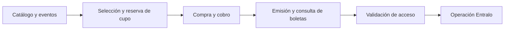

# Entralo

**Entralo** es el portal y la plataforma de boletería digital para Colombia: un recorrido de **compra end-to-end** de entradas para eventos, desde el catálogo público hasta la validación de la boleta en puerta.

El objetivo de V1 es ofrecer **catálogo y eventos, selección y reserva de cupo, compra/cobro, emisión y consulta de boletas, prueba de emisión y control de acceso**, además de la operación interna de Entralo.

> **Estado del workspace:** este repositorio contiene **documentación de producto y de arquitectura, prototipos HTML y assets visuales**. Todavía **no contiene backend ni frontend de producción** y **no es un sistema desplegable**.

## Contenidos

| Sección | Contenido |
|---|---|
| [Estado del proyecto](#estado-del-proyecto) | Tabla de estado por área (requisitos, arquitectura, demo, desarrollo) |
| [Estado del desarrollo](#estado-del-desarrollo) | Qué hay y qué no hay hoy en el workspace |
| [Dirección de arquitectura](#dirección-de-arquitectura-propuesta) | Preferencias propuestas de stack, sin implementar |
| [Activos y diseño](#activos-y-diseño) | Demo visual, referencias de imágenes y assets de estilo |
| [Documentación clave](#documentación-clave) | Enlaces a brief, propuesta de arquitectura y más |
| [Próximos pasos](#próximos-pasos) | Gates pendientes antes de implementar |

## Estado del proyecto

Estado verificado en disco el **2026-10-02**:

| Área | Estado vigente | Fuente |
|---|---|---|
| **Requisitos** | **Aprobados por el usuario** («apruebo los requerimientos», 2026-09-30) como propuesta consolidada para formalización. El brief vigente queda en `planning` / `revision-needed` (los deltas posteriores invalidaron el `ready` previo); no son aprobación de arquitectura ni de plan. | [Brief de requisitos V1](docs/specs/requirements/entralo-v1-requirements-brief.md) |
| **Arquitectura** | **Propuesta en `draft`**; ADRs en `proposed`. La revisión global del Spec Validator emitió `ready` (2026-10-02), pero **falta la aprobación humana explícita del plan (Gate 1)**: lifecycle `awaiting-human-plan-approval`. **No está implementada ni aprobada como plan final.** | [Propuesta de arquitectura](docs/architecture/architecture-proposal.md) · [Resumen de decisiones](docs/architecture/decision-summary.md) |
| **Demo visual** | **Aprobado por el usuario** (2026-09-29, «apruebo el demo visual»), limitado a la presentación y el recorrido ilustrativo. No aprueba reglas de negocio, dominio, pagos reales ni el plan SDD. | [README del demo](docs/designs/entralo-referencia-imagenes/README.md) |
| **Desarrollo** | Sin backend/frontend de producción, sin contratos ejecutables ni despliegue. | — |

## Estado del desarrollo

**Qué contiene hoy el workspace:**

- `docs/specs/` — brief de requisitos de Entralo V1 y contextos de planificación.
- `docs/architecture/` — propuesta consolidada de arquitectura, mapas (landscape, contexto, integración, mapeo de workspace), resumen de decisiones, revisión de Solution Architect y seis ADRs.
- `docs/designs/` — demo HTML clickeable, referencias de imágenes y contextos de diseño.
- `estilo/` — assets de marca e imágenes de referencia (paleta, logo, banners, capturas de pantalla).

**Qué no contiene (todavía):**

- No hay código de backend ni de frontend de producción (sin servicios, sin aplicación React).
- No hay contratos OpenAPI, migraciones de base de datos ni pipelines de despliegue.
- No hay infraestructura desplegada ni un artefacto ejecutable/desplegable.
- En consecuencia, **este workspace no es hoy un sistema desplegable**: es la base documental y visual del proyecto.

## Dirección de arquitectura (propuesta)

Preferencias y recomendaciones registradas en la [propuesta de arquitectura](docs/architecture/architecture-proposal.md) y resumidas en el [resumen de decisiones](docs/architecture/decision-summary.md). Se presentan **como propuesta/decisiones conservadas del diseño, no como algo implementado**; los ADRs siguen en estado `proposed` y el plan aguarda aprobación humana.

- **Microservicios en AWS:** seis servicios (Identity, Catalog, Purchases+Inventory, Payments, Ticketing+Validation y Blockchain) sobre ECS Fargate.
- **Lenguaje y runtime:** Kotlin con Java 21 y Spring Boot 4.
- **Persistencia y contratos:** PostgreSQL con JPA y Flyway por servicio, bajo enfoque **API-first** (OpenAPI como fuente de contrato).
- **Mensajería:** AWS SQS (con outbox/inbox y saga persistida) para coordinación y eventos internos.
- **Ingreso de APIs:** AWS API Gateway regional con WAF.
- **Identidad y canales:** Amazon Cognito + BFF (Backend for Frontend) con sesión por canal.
- **Frontend:** React (buyer y admin en proyectos separados) desplegado en Vercel.
- **Almacenamiento:** Amazon S3 para imágenes y documentos.

## Activos y diseño

| Recurso | Descripción |
|---|---|
| [demo.html](docs/designs/entralo-referencia-imagenes/demo.html) | Demo clickeable (HTML/CSS/JS inline, sin dependencias externas): recorrido Inicio → Eventos → Detalle → Datos → Pago → Confirmación, más Ingreso y Registro. **Dirección visual aprobada por el usuario.** |
| [README del demo](docs/designs/entralo-referencia-imagenes/README.md) | Comparativa capturas ↔ demo, alcance y límites de la aprobación visual. |
| [estilo/](estilo/) | Assets de marca e imágenes: paleta, logo, banners, mini design system y las ocho capturas de referencia en `estilo/pagina-img/`. |
| [docs/designs/entralo-exploracion/](docs/designs/entralo-exploracion/) | Contexto de exploración visual previa (alternativas no seleccionadas). |

## Documentación clave

| Documento | Qué contiene |
|---|---|
| [Brief de requisitos V1](docs/specs/requirements/entralo-v1-requirements-brief.md) | Fuente canónica de requisitos funcionales (R-01…R-12, criterios de aceptación, límites de aprobación). |
| [Propuesta de arquitectura](docs/architecture/architecture-proposal.md) | Resumen maestro del plan de arquitectura, decisiones fijas y recomendaciones (P1–P8). |
| [Resumen de decisiones](docs/architecture/decision-summary.md) | Disposición de los hallazgos de revisión SAR-01…SAR-14 y su estado. |
| [Contexto SDD activo](docs/specs/.working/entralo-architecture-sdd-context.md) | Estado de ciclo de vida vigente, veredictos de validación y próximos gates. |
| [ADRs](docs/architecture/decision-records/) | Registros de decisión (boundaries, gateway/mensajería, Cognito+BFF, sagas, pruebas/documentos, stack/runtime). |

## Próximos pasos

1. **Gate 1 — aprobación humana del plan:** la arquitectura está validada globalmente (`ready`, 2026-10-02) pero **pendiente de aprobación explícita del plan por parte del usuario**; sin esa aprobación no hay handoff a descomposición ni implementación.
2. **Después de la aprobación:** descomposición en tareas e implementación sobre specs validadas (fuera del alcance actual de este workspace).
3. **Gates de go-live** (condiciones externas de cuenta/contrato/seguridad) documentados en el [brief](docs/specs/requirements/entralo-v1-requirements-brief.md).

---

*Estado documentado el 2026-10-02 a partir del contenido actual del workspace.*
