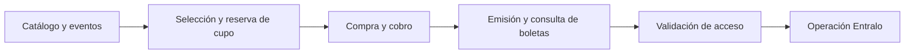

# Entralo

**Entralo** es el portal y la plataforma de boletería digital para Colombia: un recorrido de **compra end-to-end** de entradas para eventos, desde el catálogo público hasta la validación de la boleta en puerta.

El objetivo de V1 es ofrecer **catálogo y eventos, selección y reserva de cupo, compra/cobro, emisión y consulta de boletas, prueba de emisión y control de acceso**, además de la operación interna de Entralo.

> **Estado del workspace:** este repositorio contiene **documentación de producto y de arquitectura, prototipos HTML y assets visuales**. Todavía **no contiene backend ni frontend de producción** y **no es un sistema desplegable**.

## Contenidos

| Sección | Contenido |
|---|---|
| [Estado del proyecto](#estado-del-proyecto) | Tabla de estado por área (requisitos, arquitectura, demo, desarrollo) |
| [Estado del desarrollo](#estado-del-desarrollo) | Qué hay y qué no hay hoy en el workspace |
| [Dirección de arquitectura](#dirección-de-arquitectura-propuesta) | Preferencias propuestas de stack, sin implementar |
| [Activos y diseño](#activos-y-diseño) | Demo visual, referencias de imágenes y assets de estilo |
| [Documentación clave](#documentación-clave) | Enlaces a brief, propuesta de arquitectura y más |
| [Índice documental](docs/README.md) | Fuentes vigentes, contratos, históricos y evidencia faltante |
| [Próximos pasos](#próximos-pasos) | Gates pendientes antes de implementar |

## Estado del proyecto

Estado contrastado en disco el **2026-10-03**. Esta tabla es un resumen de navegación; los estados autoritativos están en los contextos y contratos enlazados:

| Área | Estado vigente | Fuente |
|---|---|---|
| **Requisitos** | **Aprobados por el usuario** («apruebo los requerimientos», 2026-09-30) como propuesta consolidada para formalización. El brief vigente queda en `planning` / `revision-needed` (los deltas posteriores invalidaron el `ready` previo); no son aprobación de arquitectura ni de plan. | [Brief de requisitos V1](docs/specs/requirements/entralo-v1-requirements-brief.md) |
| **Arquitectura conceptual** | Propuesta en `draft`; ADRs en `proposed`. El contexto macro conserva `ready` GLOBAL y **aprobación humana del 2026-10-02 para avanzar a especificaciones**. Es evidencia histórica de ese alcance, no autorización de implementación ni aprobación contractual. | [Propuesta de arquitectura](docs/architecture/architecture-proposal.md) · [Aprobación macro histórica](docs/specs/.working/entralo-architecture-sdd-context.md#human-plan-approval-approved_by_user) |
| **Especificación contractual V1** | Master Spec, ocho OpenAPI, modelos de datos documentales, esquemas de eventos y contrato de descomposición **presentes**. Incremento en `planning`, Spec Validator `verdict: none`; validaciones y aprobación humana contractual pendientes. | [Master Spec](docs/specs/increments/entralo-v1-executable-specs/master-spec.md) · [Contexto activo](docs/specs/.working/entralo-v1-executable-specs-sdd-context.md) · [Gates](docs/specs/increments/entralo-v1-executable-specs/gate-register.md) |
| **Demo visual** | **Aprobado por el usuario** (2026-09-29, «apruebo el demo visual»), limitado a la presentación y el recorrido ilustrativo. No aprueba reglas de negocio, dominio, pagos reales ni el plan SDD. | [README del demo](docs/designs/entralo-referencia-imagenes/README.md) |
| **Desarrollo** | Sin backend/frontend de producción ni despliegue. Los contratos documentales existentes **todavía no constituyen un plan validado listo para implementar**. | [Master Spec: verificación y gates](docs/specs/increments/entralo-v1-executable-specs/master-spec.md#7-verificación-futura-y-gates) |

## Estado del desarrollo

**Qué contiene hoy el workspace:**

- `docs/specs/` — requisitos, contextos de planificación y el incremento contractual V1: Master Spec, ocho YAML OpenAPI (siete superficies HTTP y componentes comunes), siete documentos de datos, cinco esquemas de eventos, fixtures y contratos de integración/descomposición.
- `docs/architecture/` — propuesta consolidada de arquitectura, mapas (landscape, contexto, integración, mapeo de workspace), resumen de decisiones, revisión de Solution Architect y seis ADRs.
- `docs/designs/` — demo HTML clickeable, referencias de imágenes y contextos de diseño.
- `docs/README.md` — índice de navegación y autoridad documental; `docs/reviews/` — diagnósticos documentales, no dictámenes de aprobación contractual.
- `estilo/` — assets de marca e imágenes de referencia (paleta, logo, banners, capturas de pantalla).

**Qué no contiene (todavía):**

- No hay código de backend ni de frontend de producción (sin servicios, sin aplicación React).
- No hay migraciones ejecutables de base de datos ni pipelines de despliegue. **Sí hay OpenAPI y DDL propuesto en Markdown**, sin validación contractual final ni SQL aplicado.
- No hay infraestructura desplegada ni un artefacto ejecutable/desplegable.
- En consecuencia, **este workspace no es hoy un sistema desplegable**: es la base documental y visual del proyecto.

## Dirección de arquitectura (propuesta)

Preferencias y recomendaciones registradas en la [propuesta de arquitectura](docs/architecture/architecture-proposal.md) y resumidas en el [resumen de decisiones](docs/architecture/decision-summary.md). Se presentan **como diseño, no como algo implementado**; los ADRs siguen en estado `proposed`. La aprobación conceptual ya está registrada; la validación y aprobación del plan contractual siguen pendientes. Las concreciones y deltas V1 están en la [Master Spec actual](docs/specs/increments/entralo-v1-executable-specs/master-spec.md), que declara las divergencias pendientes de reconciliación macro.

- **Microservicios en AWS:** seis servicios (Identity, Catalog, Purchases+Inventory, Payments, Ticketing+Validation y Blockchain) sobre ECS Fargate.
- **Lenguaje y runtime:** Kotlin con Java 21 y Spring Boot 4.
- **Persistencia y contratos:** PostgreSQL con JPA y Flyway por servicio, bajo enfoque **API-first** (OpenAPI como fuente de contrato).
- **Mensajería:** AWS SQS (con outbox/inbox y saga persistida) para coordinación y eventos internos.
- **Ingreso de APIs:** AWS API Gateway regional con WAF.
- **Identidad y canales:** Amazon Cognito + BFF (Backend for Frontend) con sesión por canal.
- **Frontend:** React (buyer y admin en proyectos separados) desplegado en Vercel.
- **Almacenamiento:** Amazon S3 para imágenes y documentos.

## Activos y diseño

| Recurso | Descripción |
|---|---|
| [demo.html](docs/designs/entralo-referencia-imagenes/demo.html) | Demo clickeable (HTML/CSS/JS inline, sin dependencias externas): recorrido Inicio → Eventos → Detalle → Datos → Pago → Confirmación, más Ingreso y Registro. **Dirección visual aprobada por el usuario.** |
| [README del demo](docs/designs/entralo-referencia-imagenes/README.md) | Comparativa capturas ↔ demo, alcance y límites de la aprobación visual. |
| [estilo/](estilo/) | Assets de marca e imágenes: paleta, logo, banners, mini design system y las ocho capturas de referencia en `estilo/pagina-img/`. |
| [docs/designs/entralo-exploracion/](docs/designs/entralo-exploracion/) | Contexto de exploración visual previa (alternativas no seleccionadas). |

## Documentación clave

| Documento | Qué contiene |
|---|---|
| [Brief de requisitos V1](docs/specs/requirements/entralo-v1-requirements-brief.md) | Fuente canónica de requisitos funcionales (R-01…R-12, criterios de aceptación, límites de aprobación). |
| [Propuesta de arquitectura](docs/architecture/architecture-proposal.md) | Resumen maestro del plan de arquitectura, decisiones fijas y recomendaciones (P1–P8). |
| [Resumen de decisiones](docs/architecture/decision-summary.md) | Disposición de los hallazgos de revisión SAR-01…SAR-14 y su estado. |
| [Índice documental](docs/README.md) | Ruta de lectura, autoridad, contratos actuales e históricos. |
| [Master Spec V1](docs/specs/increments/entralo-v1-executable-specs/master-spec.md) | Especificación canónica inicial del incremento, todavía en `planning`. |
| [Contexto SDD activo](docs/specs/.working/entralo-v1-executable-specs-sdd-context.md) | Estado del incremento contractual, evidencia disponible, bloqueos y próximo paso. |
| [Registro de gates](docs/specs/increments/entralo-v1-executable-specs/gate-register.md) | Criterios de cierre; no sustituye evidencia de ejecución ni dictámenes independientes. |
| [Diagnóstico de documentación](docs/reviews/2026-10-03-documentation-recovery.md) | Pistas de informes ausentes, riesgo de archivos no versionados y propuesta de organización. |
| [ADRs](docs/architecture/decision-records/) | Registros de decisión (boundaries, gateway/mensajería, Cognito+BFF, sagas, pruebas/documentos, stack/runtime). |

## Próximos pasos

1. **Preservar y recuperar evidencia:** los **45 archivos** del incremento (corte actual contado por curator: 44 del corte anterior más el [informe de re-review SA](docs/specs/increments/entralo-v1-executable-specs/solution-architect-rereview-2026-10-03.md) del 2026-10-03) están en disco. Recuperar los informes/salidas originales ausentes o solicitar nuevas revisiones identificadas como nuevas, sin reconstruir aprobaciones; la respuesta SA histórica **ya no se exige** porque la firma nueva la sustituye para SA-F01…07/10 y D-N1-01/N2–N6.
2. **Completar la validación contractual:** seguir el [contexto activo](docs/specs/.working/entralo-v1-executable-specs-sdd-context.md#next-action) y los gates existentes. La [revisión SA nueva](docs/specs/increments/entralo-v1-executable-specs/solution-architect-rereview-2026-10-03.md) aprobó el diseño de SA-F01…07/10 y D-N1-01/N2–N6 ([Master §14](docs/specs/increments/entralo-v1-executable-specs/master-spec.md)); siguen pendientes los **residuales SA (P04/HC completos)** y otros controles — G-OAS, auditoría API Governance, freeze/scan final y Spec Validator — sin exigir la respuesta histórica ya sustituida. Este README no autoriza tooling ni ejecución.
3. **Sólo tras `verdict: ready` y aprobación humana del plan contractual:** descomposición por Task Decomposer e implementación. La aprobación macro previa no sustituye estos requisitos.
4. **Gates de go-live** (condiciones externas de cuenta/contrato/seguridad) documentados en el [brief](docs/specs/requirements/entralo-v1-requirements-brief.md) y el [registro de gates](docs/specs/increments/entralo-v1-executable-specs/gate-register.md).

---

*Resumen documental actualizado el 2026-10-03. No es un dictamen de readiness ni evidencia de despliegue.*
