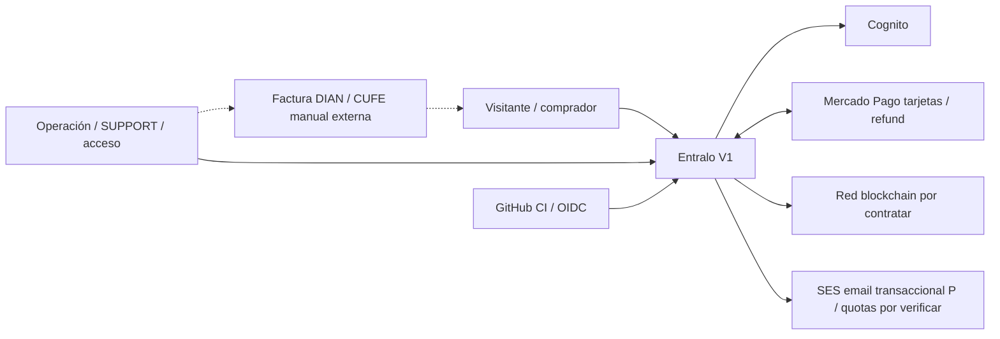
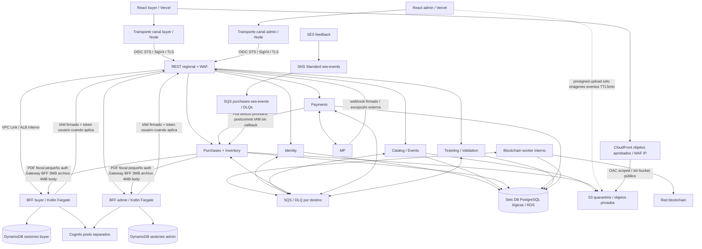

# Entralo V1 — propuesta consolidada de arquitectura

- **Lifecycle status:** `draft`; **estado de revisión:** `revision-needed` (contexto activo `planning`, aprobación anterior invalidada).
- **Fecha:** 2026-10-01. **Owner:** Planner; revisión independiente a cargo de Solution Architect y Spec Validator, coordinados por orquestador. D-AUTH-01 incorporado como delta sustantivo de flujo, pendiente revalidación.
- **Decisión solicitada:** aprobar o ajustar **este único plan de arquitectura** después de su revisión independiente. Ningún ADR está `accepted`; no existe aprobación humana del plan.
- **Alcance:** resumen maestro de arquitectura y contratos mínimos de integración; no Master Spec ejecutable, OpenAPI completo, DDL, tareas ni autorización de implementación.
- **Convención:** **C** requisito/preferencia fija del usuario; **P** recomendación técnica incluida en este plan; **G** verificación/gate posterior. Una recomendación seleccionada dentro de la propuesta no equivale a decisión humana aprobada.

**Precisión vinculante SAR-01/F-E / D-SAR01-CA04 aprobada:** usuario **«sí, dale la opción A»** (2026-10-01). `payment_approved_at` MP determina elegibilidad comercial, no `accepted_at`: approval `<grace_end_at` y evidencia canónica/durable reconciliada `<reconciliation_deadline=grace_end_at+5m`, con permiso/asignación válidos, honran compra **aunque Purchases persista accepted_at después del cutoff comercial**. F-E materializa esa reconciliación por decisión+stock+obligación atómicos predeadline en Purchases; accepted_at no es tiempo de compra ni exige ser anterior a grace_end_at. Sin confirmación canónica al deadline libera; aprobación hallada después de liberar o después del deadline sin decisión durable previa → R-04/no reconsumo. Respuesta MP cruda no es reconciliación; no extensión comercial/nuevos pagos. Brief CA-03/04/R-03/04 actualizado, pendiente revisión independiente, no plan aprobado ni ready.

## 1. Resumen ejecutivo y fuentes

### Resumen de una página — qué se propone y qué falta aprobar

**Decisiones previas conservadas; D-AUTH-01 incorporado.** Visitante consulta eventos públicos sin sesión; selección/navegación no crean hold. Debe iniciar sesión/crear cuenta y quedar autenticado antes de reservar. Hold, orden/compra y solicitud de refund pertenecen al `userId` autenticado; límites default8/orden y8/userId-evento se validan antes de crear hold, contando confirmadas y reservas activas incluida gracia/UNKNOWN. Disponibilidad se comprueba al reservar y de nuevo antes de MP. Sesión inválida exige reautenticación del mismo propietario: no transfiere ni renueva la reserva. TTL20 empieza al crear el hold, no al navegar/login; gracia30/UNKNOWN5min, una transacción MP/orden y refund original intactos. Aprobación de dirección de diseño conservada; validación anterior invalidada, lifecycle activo planning/revisión revision-needed.

**H-A confirmado2026-09-30, precisado2026-10-01.** MP payment_approved_at<grace_end_at con permiso/asignación válida y confirmación antes reconciliation_deadline acepta compra aunque emisión termine después. Webhook/worker/commit no cambian timestamp de compra. Espera real cruzando cutoff/deadline no revierte venta aceptada; **tercer fallo definitivo de emisión tras3 intentos totales1/5/25s timeout10s→R-04 automático original**, no pending perpetuo/cuarto intento. ACK incierto consulta/cierra mismo resultado. CLOSING no refund; approval en/tras cutoff o descubierto tras release sí R-04. D-TIME-01 formalizado en brief: payment_approved_at proveedor=purchased_at de compra válida para comparación hito; received_at/accepted_at/issued_at solo auditoría.

**D-UNKNOWN-01 APROBADA «sí, la B»2026-10-01, no aprobación de plan.** UNKNOWN al grace_end_at retiene inventario **máximo5min adicionales no renovables solo conciliación**, reconciliation_deadline=grace_end_at+5m, consulta MP canónica durante ventana. No nuevos inicios/pagos/venta al cutoff. Approved con evidencia canónica/durable reconciliada en Purchases antes del deadline (respuesta MP cruda no basta) con payment_approved_at<grace_end_at/asignación válida→honrar compra/emisión posterior; failed/declined→liberar; UNKNOWN al deadline→liberar/seguir conciliando. Toda approval descubierta después de release→R-04 automático/aviso/incidente, nunca reconsumo aun timestamp previo. Confirmación igual/posterior al deadline no acepta venta pendiente aunque liberador se retrase; decisión durable válida previa conserva obligación de entrega. Release UNKNOWN inmediato al cutoff sustituido; hold indefinido descartado. Ready brief invalidado por delta, no otra decisión de producto pendiente.

**F-01/F-02 corregidos por Planner sin nueva decisión humana:** polling MP `grace_end_at+[0,5,15,30,60,120,240,300]s`; primer poll no equivale al cierre comercial, que ocurre por timestamp. Webhooks disparan consulta/conciliación de idempotencia; deadline exacto+300s libera sin esperar red si no hay aprobación admisible con evidencia canónica/durable reconciliada en Purchases antes del deadline (respuesta MP cruda no basta). Poll+300 sólo concilia después de decisión terminal; posteriores cada5min, jamás reconsumir, late approved refund. Sólo emisión conserva cifras aprobadas máximo3/+1/+5/+25s/timeout10s, base durable única `issuance_cycle_started_at`, inicio real>=máximo(slot,resolución anterior), no solapamiento/reset. Transient probado sin efecto permite retry; non-retryable definitivo no espera retries inútiles: cierre/ausencia probada/refund R-04. Timeout/ACK incierto concilia emissionId/issuance_id/guard/tombstone antes retry/refund; ticket existente recupera éxito, cero false refund. Imposibilidad comprobada o agotamiento de tres fallos definitivos→cierre seguro/R-04 original. No nuevo negocio, ready ni plan aprobado. Contrato temporal/taxonomía/AC/señales canónicos en integration-map §§3.1/4.2, brief R-04/CA-04/§13.C.

**Plataforma recomendada, todavía no aprobada.** Seis servicios Kotlin/Spring en Fargate: Identity, Catalog, Purchases+Inventory, Payments, Ticketing+Validation y Blockchain. Cada uno posee su base lógica PostgreSQL; inicialmente comparten una RDS Multi-AZ física. SQS Standard, outbox/inbox y saga persistida evitan perder obligaciones; blockchain no bloquea pago/acceso. React buyer/admin en Vercel, Cognito y dos BFF Kotlin AWS con sesiones DynamoDB; Terraform/GitHub OIDC para entrega.

**H-B: ingreso de APIs y bytes.** Browser→Vercel signer→Gateway IAM→BFF AWS→familia owner para sesión/negocio/documentos pequeños. WAF Gateway ve egress agregado. Imágenes upload S3 prefirmado<=5min quarantine; posters aprobados públicos sin PII por CloudFront OAC/WAF. SAR-02 elimina streaming fiscal/ALB público: evidencia fiscal por registro externo protegido verificado, adjunto opcional<=3MB/body<=4MB por owner/BFF; archivos mayores permanecen en sistema manual externo V1. No API fiscal ni presign fiscal requerido. Máximo Vercel4.5MB por dirección.

**H-C: close gate durable + advisory transaccional/fencing.** close_requested persistido corta admisión antes de drenar shared advisory de reservas/prechecks; exclusivo try aplica barrera/version/conjunto. Adjudicación previa usa CAS orden, no gate OPEN. Stock/cuenta/orden exclusivos locales, sin row FOR SHARE gate caliente ni red bajo locks. PostgreSQL18 documenta shared/exclusive/release al fin tx, **no fairness**: tests starvation, crash/failover, pools, MultiXact/write churn/autovacuum requeridos. No promesa de cero llamadas MP de permisos previos tras barrera.

**Coste y límites.** Seis servicios, dos BFF, dos transportes, pools Cognito/DynamoDB y gateway doble salto añaden despliegues, guardia y latencia. RDS física compartida mantiene blast radius failover/IOPS/conexiones/mantenimiento/PITR conjunto, presupuestos de pools agregados<=70%; CloudFront/WAF de objetos añade coste. SLO/DR son objetivos sin benchmarks. MP/PCI/fiscal/cadena/privacidad/publicación conservan gates productivos; no infraestructura ni contratos ejecutables creados.

**Alcance de aprobación y revisión.** «Actualiza la documentación y apruebo el diseño» aprueba requisitos/dirección de diseño, no el conjunto documental aún pendiente de revisión ni Gate1. D-AUTH-01/H-A/D-TIME-01/D-UNKNOWN-01 y Cognito+BFF no se repreguntan. Todo draft/proposed; consulta formal Solution Architect atendida en `solution-architect-review.md` §10 (2026-10-01); pendiente solamente Spec Validator global. Tras un `verdict: ready` vigente de Spec Validator, el plan se presenta SIEMPRE al usuario y se espera una única aprobación humana explícita, registrada con el heading exacto `## Human Plan Approval: approved_by_user`, antes de cualquier descomposición o ejecución; ese gate nunca se salta. «Solo si el diseño revisado difiere significativamente de lo indicado» aplica únicamente a reabrir requisitos (una única confirmación explícita en ese caso), no al gate: no cuestionario adicional ni aprobación automática.

Recomiendo **seis microservicios Kotlin/Spring Boot en ECS Fargate**, con inventario y compra en una misma frontera transaccional, API Gateway REST regional protegido por AWS WAF, SQS Standard con outbox/inbox y saga persistida en Purchases. React buyer y admin permanecen en proyectos Vercel separados; cada canal usa BFF Kotlin en AWS, cookie same-origin y sesión durable DynamoDB. Seis bases PostgreSQL lógicas aisladas comparten inicialmente una instancia RDS Multi-AZ. Terraform gobierna infraestructura; GitHub Actions despliega backends con OIDC y promoción de imágenes inmutables. Blockchain funciona por lotes recuperables, sin participar en la ruta crítica de pago o acceso.

La propuesta mantiene el coste de coordinación que implica la preferencia **no monolito**; no lo disfraza como simplicidad. Preserva integridad con un writer por dato, transacciones locales cortas, guardas terminales y conciliación, no con promesas de exactly-once distribuido.

| Artefacto canónico existente | Responsabilidad / lectura dirigida |
|---|---|
| [Brief canónico](../specs/requirements/entralo-v1-requirements-brief.md) | R-01–12/CA/§§13–15; lifecycle planning/revisión revision-needed, aprobación general conservada/ready invalidado, sin arquitectura aprobada |
| [System landscape](system-landscape.md) | C4 contexto/contenedores, owners y matriz de datos |
| [Context map](context-map.md) | Relaciones DDD, call graph síncrono por fase sin callbacks, precio único y módulos Purchases |
| [Integration map](integration-map.md) | I-01–28, payloads mínimos, saga/cierre, retries/DLQ, contingencia y SLO |
| [Workspace mapping](workspace-mapping.md) | Repositorios/rutas futuras y ownership de contratos; ninguno creado |
| [ADR-001](decision-records/ADR-001-servicios-y-ownership.md), [ADR-002](decision-records/ADR-002-gateway-y-mensajeria.md), [ADR-003](decision-records/ADR-003-cognito-bff-y-canales.md) | Boundaries/datos, gateway/colas, Cognito/BFF |
| [ADR-004](decision-records/ADR-004-sagas-y-efectos-idempotentes.md), [ADR-005](decision-records/ADR-005-pruebas-durables-y-documentos.md), [ADR-006](decision-records/ADR-006-stack-runtime-y-entrega.md) | Saga/H-2, blockchain/documentos, stack/runtime/CI/IaC/DR |
| [Demo aprobado](../designs/entralo-referencia-imagenes/README.md) | Dirección visual buyer: blanco/fotografía/fucsia/cards/checkout bicolumna; no autorización de reglas ni dominio |
| [Solicitud de revisión](architecture-review-request.md) | Alcance de revisión independiente y evidencia, no dictamen |
| [Shared context](../specs/.working/entralo-architecture-sdd-context.md) | Estado activo, evidencia y próximos gates |

**Precedencia/delta:** solicitud actual > brief canónico > propuesta; pack refresh6/incomplete leído como índice, decisión D-SAR01-CA04 aprobada literalmente «sí, dale la opción A» y propagada al brief y arquitectura. Refresh7 ejecutado por context-curator (2026-10-01, `stale_status: cleared`) tras esta escritura; pack re-sincronizado sin editarlo. Informe SA conserva snapshot/opinión propios; consulta formal Solution Architect atendida en `solution-architect-review.md` §10 (2026-10-01), pendiente solamente Spec Validator global. Aprobación funcional no equivale a aprobación del plan ni dictamen Validator.

**Estado observado:** workspace documental sin Git, `projects/`, backend, OpenAPI, migraciones, task board, MEMORY.md ni Graphify; `docs/specs/workspace_changes.md` no existe. No hay tareas bloqueadas que consumir ni grafo que actualizar/consultar. Esto es diseño greenfield, no auditoría de runtime.

## 2. Decisiones fijas y ocho recomendaciones cerradas dentro del plan

**C, no reabrir:** seis servicios identity, catalog/events, purchases+inventory, payments, ticketing/validation y blockchain; AWS API Gateway/SQS/S3; Java 21 + Kotlin + Spring Boot 4; PostgreSQL/JPA/Flyway por servicio; OpenAPI-first y generación Gradle de interfaces/request/DTO; React buyer/admin separados Vercel; visual buyer aprobado; Cognito+BFF cookie; CI/CD backend GitHub; sagas/retries; blockchain async no bloqueante y fiable. También precio mínimo COP100.000, cargo único 15% default configurable, 1 orden/1 pago MP, TTL20+gracia30, SUPPORT/medio original, PDF NO fiscal/factura manual externa, payout7d, N100/T15min y H-2 cerrado.

| ID / elección P del plan | Recomendación concreta y justificación | Alternativa / coste asumido |
|---|---|---|
| P1 / GW-01 | **REST API regional + WAF regional en cada stage**, execute-api deshabilitado; integración privada VPC Link V2→ALB interno. IAM/SigV4 para canales y servicios, auth usuario adicional en backend. WAF nativo y Gateway Responses evitan crear edge/authorizer propio para esta necesidad | HTTP API+CloudFront/WAF exige guard de origen y normalización adicionales; menor precio por request, más superficie operativa. No elegido |
| P2 / ID-01 | **Pools Cognito buyer/staff separados**. Buyer email verificado, password y TOTP opcional; staff provisionado, TOTP MFA requerido, sin self-signup ni federación V1. Separa recuperación y privilegios | Un pool simplifica usuarios, pero MFA no es política por app client. Mismo correo no vincula identidades |
| P3 / BFF-01/02 | **Dos BFF Kotlin/Spring en Fargate**, DynamoDB de sesiones por canal; React+adaptador de transporte Node/TS mínimo en Vercel same-origin. Adaptador firma SigV4 con OIDC→STS, sin lógica de dominio/sesión | BFF completo Node en Vercel reduce salto y compute, añade stack para auth; no elegido. Rewrite externo simple no proporciona identidad de origen; descartado como única solución |
| P4 / RUN-01 | **ECS Fargate**, API y workers escalables por separado, procesos Spring persistentes, dos AZ para API prod | EKS no aporta necesidad actual y añade operación Kubernetes. Lambda no default para JPA/leases/worker duradero; EC2 exige gestionar hosts |
| P5 / DATA-01 | **RDS PostgreSQL Multi-AZ DB instance, seis DB lógicas** y usuarios separados. Una instancia física inicial prod; presupuestos de conexiones/IOPS por servicio. PostgreSQL18.x candidato, minor exacto según oferta regional y compatibilidad | Seis instancias aíslan fallos/carga con mayor coste; evolución sin contrato compartido. Aurora PostgreSQL no default hasta demostrar necesidad/coste de lectores/elasticidad |
| P6 / REGION-01 | **us-east-1 (N. Virginia) primaria propuesta**, servicios/store/BFF juntos; funciones Vercel colocadas próximas a AWS. Comparar RTT Bogotá/Medellín/Cali antes de fijar deployment | sa-east-1 y mx-central-1 son alternativas reales. Cercanía nominal no demuestra latencia. Región sigue propuesta hasta cuenta, disponibilidad y transferencia/tratamiento de datos Colombia; no afirmar residencia colombiana |
| P7 / MSG-01 | **SQS Standard por destino/protocolo**, DLQ por cola, guards/versiones y outbox/inbox. Sin SNS/EventBridge para eventos internos por defecto; **excepción SES configuration set→SNS→SQS `purchases-ses-events`**, sin entrega SES directa SQS | FIFO sólo con orden estricto demostrado; dedup5min no sustituye DB. SNS acotado a feedback SES, no bus general; EventBridge no seleccionado |
| P8 / IAC-01 | **Terraform**, repo platform y estado S3 cifrado/versionado con lockfile; GitHub OIDC, plan/apply y roles por entorno separados. Abarca AWS y recursos Vercel con review de diff común | AWS CDK/CloudFormation válido para AWS-only, no elegido; otra abstracción/lenguaje y coordinación Vercel separada. Pins/licencia Terraform/provider se cierran en bootstrap |

Las ocho elecciones quedan recomendadas como **un paquete**, no ocho preguntas. Red/proveedor/firma/finalidad blockchain permanecen un gate de contrato productivo explícito, no selección implícita de Polygon ni una novena pregunta comercial.

## 3. C4 contexto y contenedores

### Contexto

Entralo es vendedor/emisor funcional V1; la emisión/envío material fiscal ocurre fuera del portal. MP es autoridad monetaria, Cognito de credenciales y cadena sólo prueba de emisión. Owners de externos y actores: landscape §2; no nuevo servicio de facturación/notificaciones.

### Contenedores y fronteras de confianza

El Gateway no llama recursivamente al BFF: **familias de rutas distintas** para ingreso de canal y APIs owner. Roles del transporte Vercel sólo invocan su familia BFF; roles BFF sólo APIs owner permitidas. Seis servicios de negocio, dos adaptadores BFF, dos transportes técnicos: no diez bounded contexts. Blockchain sin API pública; Ticketing sirve verificación y proyección de prueba. Detalle I-03/I-21–27 en integration-map y landscape; diagramas no representan infraestructura desplegada.

## 4. Boundaries, ownership y datos

| Contexto / owner funcional → técnico propuesto | Fuente propia / modelo lógico mínimo | Consistencia e invariantes |
|---|---|---|
| Identity: operación/producto → responsable Identity | Sujeto `issuer+sub`, contacto verificado, roles/asignaciones evento | Un vínculo único issuer+sub; permisos críticos actuales, no Cognito groups/JWT viejo como autoridad |
| Catalog: operación eventos → responsable Catalog | Evento, oferta/localidades/capacidad propuesta, términos/fiscalidad versionados, imágenes, intención control/hitos | No escribe holds/ventas. Publicación/cambio capacidad requiere ACK Purchases, nunca reducir bajo obligaciones |
| Purchases: ventas/SUPPORT → responsable Purchases | Cupo efectivo, hold, orden/snapshot, gate/permiso/fence, saga, refund autorizado, solicitud fiscal/PDF/avisos | Writer único stock+orden; disponibilidad>=0, límites8/8 incluyendo grace; snapshots inmutables |
| Payments: finanzas → responsable Payments | Intención/key única por orden, observaciones MP, intentos/refund/conciliación | Un pago por orden; ningún token persistido; suma refunds<=cobrado, una total/order y ajustes distinguibles |
| Ticketing: acceso → responsable Ticketing | Conjunto emisión/order, ticket `(order,line,ordinal)`, QR protegido, uso/guard/tombstone, proof view | Emisión única, uso único, cierre/uso/emisión serializados; no stock ni ledger monetario |
| Blockchain: producto/seguridad → responsable Blockchain | Compromiso/emisión, obligación, lote/membresía/root, intent/tx/finalidad | Un lote activo por obligación, pending hasta finalidad verificada; no PII/QR ni estado operativo |

Seis stores `entralo_identity`, `entralo_catalog`, `entralo_purchases`, `entralo_payments`, `entralo_ticketing`, `entralo_blockchain`, schema `app`, runtime/Flyway con credenciales exclusivas. Ningún FK/join/FDW/import domain remoto; ningún acceso de BFF/React a DB de negocio. Compartir instancia implica blast radius de failover/IOPS/mantenimiento, **no aislamiento físico** ni restauración PITR independiente por DB lógica.

ACID local: estado+outbox y efecto+inbox+outbox en commit propio; redes fuera del lock. Lecturas críticas en primario, no réplica para cupo/uso/deadline. Pool agregado de todas las réplicas y workers <=70% del límite disponible, resto operación/migración; tamaño exacto en spec de capacidad tras carga. Aislamiento físico conforme §11.1, sin cambio de ownership.

Modelos anteriores son **lógicos**, no schemas físicos autorizados. Tipos/nullability/índices/checks/FKs locales/retención/migration contract se completarán en SDD antes de ejecución. Retención legal Q-N05 no se inventa: sin borrado automático financiero/fiscal/dedup/obligaciones pendientes; minimización de PII y legal hold requieren política aprobada para producción.

## 5. Compra, saga y cierre H-2

**H-2 cerrado funcionalmente; delta actual pendiente revalidación, no reutilizar validación histórica.** Precheck fuerte antes MP, no cache. R-03/04 cutoff pago estricto/hold conciliación5min; R-07 SUPPORT normal, nunca refund masivo por cancelación.

0. Visitante navega oferta pública sin sesión/hold. Antes de reservar inicia sesión/crea cuenta y queda autenticado por Cognito+BFF. Login no conserva cupo ni crea reserva; autenticación incompleta deja al visitante sin hold. BFF valida sesión y Purchases valida principal/propiedad, disponibilidad fuerte, oferta/gate y límite agregado `userId+event_id` antes del hold (integration §2.2).
1. Purchases reserva cupo/límite del `userId` autenticado+orden+snapshot atómicamente. Propietario inmutable obtenido server-side, nunca de cookie anónima/dispositivo/tarjeta ni userId arbitrario del cliente. `created_at` es creación servidor del hold; `expires_at=created_at+TTL20m`, `grace_end_at=expires_at+grace30m`, parámetros snapshot e inmutables. Sesión que expira durante hold niega nuevas acciones del comprador hasta reautenticar el mismo userId; otro propietario se rechaza, sin transferencia, reserva nueva implícita ni renovación de relojes. Hold liberado no revive; conciliación/emisión/compensación internas continúan sin sesión abierta.
2. Tokenización MP browser; token efímero TLS transporte/BFF→Payments sólo memoria. Payments intención única+I-24 inmediatamente antes MP; shared advisory transaccional con relectura close_requested/gate en primario→cuenta/localidades/orden; cierre flag durable→try exclusivo drena y aplica barrera. No FOR SHARE gate ni red bajo locks. Denegación cero MP para ese inicio, permiso/fence por orden. HC-01–09 integration §5.0.
3. **Linealización de inicio/cierre:** permiso registrado antes del commit CLOSING pertenece al conjunto previo y puede resolver dentro de su deadline. Si CLOSING gana, no se inicia MP. Registrar antes de cerrar evita invalidar indiscriminadamente pagos ya iniciados. No se sostiene lock durante red; MP puede procesar después del cierre: el permiso fija precedencia, no ACID con MP.
4. Approval MP requiere `payment_approved_at<grace_end_at` y permiso/asignación válidos. Payments persiste evidencia canónica y llama directamente al receptor privado Purchases tras commit (I-08 prioritario IAM/TLS), conservando outbox/SQS para recuperación. Purchases reconcilia evidencia/decisión/stock/obligación por CAS `accepted_at<reconciliation_deadline`; **accepted_at puede ser posterior a grace_end_at** sin excluir compra cuyo tiempo comercial es MP. I-28 recupera predeadline. Sin reconciliación durable al deadline libera/refund; respuesta cruda o sello Payments aislado no bastan. `canonical_confirmed_at` no es comparador remoto. §5.2 aplica D-SAR01-CA04 aprobada y brief actualizado; `purchased_at=payment_approved_at`, emisión posterior no redefine compra.
5. Ticketing emisión única/guard/outbox aun post-corte; CLOSING/lentitud no refund. F-02: máximo3/base durable+1/5/25s/timeout10s sólo emisión, serializados; transient sin efecto reintenta, non-retryable definitivo cierra/prueba ausencia/refund R-04 sin esperar3; agotamiento de3 fallos definitivos mismo cierre/refund. Timeout/ACK incierto concilia emissionId/guard/tombstone antes retry/refund, ISSUED recupera/no false refund ni cuarto intento. Cancelación bloquea uso/cambio no, política normal R-07/SUPPORT sólo compras sin automatismo R-04.
6. TTL EXPIRANDO no libera20m. UNKNOWN al cutoff hold solo conciliación≤5min no renovable hasta reconciliation_deadline, consulta canónica ventana; failed/declined libera, UNKNOWN deadline libera/avisa y concilia cada5min/incident24h hasta resolver. Sin pago pendiente libera cutoff. No nuevo inicio/pago/venta al cutoff, no renovación; tras LIBERADA approval aun previo→R-04/aviso/incidente/cero reconsumo.15s objetivo técnico no tolerancia: retener UNKNOWN más allá deadline es incumplimiento. D-UNKNOWN-01 aprobado, no checklist de decisión pendiente.
7. Approval>=cutoff/permiso no admisible→refund único/aviso/incidente. Evidencia durable Payments reconciliada por CAS Purchases predeadline/asignación válida autoriza venta; accepted_at post-cutoff comercial permitido, ACK/recuperación de esa decisión previa pueden llegar después del deadline, no constituyen venta nueva. Evidencia Payments no reconciliada predeadline por sí sola no autoriza CAS tardío en DB separadas. Aprobación encontrada después del deadline o release sin decisión durable previa → R-04, sin comparar clocks ni LIBERADA→VENDIDA. Respuesta cruda a deadline−1ms no garantiza pipeline1ms: caso CA-04 actualizado por aprobación literal D-SAR01-CA04.
8. ACK perdido recupera el mismo conjunto, no nueva emisión ni aborto por timeout/CLOSING. Emisión incierta exige resultado durable o cierre terminal antes refund/liberar stock vendido; sin evidencia queda obligación y alerta, no cupo reutilizable con boleta activa. Latencia y corte comercial son señales separadas.

| Máquina separada | Estados P y transiciones relevantes |
|---|---|
| Reserva | RESERVADA→EXPIRANDO→VENDIDA o LIBERADA; failed permite LIBERADA antes TTL; nunca LIBERADA→VENDIDA |
| Saga | PAYMENT_PENDING→ISSUANCE_PENDING→CONFIRMED; imposibilidad non-retryable probada o agotamiento3 sin efecto→ISSUANCE_FAILED_FINAL→COMPENSATION_PENDING_GUARD si cierre pendiente→REFUND_PENDING→COMPENSATED; no vuelve a emitir. Incierto consulta resultado: ISSUED→CONFIRMED sin falso refund. UNKNOWN monetario puede persistir con reserva LIBERADA, no hold indefinido ni eliminación de obligación |
| Guard emisión | OPEN→ISSUED por venta válida o CLOSED por compensación autorizada; sin cutoff físico, CLOSED jamás se reabre |
| Gate evento | OPEN→CLOSING→CLOSED por cancelación; cambio reaplica oferta y reabre sólo con ACK. Permisos previos no se añaden después del cierre |

Catalog hito servidor UTC/ms tras ACK barrera/control/clasificación UNKNOWN con límite/release/obligación, no entrega/MP/refund completos. R-07 actualizado: payment_approved_at proveedor<hito de compra válida, aun auditoría/entrega posterior; empate fuera/America-Bogota/ventana/SUPPORT intactos. No backdating de hitos/locales; después de liberar R-04, no elegibilidad R-07 por timestamp aislado.

### 5.1 Corrección de elegibilidad confirmada, no decisión nueva

`payment_approved_at` MP verificable nullable hasta confirmado, `purchased_at` igual para venta válida; received_at/observed_at/accepted_at/issued_at sólo auditoría. Approval<hito admisible mantiene anterioridad aun entrega posterior, empate/posterior fuera, timestamp MP no verificable no determinada/sin fallback local. Tras LIBERADA R-04/cero reconsumo, no R-07 por timestamp aislado. Detalle TIME-01–03/integration §4.3; decisión D-TIME-01 no se reabre.

### 5.2 F-E — elegibilidad MP y reconciliación durable acotada (diseño técnico draft; D-SAR01-CA04 aprobada)

**Fuente:** única fuente de aprobación: respuesta literal del usuario «sí, dale la opción A», 2026-10-01; aprobación **solo del punto funcional** D-SAR01-CA04, la solicitud actual sólo da procedencia de propagación, no ratificación ni fuente adicional de aprobación. Trazabilidad: brief cabecera/§13.A source trace/R-03/R-04/CA-03/CA-04. **D-SAR01-CA04 cerrada como decisión funcional y aplicada**, no sólo corrección técnica ni aprobación del plan. H-A/D-UNKNOWN-01/D-TIME-01/TTL20/grace30/R-07 intactos. Distinguir tres fronteras: (a) elegibilidad comercial por MP approval<grace, (b) reconciliación canónica/durable antes del deadline, (c) emisión posterior sin deadline físico. En esta propuesta F-E, (b) es la decisión atómica Purchases sobre evidencia durable Payments, no recepción raw ni timestamp remoto aislado; accepted_at post-grace es válido, nueva decisión en/tras deadline no. No aceptar tras LIBERADA.

1. **Purchases fija el tiempo:** al crear hold, su BD primaria genera `created_at` UTC y los instantes inmutables `grace_end_at` y `reconciliation_deadline=grace_end_at+300s`. I-24 los pasa exactamente en `PaymentAttempt` junto con order/intent/monto/moneda/fence; Payments persiste ese snapshot, no recalcula ni extiende. Tiempo monotónico de procesos sólo budgets, nunca sustituto del deadline persistido.
2. **Payments fija el hecho pre-cortado:** consulta MP fuera de transacción desde webhook autenticado/query, valida referencia, approved, monto COP, timestamp proveedor y snapshot I-24. Un timestamp ausente/ambiguo deja UNKNOWN; approval>=grace no es admisible. Transacción idempotente intent+observation_version persiste `CanonicalPaymentFactV1`+evidence_id+outbox; `canonical_confirmed_at` es auditoría de registro BD, no timestamp exacto commit ni prueba de frontera entre hosts. Sólo después del commit se notifica I-08: llamada privada directa Payments→Purchases IAM/SigV4/TLS con presupuesto total3s/connect1s, máximo1 retry seguro dentro ese total y misma key. No añadir firma KMS/JWKS al hecho interno: productor autorizado exclusivo, contrato/hash y evidencia durable consultable I-28; IAM/SSE-KMS/TLS/outbox-inbox en SQS. Outbox/SQS duplicados son recuperación, no prerrequisito del CAS ni nuevo intento monetario. Hash distinto para misma key→conflicto/incidente, nunca overwrite. Sin red bajo locks y sin publicar evidencia provisional.
3. **Purchases reconcilia y honra antes del deadline, aunque accepted_at sea post-cutoff:** receptor privado I-08 y job I-28 procesan evidencia **durante** la ventana, no difieren hasta poll+300. Validar contrato/producer/evidence fuera de locks; READ COMMITTED bloquea cuenta/localidades en orden estable y orden/permiso/asignación según HC; revalida fence/monto/snapshot/no LIBERADA. **Tras todos los locks**, sentencia nueva lee una sola vez `clock_timestamp()` BD Purchases, evalúa accepted_at<deadline y payment_approved_at<grace, y escribe decisión de reconciliación+aceptación única+conversión reservado→vendido+obligación/outbox atómicamente. **No condición accepted_at<grace_end_at**: ese campo audita decisión local; purchased_at=payment_approved_at es tiempo comercial. No now/transaction_timestamp/statement_timestamp anteriores a espera ni predicado volátil supuestamente reevaluado. Sólo commit exitoso conserva resultado; decisión previa con ACK/commit tardío se recupera por key y release serializado observa venta o rollback; accepted_at no afirma timestamp exacto commit. Tx<=1s enforcement HC-09; abort/retry obtiene reloj nuevo. Sin reconciliación durable válida previa no nuevo CAS en/tras deadline aunque liberador tarde; sello Payments aislado no autoriza venta tardía.
4. **Purchases libera:** misma guarda/BD, todos locks antes sentencia nueva/lectura única clock_timestamp, instante>=deadline libera/invalida fence una vez si no aceptación previa; sin MP/I28/SQS/poll+300. CAS previo committed conserva entrega; rollback no. Hecho tardío sin CAS previo R04 aun liberador retrasado. I28 timeout total3s/1retry seguro dentro3s y restante, snapshot provisional negativo no adelanta release; key intent+deadline+fence/version sin MP/I24/I08 callback. Sello terminal pertenece Purchases, no clock host Payments.
5. **Salud temporal:** BD owners UTC y guard medido de desfase máximo1s; abs(offset)>1s o medición ausente>60s retira sólo writer afectado de nuevas mutaciones temporales hasta reloj verificado, failover incluido. No ±1s de tolerancia comercial ni comparar canonical_confirmed_at remoto con deadline−1ms. Para orden temporal proveedor/cutoff, usar timestamp MP verificable sin alterar precisión; incertidumbre de fuente que impida ordenar→UNKNOWN, nunca fallback local. No garantía UTC perfecta; medir desviación/precisión con evidencia DR-05. Outage Purchases genera overdue visible, no hold renovado. Caída Payments no impide release local al deadline ni convierte UNKNOWN en failed monetario; reconciliación/refund continúan.

**M1-AC01–08/SAR-01/08 / CA-03/04 (casos no ejecutados):** (01) approval=cutoff−1ms, evidencia committed y reconciliación CAS Purchases a cutoff+299.999s: **accepted_at>grace permitido**, compra honrada/stock/obligación únicos, emisión posterior; (02) raw webhook/query recibido pero evidencia no comprometida/reconciliada: no éxito supuesto; (03) reconciliación nueva a +300s o después deniega aun release demorado, approval previo encontrado fuera del deadline R-04; (04) tx iniciada predeadline, lock concedido después: reloj nuevo niega, rollback/crash no deja venta; (05) LIBERADA no revive, I-28/SQS tardíos refund único aun approval/sello Payments previos; (06) ACK perdido de decisión durable previa recupera venta/entrega tras deadline sin refund por latencia, tres fallos definitivos emisión R-04; (07) raw respuesta MP a +299.999s y delay ingress→Payments→CAS2s sin reconciliación durable previa: **release/refund conforme a CA-04 actualizada**, no venta por respuesta cruda; (08) I-08 directo duplicado con outbox/I-28/crash postcommit Payments: una decisión, cero reconsumo/segundo pago/nuevo inicio en ventana. Inyectar clocks hosts±1s manteniendo BD Purchases: no efecto en frontera; failover/timeouts/locks/sin firma KMS. Métricas `payment_evidence_to_acceptance_seconds`, `payment_predeadline_delivery_missed_total`, `purchase_acceptance_total{outcome}`, `payment_released_assignment_refund_total`; auditoría protegida evidence_id/decision_version/payment_approved_at/grace_end_at/reconciliation_deadline/accepted_at/release/fences. Respuesta MP, evidencia y decisión durable se distinguen; ningún test ejecutado.

**SAR-01 — presupuesto técnico, decisión funcional ya aprobada:** margen conservador **5s** para planificar dispatch/recuperación (3s I-08/I-28+1s tx+1s scheduler), prioridad deadline−5s. No es deadline anticipado: polling/webhook/evidencia útil posterior siguen permitidos hasta frontera estricta, no rechazar reconciliación válida a +299.999s. p95 evidence→acceptance<=1s/p99<=5s bajo H-C, alarma misses>0; objetivos no garantías bajo fallo. Poll útil+240/ledger recovery+295 conservan slots brief; SQS no garantiza1ms. No nueva pregunta de negocio ni reapertura de UNKNOWN5m.

**D-SAR01-CA04 — approved-by-user / applied-awaiting-independent-review:** fuente literal **«sí, dale la opción A»** (2026-10-01). Semántica: `payment_approved_at` MP determina elegibilidad; `<grace_end_at` + permiso/asignación válidos + evidencia canónica/durable reconciliada `<reconciliation_deadline=grace_end_at+5m` → honrar compra aunque Purchases persista accepted_at post-cutoff. Sin confirmación canónica al deadline libera; approval encontrado tras release o después del deadline sin decisión durable previa → refund R-04/no reconsumo. Ventana sólo conciliación, no nuevos pagos ni tiempo de compra extendido. **Aplicado al brief R-03/R-04/CA-03/CA-04/source trace**: retirado el criterio de respuesta cruda+299.999 como venta automática. Restantes R/CA, TTL20/grace30/UNKNOWN5m/R-07/H-A/medio original/SUPPORT intactos. Es delta funcional aprobado, no ready/plan approval/Gate1; no pedir de nuevo reconocimiento humano de la opción A.

**Alternativas descartadas/impacto:** accepted_at como cutoff comercial, respuesta MP raw como venta, sello host Payments como autorización de CAS postdeadline, deadline+epsilon, renovar hold/nuevos pagos y LIBERADA→VENDIDA descartados. Misma instancia RDS no crea ACID cross-DB; shared store/2PC violarían owners sin resolver pipeline1ms, no seleccionados. Evidencia Payments necesaria pero sólo reconciliación durable Purchases predeadline adjudica; resultado previo durable recuperable después, no venta nueva. Impacto comprador: compra de timestamp MP previo honrada pese accepted_at post-cutoff; raw sin reconciliación al deadline release/refund. Process manager Purchases/Adapter-ACL/Command no sensible se mantienen sin GoF nuevo/séptimo servicio. Brief actualizado exclusivamente para opción A aprobada. Consulta formal SA de esta materialización y Validator de conformidad requeridos; no atribuir aval nuevo.

**Verificación futura:** H2-01–06 requieren comprador autenticado/hold propio como precondición; AUTH-01–06 (integration §2.2), CA-AUTH-01 del brief y ADR1-AC5–6/ADR3-AC8–9 prueban navegación pública, rechazo sin efectos, límite concurrente por userId y reautenticación sin cambio de dueño/relojes. UNKNOWN-01–04/TIME-01–03/HC/HB conservados. No tests runtime ejecutados; revisión independiente pendiente.

## 6. Contratos mínimos sync/async

Los I-01–28 de integration-map son el **catálogo completo macro** y poseen payload, key, compensation y señales. I-28/evidencia en §5.2; sin paths/DTOs parcialmente implementables.

| Flujo / trigger / owners | Contrato y key mínima | Timeout/retry/fallo/compensación y señal |
|---|---|---|
| Público BFF→Catalog+Purchases / catálogo I-21 | Oferta+availability con versiones/as_of; lectura sin efecto | Paralelo3s, 1 retry seguro dentro5s; caída/desfase→UNKNOWN, no venta por cache; `catalog_composition_total{outcome}` |
| Payments→Purchases / inicio I-24 | order/intent, monto snapshot, deadline, gate_version/fence; key payment_intent_id | 3s; timeout consulta claim durable, no MP sin permiso probado; denegación release no monetario; `payment_start_gate_total{outcome}` |
| Browser/BFF→Payments→MP I-07/I-09 | Token sólo sync, intención/key estable por orden, autenticidad webhook | MP10s, BFF15s; sin retry ciego de creación. UNKNOWN consulta identidad; post-terminal refund; `payment_create_total{outcome}` |
| Catalog→Purchases/Ticketing / oferta/control I-04–06 | OfferChange/Close/Milestone versiones, closure_id+destino+version; ACK propios | Entrega5 intentos; hueco resync/rechazo, no publicar ni hito falso; `offer_apply_total`, `event_close_pending_age_seconds` |
| Payments→Purchases / I-08 prioritario+recuperación | CanonicalPaymentFactV1/PaymentObservedV1 intent+version/evidence/fence/amount/provider approval pre-cortado, sin firma propia | Directo IAM/TLS postcommit3s/1retry dentro3s; outbox/SQS respaldo. CAS reloj Purchases<deadline+stock/obligación, tardío sin decisión previa R-04. No callback/red locks ni tiempo host Payments como autorización. §5.2/delta SAR-01. `payment_evidence_to_acceptance_seconds`, `payment_predeadline_delivery_missed_total` |
| Purchases↔Ticketing / emisión/cierre I-10–12 | IssueTicketsRequestedV1 order/issuance_id/fence/payment_approved_at/purchased_at/accepted_at/grace_end_at/reconciliation_deadline/referencia decisión-confirmación durable/attempt_number, sin deadline físico emisión; Close guard/resultado | F-02 máximo3/+1/5/25s/base durable/timeout10s sin solapar; transient sin efecto retry, non-retryable definitivo cierre/ausencia/refund inmediato sin retries inútiles; incierto concilia guard/emissionId antes retry/refund, ISSUED recupera/no false refund; agotamiento definitivo→guard+R-04 original. `ticket_issue_failed_final_total`, `issuance_close_total`, `issuance_reconciliation_total` |
| Purchases→Catalog/Ticketing / refund I-22/I-11 | Hechos hito/uso actuales, guard por refund_id | Lectura3s/1 retry dentro5s; revalidar/guard fuerte. Dependencia caída→elegibilidad no determinada, no autorizar; `refund_eligibility_total` |
| Purchases↔Payments / refund I-13–14 | Refund autorizado unique order+motivo+alcance/ajuste; MP key refund_id | 3 envíos1/5/25min,10s; incierto consulta primero; hora24h+incidente, original, no desbloqueo automático; `refund_initiated_at`, `refund_failed_final` |
| Ticketing↔Blockchain I-15–16 | EmissionCommittedV1 emission+proof_version; compromiso sin sensibles. ProofStatusObservedV1 | Inicial+3 retries1/5/25min, timeout P15s/poll1min; reorg→pending, sin compensación de compra; `anchor_obligation_total`, `anchor_confirmation_total` |
| Identity→Purchases / contacto I-23 | ContactReferenceChangedV1 subject+contact_version, sin dirección/correo | Resolver privado3s/1 retry, luego aviso5 intentos1/2/4/8/16min; fallo incidente no rollback; `notification_contact_resolution_total` |
| Purchases jobs/S3/manual/avisos I-17–20 | asset+version/order+receipt_version; invoice_request_id; notification order+tipo+version; job type+aggregate+due/version | Persistir jobs antes ACK, revisión fiscal diaria, PDF/avisos5 intentos1/2/4/8/16min; error visible no rollback; `receipt_generation_total`, `external_invoice_review_total`, `notification_dead_total` |
| Visitante/puerta→Ticketing I-25–26 | Verificación opaca sin login; uso admission_attempt_id+staff/event/device | 3s, retry lectura seguro; uso incierto consulta key, no abrir por timeout/cache; `public_verification_total`, `admission_decision_total` |

SQS colas propuestas: purchases-catalog, ticketing-event-controls, catalog-results, purchases-payment-results, ticketing-commands, purchases-ticket-results, payments-refunds, payments-commands (sólo conciliar), blockchain-emissions, ticketing-proof-results, purchases-identity, purchases-notifications y **purchases-ses-events** (sólo feedback externo SES vía SNS; contrato I-18 §2.3 integration-map). Prefijo `entralo-{env}-`, DLQ homóloga; SNS topic `entralo-{env}-ses-events` y subscription DLQ `entralo-{env}-ses-events-subscription-dlq` separada para fallo SNS→SQS. No consumers compitiendo como broadcast.

Envelope IntegrationEnvelopeV1 con event_id UUID, type/schema_version, producer, aggregate_id/version, UTC/ms, correlation/causation y traceparent; payload productor versionado. Inbox `(consumer,event_id)` y business key evitan efectos duplicados aun con nuevo event_id; key repetida con payload distinto es conflicto/incidente. Outbox estado+entrega por destino atómicos, publicado tras ACK; consumidor efecto+inbox+respuesta antes DeleteMessage. Orden viejo no regresa estado, hueco resync. No PII/token/QR/URL firmada en mensajes.

**Política seleccionada P/SAR-07/09:** Standard/origen4d/DLQ14d/receive5/longpoll20s/batch10. General handler<=10s/visibility60s; `purchases-payment-results` handler<=5s/visibility30s (6×). Error recuperable tras rollback confirmado→ChangeMessageVisibility5s; heartbeat cada10s sólo mientras handler vivo, extensión30s, procesamiento total<=10s en esa cola antes ceder/reconciliar. Inbox/fence protegen duplicados incluso visibles. No esperar MP/cadena bajo locks. SQS no es timer de release ni garantiza cumplir deadline: scheduler DB/I-28/directo I-08 controlan frontera. Jobs críticos corte/recuperación lease<=5s/fence, mínimo2 réplicas, tick1s; relectura reloj tras claim/locks y worker stale denegado. Otros jobs lease30s. Crash del release worker objetivo recuperación<=6s y ejecución<=15s sano; overdue>0 incumplimiento sin extender negocio. Delay>15min DB, DEAD conserva obligación/reconciler5min. Alarma critical payment queue oldest>5s durante1min o age>=deadline restante, DLQ>=1/1min; métricas `sqs_visibility_change_total{queue,outcome}`, `durable_job_lease_recovery_seconds`, `reservation_release_overdue_seconds`. No cinco visibility60s como estrategia de deadline.

## 7. Canales, autenticación y protección de origen

**D-AUTH-01 vinculante:** eventos públicos/detalle/disponibilidad informativa y verificación pública permanecen sin sesión buyer; reserva/operación de hold, inicio de compra/pago, consulta de compras propias y solicitud de refund requieren sesión válida y titularidad. Cognito+BFF cookie fijo; mapping de identidad y capacidad en §7.1. Owner revalida propiedad; reauth no transfiere ni renueva. Registro/login no garantizan stock; contrato macro integration §2.2.

**Placement seleccionado:** BFF AWS Kotlin. El transporte Node/TS en cada proyecto Vercel es exclusivamente adaptador HTTP/OIDC workload/SigV4: no pricing, saga, permisos, store de sesión ni persistencia de tokens. Permite same-origin sin depender de una capacidad no demostrada de añadir secretos desde rewrites. Cambia la recomendación anterior de «rewrite por validar» por transporte autenticado explícito; no cambia stack de los seis backends.

- Hosts lógicos buyer y admin bajo dominio propio pendiente Q-N01; nombres reales no aprobados. UI y transporte comparten host, `/api` es familia conceptual reservada (paths finales en OpenAPI). Callback/redirect externos usan exactamente el host visible del canal; nunca host origin AWS ni wildcard de previews.
- React→transporte conserva cookies/respuesta; transporte→Gateway firma TLS SigV4 con credenciales temporales Vercel OIDC→STS restringidas a issuer/aud/sub exactos team+project+environment, rol separado buyer/admin. Gateway familia canal **AWS_IAM**, policies sólo rol correspondiente. execute-api apagado, dominio controlado y WAF sobre stage incluso acceso directo. No API key/header secreto como sustituto de identidad.
- Gateway→BFF privado mediante VPC Link/ALB; BFF sólo acepta familia/host de canal configurados, headers de contexto reemplazados por integración, no confiados del cliente. BFF→familia APIs owner firma IAM con rol Fargate permitido; access token Cognito del usuario viaja en header interno separado de Authorization SigV4, validado por owner (firma/issuer/JWKS/exp/token_use=access/client/scope). Lecturas públicas usan rol BFF read-only sin token comprador; las de cuenta/staff exigen ambos niveles y permisos Identity actuales. Un método usa IAM, **no IAM y Cognito authorizers simultáneos**.
- MP webhook es excepción externa de **API**, sin sesión/Cognito/IAM: validar firma MP conforme contrato oficial de modalidad DR-05 (secret protegido, bytes/campos exactos/manifest/request-id/ts, tolerancia y rotación se fijan en contrato antes código); inválida no ACK exitoso ni consulta MP, replay dedup durable; válida sólo trigger consulta canónica. IP allowlist/rate WAF no sustituye firma. S3/CloudFront tienen excepciones **de bytes** §9, no rutas alternativas de negocio. Servicios identidad workload, no cookie buyer.
- Store DynamoDB cifrado por canal, lecturas fuertes y conditional writes versionadas. Tokens OIDC cifrados, session_id aleatorio opaco>=256bits; cookie `__Host-entralo_session`, Secure/HttpOnly/Path=/, sin Domain, SameSite=Lax, no parent-domain ni localStorage. Idle30min/absolute8h P; verificación de expires/revoked en aplicación, TTL sólo limpieza. Rotar sesión al login/cambio privilegio; logout local inmediato y revocación remota retry sin conservar sesión utilizable.
- Refresh lease/CAS session_id+token_version: una renovación, followers leen nueva versión; crash/canje incierto→reautenticar, no refresh paralelo con token rotado. Store caído→fail-closed auth/mutación; no fallback token browser. Flujos OIDC Code+PKCE/state/nonce, callbacks exactos; ninguna sesión staff operable en primer onboarding hasta verificar TOTP y una autenticación posterior completa. Recuperación staff administrada auditada con verificación de identidad, sin desactivar MFA silenciosamente; federados fuera V1.
- CSRF token ligado sesión+Origin/Referer exacto en mutaciones; SameSite no basta. GET sin efectos, CORS browser sólo same-origin; APIs privadas no permiten cookie directa. Auth/PII/pago no-store en todos los saltos, headers/proxy request cuerpos no logueados. Deployment aliases no acceden sesiones prod: host allowlist en BFF y protección de previews; pruebas directas a origin/alias con token válido deben denegarse.
- **H-B APIs único camino, bytes §9:** negocio/auth/verificación/documentos pequeños Vercel→Gateway canal IAM→BFF→owner; únicas excepciones bytes imágenes S3/CDN. Fiscal mayor al cap permanece externo/manual, sin ALB público/grant transferencia. WAF agregado, firma MP y ownership obligatorios; no S3 público/PDF presign ni fallback desprotegido.

**AC AUTH:** tokens buyer no admin; ACCESS no refund; SUPPORT no pricing; revocación Identity niega mutación; dos refresh paralelos producen una renovación; cookies/callback mismo host, no cache/third-party cookie; request origin/alias/execute-api sin workload permitido no llega a BFF/owner. Requisitos de plan/licencia firewall Vercel y budgets del transporte se verifican en bootstrap, sin fallback desprotegido.

**Contrato técnico mínimo del canal/store (P):** transporte conserva el budget total5s lectura/15s pago, no añade retries de mutación ni persiste bodies. Headers confiables host/client-context/correlation y body íntegro deben quedar cubiertos por SignedHeaders/payload SigV4; integración reemplaza identidad workload con contexto validado, jamás copia una afirmación de principal enviada por browser. Acceso DynamoDB timeout2s y máximo1 retry de lectura/CAS consultable dentro budget; fallo de conditional write no sobrescribe versión. Lease refresh10s, petición Cognito5s, un canje sin retry ciego; fallo/resultado incierto termina sesión y reinicia auth. Revocación remota fallida deja obligación técnica por session_id+revocation_version (sin token en cola),5 intentos1/2/4/8/16min y alerta, sesión local ya inválida. Éxito/fallo exactos bff_auth_total, bff_session_refresh_total, bff_session_store_total{operation,outcome}, bff_revocation_total{outcome}, channel_transport_total{channel,outcome}; fallo de canal nunca compensa una compra completada, estado posterior se consulta por key.

### 7.1 M-2 — lifecycle de identidad y cuotas Cognito/SES

**Elección técnica:** resolver mapping **en onboarding/login/refresh**, no llamada sync Identity en cada hold. Identity crea UUID opaco `userId`, vínculo único `(issuer,sub)` y estado `PENDING/ACTIVE/SUSPENDED/DELETED` (modelo lógico no DDL); sólo ACTIVE+contacto buyer verificado o staff onboarding completo habilita sesión operable. Upsert idempotente key `(issuer,sub)`, concurrencia retorna el mismo UUID. Se realiza después de validar OIDC y antes de sesión operable/hold: timeout3s, 1 retry consultable dentro5s; fallo deja login pendiente/no hold, reintento con misma key, sin borrar Cognito ni recrear cuenta. No vinculación por correo ni owner elegido por browser. Onboarding staff provisionado→TOTP verificado→nueva autenticación completa→activación grants Identity; tokens iniciales solos no conceden permisos.

El BFF mantiene mapping validado en sesión durable y produce una **aserción interna firmada de principal** TTL<=60s ligada a issuer/sub/userId, hash del access token, canal/audience owner, iat/exp/jti, mapping_version y `mapping_valid_until`. **F-A:** freshness empieza al inicio de lectura autoritativa Identity, no al recibir respuesta; `mapping_valid_until=identity_read_started_at+60s`. `exp=floor(min(iat+60s,mapping_valid_until,access_token_exp,session_expires_at))`, nunca hacia arriba. Owner valida firma+token+IAM, correspondencia y `now<exp`/`now<mapping_valid_until`; cache owner no extiende ese fin ni admite leeway positivo. Desfase/incertidumbre de reloj entre emisor/verificador se descuenta conservadoramente de exp; reloj sin cota medida niega mutación, no añade otros60s. Aserción acuñada al segundo59 dura como máximo1s, no hasta119. Cache-hit/mint no renuevan freshness; sólo nueva lectura ACTIVE autoritativa la renueva. Client/browser no pueden emitirla; claves KMS/asimétricas rotables/JWKS privados y audiencias por owner, sin token en logs/colas. No modificar sub ni suponer claim custom. Mapping no grants: lag suspensión buyer<=60s incluyendo cache+aserción, staff permiso Identity actual fail-closed. Stale/ausente niega mutación; refresh/mapping antes otra aserción, no hold anónimo.

Suspensión/deletion invalida sesiones y nuevas acciones; no cambia propietarios históricos ni cancela conciliación/refunds internos. Recreación Cognito con otro sub es nueva identidad: no adoptar compras de la antigua ni merge automático; recuperación de vínculo sólo proceso verificado/auditado y contrato posterior, no permiso operacional implícito. Borrado de perfil no borra ledger/legal hold; retención legal pendiente antes prod. `identity_binding_total{outcome}`, `identity_binding_pending_age_seconds`, `principal_assertion_rejected_total`, `identity_binding_cache_total{outcome}` sin PII/subject en labels.

**Cuotas, no constantes hardcodeadas:** bootstrap obtiene inventario real por cuenta/región/categoría/pool para Cognito (auth, signup/confirmation, token/refresh, recuperación, administración y triggers si existen) y por cuenta/región para SES (recipients/second, recipients/rolling24h, enviados24h, sandbox/prod y sending enabled). Registrar fecha, scope, valor efectivo, adjustable/no ajustable y ticket/aprobación de aumento; dos pools no duplican una cuota account-region. Los números de documentación son ejemplos, nunca capacidad disponible de Entralo. Revalidar antes load/release y diariamente en operación; snapshot ausente o >24h bloquea go-live/cambio de capacidad, no invalida sesiones existentes por sí solo. Estimar llamadas por login/refresh/concurrencia, onboarding y recuperación separadamente del RPS holds autenticados; dedup/CAS refresh evita stampede. Headroom P30%, alarms80% de cuota efectiva, circuit breaker/bulkhead/throttle por categoría. Quota exhaustion deja login/recuperación pendientes con error reintentable, sin sesión parcial ni bypass. Aumento requerido antes un pico que exceda budget.

**Avisos P SES:** contacto Identity/DKIM-SPF-DMARC/sandbox/configuration set, job order+tipo+version/10s/5intentos1/2/4/8/16min/dispatch<=70% cuota real-reserva auth; sin dispatch no consumir intento. DEAD conserva obligación/incidente/reconciler/no rollback, ACK no entrega/exactly-once. SES→SNS dedicado→SQS purchases-ses-events, owner Purchases ACL/suppression/plataforma policies/KMS. SAR-06 autenticidad fuente exacta/IAM/HTTPS/envelope Notification/TopicArn/schema, no fetch cert/firma propia; dedup messageId+eventType/fuente4d/DLQ14d/receive5/subscriptionDLQ separada, PII mínima §2.3. Permanent bounce/complaint suprime/no resend, no URL S3/PDF adjunto; ses_event_ingestion_total/ses_event_authenticity_rejected_total/sns_subscription_delivery_failed_total. Fallo no compensación monetaria.

**M2-AC01–05:** (01) logins paralelos mismo issuer/sub dan un UUID/owner/límite estable, correo igual pools distintos no vincula; (02) hold fresh cero lookup Identity, firma/audience/token-hash equivocados niegan; (03) mapping/MFA incompleto cero hold/grants; (04) throttling Cognito/SES conserva obligaciones sin duplicar negocio, cuotas reales/load obligatorios; (05/F-A) suspensión inmediatamente tras lectura Identity y mint al segundo59: exp nunca supera fin original60s, request en/tras ese fin denegado aun cache owner/replay/múltiples mints/leeway, desfase descontado; recreación no adopta órdenes. Agotada freshness obliga lectura ACTIVE nueva antes aserción y fallo niega mutación. Mismo criterio I3-AC02/ADR3-AC10, no defaults internet.

**SAR-05 — dependencia y presupuesto separados:** BFF renueva mapping proactivamente cuando resten<=30s o <=budget de operación+1s, por CAS/lease de sesión; sin polling de sesiones inactivas ni reset por mint. Reserva admite principal con vigencia restante>=budget5s+1s, pago>=15s+1s; si no, refrescar antes dispatch, sin extender exp y conservando idempotencia. Snapshot cuotas suma Identity API/pool DB/RDS, KMS Sign/aserciones y cifrado SQS/S3/DynamoDB, STS/OIDC AssumeRole, DynamoDB RCU/WCU/conditional/transaction/throttles, SQS/Gateway/SES/Cognito por scope real y cache misses/rolling/failover. Separar presupuesto auth/reserva de avisos/documentos/cadena, >=30% headroom, alarm80%, owners plataforma/canal/Identity. H-C10.000 cuentas activas/refresh30s implica hasta334 lecturas Identity/s sin jitter (más login/staff), no «cero dependencia» por hold cache-hit; registrar perfil warm/cold/refresh sincronizados y KMS mint por request, STS por renovación credenciales **no por request**. Renovación con jitter anticipado dentro margen, credenciales STS en memoria por instancia hasta expiración/rotación, nunca keys largas. Reserva99,9% end-to-end incluye Identity/KMS/STS/DynamoDB/canales y DB/Gateway; caída Identity>=60s niega nuevas mutaciones, lectura pública sigue, jobs de compra aceptada independientes. **M2-AC06:** request segundo59 refresca/no exp119; caída/throttling dependencias separadas prueba fail-closed, reservas no robadas por avisos y matriz no excede cuotas efectivas.

**SAR-06 — inventario mínimo de confianza:** único token interno propio = aserción principal BFF existente (perfil JWS/asimétrico/KMS/rotación común, exp F-A). Se eliminan firma de CanonicalPaymentFactV1, grant fiscal y grant staff de admisión. Ticketing recibe token/aserción principal/IAM y consulta permiso Identity actual para action/event/device en cada uso; admission_attempt_id dedup, ningún bearer nuevo ni offline. Firmas externas MP/OIDC/Cognito, CloudFront privado condicional y S3 presign no se sustituyen por ese token interno. SNS→SQS se autentica por políticas fuente exacta/IAM/HTTPS/envelope, no descarga propia de certificados; si se habilitara receptor SNS HTTPS, exigir verificador oficial de firma con URL allowlist/no SSRF y nueva revisión, no parte V1. **SEC-SAR06:** emisor SQS no permitido/TopicArn distinto/token principal manipulado niegan; replay no emite/cobra/admite otra vez; I-08 sólo productor Payments autorizado y evidencia no comprometida no acepta.

### 7.2 I-1 — budgets coherentes de WAF/Gateway/principal

Valores **P provisionales**, no quotas AWS ni volumen comercial aprobado. H-C200 reservas/s durante300s=60.000; burst400/s durante60s más240s×200=72.000 por ventana5min de reservas, no120.000. I-24 agrega200/s sostenido y burst se prueba aparte; catálogo/auth/lecturas/polling/transporte y doble salto owner también consumen capacidad.120.000/5min equivale a400rps promedio **de la familia completa**, no400rps de burst de reservas ni capacidad sobrante garantizada.

En bootstrap crear matriz ruta→canal→owner→cuenta/región con tasa sostenida, duración pico, reintentos seguros y número de saltos. WAF rate CONSTANT con scope method+familia/ruta en ventana300s: `threshold_route >= ceil(1.30 * requests_legitimos_max_300s_route)`; agregado familia `>=ceil(1.30*sum(requests_legitimos_max_300s_route))`, agregado cuenta Gateway dimensionado por suma **de ambos saltos** más I-24/servicios/webhook. Perfil reserva aislado pide al menos93.600/300s (72.000×1.30); no fijar ese mínimo como agregado completo.120.000/familia y10.000/webhook permanecen sólo semillas en **COUNT**, no BLOCK hasta matriz/load/catchup aprobados por seguridad/plataforma. Configuración BLOCK rechazada si inferior al perfil legítimo+headroom. Gateway método/stage y cuota account-region medidos aparte: burst es tokens/capacidad, no misma unidad que rps durante60s ni contador WAF; aumentos de cuota verificados antes carga. WAF aproximado, no bucket de inventario ni cuota exacta por usuario.

Límites abuso P configurables: catálogo300/5min/IP, verificación60/min/IP, login20/5min/IP en Vercel con IP confiable; admin120/min/principal. Reserva por `(userId,event_id)` backend token bucket P10/min/burst3 intentos nuevos, **replays y consulta de resultado no crean holds ni cobran**, budget independiente para no impedir recuperar timeout; límite negocio8-evento siempre transaccional. Perfil H-C usa10.000 cuentas distribuidas, no200rps de una cuenta. Claims/pagos por order+intent tienen dedup/bulkhead, no nuevo rate que fuerce segundo pago. Verificar NAT de asistentes/puerta, no aplicar rate de catálogo a acceso staff. Alarmas80%, WAF COUNT/BLOCK/429 por ruta/layer y falsos positivos; rollback de rate sólo auditado, nunca desactivar firma/IAM/owner. **I1-AC01–03:** tráfico mixto ambos saltos/burst60s/catchup webhook sin bloqueo legítimo; dos usuarios mismo egress límites principal distintos; ataque sobre ruta no agota auth/refund/acceso por compartir budget y suma account-region no supera cuota efectiva.

## 8. Pricing, fiscalidad, devolución y documentos

Catalog autoría P-04 de configuración por evento/línea/rol: clasificación nominal, base/tasa/régimen, calificación476.11 cuando corresponda, contribución10%/autorización MinCultura sólo si aplica, responsables/autorizaciones/evidencias y versión. Sin valores exigibles bloquea publicación/cobro; no19%/10% universales ni PL004 como ley. Purchases motor único quote/fee/margen y snapshot; BFF/React/Catalog no duplican fórmula. Payments valida amount/currency snapshot y registra costo MP real conciliado.

PRICE-01 P: COP decimal exacto scale2 HALF_UP por componente unitario, cantidad×componentes redondeados, suma líneas sin nuevo porcentaje/round total. Nominal>=100.000; servicio único15% default por boleta configurable+impuesto aplicable real; ejemplo100.000→servicio15.000, total115.000+impuesto configurado, sin inventar éste. Costos MP r/F seed público2,99%/800+IVA MP **histórico verificado en brief, no reconsultado aquí ni contratado**; payout7d fijo aprobado. Calculadora órdenes1/8, lotes1/10/100, costo/margen incompleto explícito; margen real negativo advierte y activa sólo decisión comercial afectada, no ajuste automático. Precisión admisible MP se verifica DR-05; si incompatible, revisión puntual PRICE-01 antes contrato, no redondeo oculto.

Refund normal R-07: compra estrictamente anterior a último hito, ventana semiabierta3meses calendario, nominal sin servicio, tratamiento fiscal según snapshot/evento, SUPPORT valida incluso cancelación. Automático R-04 para fallos de emisión/no completada/pago tardío, sin SUPPORT; alcance monetario exacto de compensación R-04 se cerrará en spec financiera contra contrato MP, sin inventar regla fiscal. Identidad order+motivo+alcance/ajuste, refund_id estable, una total por orden, suma<=cobrado. Guard Ticketing antes autorización/ejecución, medio original; inicio≤7d desde aprobación, no acreditación; alertar día6/ruptura0. No retorno automático de tickets utilizables con refund incierto.

Compra confirmada dispara PDF **«Comprobante de compra — NO fiscal»** privado S3 con orden/fecha/nominal/servicio/impuestos reales/total, sin CUFE generado. Oficial sólo si solicita: datos titular mínimos protegidos, estados SOLICITADA→EN_GESTION_EXTERNA→EMITIDA_Y_ENVIADA o ERROR_PENDIENTE; operación externa manual, referencia/CUFE/evidencia sólo verificados, revisión diaria/corrección/escalado. Refund facturado deja obligación nota crédito externa, no API fiscal V1. Error PDF/aviso/fiscal no revierte compra ni refund.

## 9. S3 y frontera PCI

S3 privado por entorno/owner, BPA/Object Ownership sin ACL públicas/SSE-KMS/TLS/IAM mínimo. Keys canónicas propuestas: `catalog/quarantine/{asset_id}/{version}`→`catalog/approved-public/{asset_id}/{version}/{variant}` sólo display público/noPII o `catalog/approved-private/{asset_id}/{version}/{variant}` restringido; `purchases/receipts/{document_id}/{version}.pdf`, `purchases/fiscal-evidence/{evidence_id}/{version}`. Sin PII/order/payment en keys/metadata públicas. Catalog guarda clasificación/key/version/checksum/type/size/estado y autorización, no URL temporal como identidad permanente; no prefix genérico approved que permita mezclar visibilidades.

**I-3 / H-B/S3 excepción imágenes:** sólo Catalog autorizado emite presigned upload quarantine<=5min/key nueva/checksum/tipo/longitud/version; nunca PDF/fiscal. Credenciales/signatureAge300000ms/IAM mínimo sin list/ACL/delete, CORS hosts exactos. Bearer reutilizable/no revocación inmediata/no-store/no-referrer/query fuera logs. Approved sólo CloudFront OAC/WAF, sin presigned S3 read alternativo; upload directo no protegido por WAF Gateway. Archivo imagen<=10MiB/40MP no atraviesa transporte/BFF, por tanto no limitado por body Vercel; metadata/autorización sí.

Imagen JPEG/PNG/WebP<=10MiB/40MP/no SVG, quarantine key/version/checksum/finalize/magic/anti-bomba/AV/EXIF removal; scan UNKNOWN/fallo/malware no publica, job5intentos1/2/4/8/16min10s. Backend promueve derivados inmutables; approved no significa público sin permiso Catalog, originales/quarantine/unapproved nunca CDN. Fiscal copia pequeña opcional owner API/AV/quarantine/PDF safe; grande sólo expediente externo protegido referenciado, ningún stream alternativo. Temporales24h/multipart7d/retención legal posterior.

**F-C / CloudFront seleccionado P:** priorizar caché CDN para posters de eventos intencionalmente públicos y sin PII, **URL viewer sin firma** sólo para derivados approved autorizados para display público. Supuesto/preferencia técnica de esta propuesta, no decisión del usuario sobre restricciones privadas. Bucket sigue privado/BPA, HTTPS/OAC always-sign para **origin** (no equivale a viewer signed URL), SourceArn distribución exacta/prefix approved-public/KMS; no quarantine/originales/fiscal ni approved privado. Catalog owner de clasificación/promoción/retiro; plataforma owner distribución/OAC/WAF. Cache keys asset/version/variant inmutables sin sesión/query firmada, Cache-Control public max-age300/s-maxage300; retiro bloquea origin y solicita invalidación, copias ya descargadas no revocables. WAF IP/rate300/5min y120k agregado semillas COUNT hasta capacidad. S3 anónimo/otra distribución denegados.

**Sólo si producto/acceso exige imagen privada:** comportamiento CDN privado separado scoped approved-private, trusted key group, viewer signed URL<=5min, no acceso anónimo. **Catalog es signer/owner**: autoriza recurso/principal, firma con clave compatible CloudFront custodiada Secrets Manager/KMS y acceso task-role exclusivo; plataforma posee key group/rotación, BFF sólo transporta, nunca firma. No public fallback, no firma originales/quarantine. I-21 incluye image_visibility, asset/version/variant y URL firmada+expires_at sólo rama privada, respuesta no-store; rama pública URL estable/cacheable sin capability. `object_capability_issued_total{kind=event_image_download,outcome}`, `catalog_image_signing_total{outcome}`, `catalog_image_signing_duration_seconds`, `catalog_image_delivery_total{visibility,outcome}`; sin URL/principal como labels. I-17 gobierna upload capabilities. No signer ausente, no coste firma por cada poster público.

**F-D / canal BFF de sesión:** máximo absoluto plataforma Vercel **4.5MB por request body y por response body**, no5MiB ni promesa de que streaming lo evada en este diseño. Márgenes P: archivo<=3MB (3.000.000bytes), **body serializado combinado de cada dirección<=4MB** (4.000.000bytes), incluyendo multipart/metadata/base64 (3MB base64 ya ocupa4MB, overhead puede exigir archivo menor). Request+response son límites separados, no sumar ambos como regla Vercel. Medir además representación binaria Gateway y headers conforme sus límites, nunca asumir4MB archivo+4MB metadata. Rechazo413 antes buffer/envío si excede; no ignorar chunked sin Content-Length, contador de bytes obligatorio.

PDF NO fiscal pequeño y fiscal pequeño: Purchases lee/escribe S3 por task role/key/version y transmite por Gateway/BFF/transporte con sesión/CSRF upload y owner/rol actual en cada range; sin302/presign/CloudFront/email bearer. No-store/no-referrer/attachment/nosniff/logs sin cuerpo;10s owner/15s canal, bulkhead separado reserva; GET1 retry seguro sólo antes bytes dentro budget, fallo durante stream se reanuda con range autenticado/versión exacta, no mezcla versiones ni regenera documento. Error no rollback.

**SAR-02 — V1 manual sin ingreso fiscal público:** R-09/CA-09 exige registro de referencia/CUFE y evidencia protegida verificada, **no exige upload de representación fiscal ni tamaño4–25MB**. Default registro auditable de localizador opaco del expediente externo protegido, resultado de verificación, responsable/instante y reference/CUFE sólo verificados. No URL bearer/query pública; no fetching automático/SSRF ni API fiscal. Operación custodia original en sistema externo con permisos, accede manualmente y confirma emisión/envío; referencia no verificable deja ERROR_PENDIENTE, revisión diaria/escalado. Adjuntar copia es opcional: archivo<=3MB y body<=4MB, metadata/multipart/base64 incluidos, por Purchases autenticado/Gateway/BFF; cap efectivo puede ser menor por overhead. PDF original>cap no se sube a Entralo V1, **se conserva obligación/evidencia referenciada externa**, sin truncar ni inventar CUFE. No endpoint ALB público, grant60s, streaming4–25MB, protocolo finalize grande ni presupuesto público adicional. Tampoco presign fiscal privado elegido: sólo con necesidad explícita demostrada y ADR futuro, nunca fallback automático. PDF NO fiscal generado debe caber en cap; error de generación conserva obligación/no rollback, no stream alternativo. **DOC-SAR02:** referencia externa protegida verificada cierra estado R-09 sin adjunto; falta de evidencia mantiene error; adjunto pequeño AV/owner/range; archivo>cap413 antes buffer, registro externo sigue posible; ninguna ruta fiscal directa fuera Gateway/owner ni URL fiscal pública.

**AC HB-05–08:** upload imágenes5min/key scoped/AV/version/CDN approved-public; EICAR/MIME/bomba/scan caído/overwrite no publica; privado/anon/range/ajeno niega, sin presign PDF/302/S3 read bypass. Egress compartido mantiene límites principal/firma MP. Fiscal sólo referencia externa protegida o copia<=3MB por owner/BFF, sin ALB público/grants ni upload grande. Error S3/externo conserva obligación/no rollback. Presign fiscal no seleccionado.

**I3-AC01/F-C:** poster público approved sin PII/cache CDN sin viewer firma, bucket/otra distribución/quarantine/unapproved denegados; privado sólo restricción/Catalog signer/exp/metrics/cero fallback. **I3-AC02/F-A:** PDF owner/rol/range/no-cache/sin302-presign, revocación y fin freshness60s sin leeway/reset; staff actual fail-closed. **I3-AC03/SAR-02:** archivo<=3MB/body<=4MB/cada dirección<4.5MB; overhead/base64/chunked/range/concurrencia; image10MiB bypass; fiscal>cap413/sin upload/ALB público, referencia protegida externa verificada satisface evidencia R-09 y no cambia compra. Tests futuros, no pass runtime.

**Tarjetas:** PAN/CVV nunca Entralo, transporte/BFF, DB, logs/trazas/SQS/DLQ. Captura/tokenización componentes MP; token efímero sólo memoria Payments tras TLS. CSP allowlist SDK/frames MP, integridad/dependencias y protección scripts checkout; no analytics de campos/bodies. MP externo reduce exposición pero **no prueba exención PCI ni SAQ específico**: modalidad exacta Checkout/API, obligaciones/acquirer y revisión PCI son gate de seguridad DR-05 antes cobro real. Request logging/data tracing/WAF body sampling MP deshabilitados/redactados en todos los saltos; no token ni echo en errores.

## 10. Blockchain fiable, lotes y seguridad

P-02: **recomendar Merkle batching versionado**, N100 o T15min desde primera pendiente (primero), persistir membresía/root/intent antes broadcast; hash256 con dominio+secreto>=256bits en Ticketing, formato exacto bajo revisión criptográfica. No NFT/wallet. Obligación outbox/inbox única emisión+proof_version, store Blockchain recuperable incluso si expira SQS; lote no contiene PII/order/payment/QR/preimagen. Cierre/refund nunca borra prueba histórica.

Worker submit/consulta P15s, poll1min; inicial+3 retries intervalos1/5/25min, consulta intent/tx/nonce antes reenviar incierto. Incidente final conserva pending/obligación, reconciler5min y redrive manual auditado tras reparar claves/fondos/proveedor; confirmación sólo con finalidad verificada, reorg→pending+incidente. T15+backoffs31=46min más4 duraciones/finalidad; alerta20/60min no SLA final. No garantizar una única tx on-chain ni confirmación con proveedor indefinidamente caído.

**Contrato productivo de cadena G:** red/proveedor, chain_id/algoritmo, custodia/firma administrada compatible (no asumir KMS soporta cada red), autorización IAM, fondos/límite gasto, finalidad/reorg, reconciliación/nonce y coste por lote se fijan en ADR/contrato posterior antes activar anclaje real. Gate no impide aprobar boundaries/fiabilidad; impide considerar Blockchain implementation-ready. Propuesta no elige Polygon por herencia.

Ticketing pública única allowlist operational_status/proof_status/proof_as_of minutoUTC/null/errorR06; ninguna metadata batch/tx/hash/leaf/root/proof/finetime pre-gate, no query pública Blockchain/cadena. P03 threat model+acta seguridad/producto antes exposición; raw/QR/PII/payment-order nunca públicos/no no-vinculabilidad prometida. Cadena caída no bloquea compra/uso legítimo, Ticketing caído503/no vigente inferido. Puerta token/aserción existente+permiso Identity actual sin grant nuevo, cache informativa/contingencia lista manual writer único/partición/carril aislado/marca antes ingreso/ACK reconciliación §5.1.

## 11. Plataforma, capacidad, observabilidad y recuperación

Fargate APIs prod mínimo2 tasks en2AZ; workers críticos expiración/saga/refund también redundantes con lease/fence DB, no timers de request. Workers documentos/avisos/cadena separados de cupo/puerta; cada réplica con pool acotado. Subredes privadas, ALB interno, endpoints S3/SQS/Secrets según coste, egress MP/cadena controlado; no IP pública de servicio/DB. No runtime Lambda/EKS por defecto. Spring MVC/JPA y virtual threads Java21 con bulkheads/pools acotados, no capacidad infinita; carga y lock contention event gate necesitan benchmark antes fijar vCPU/RPS. Sala de espera no añadida por inferencia; escalamiento si benchmark del pico real demuestra cola/admisión necesaria.

Telemetría Micrometer/OpenTelemetry W3C, logs estructurados allowlist sin PII/QR/tokens/URL firmada, correlation/causation opacos y auditoría sensible separada restringida. Backend logs técnicos30d P, retención legal por política. CloudWatch métricas/logs/alarmas y dashboards saga/pagos/refund/acceso/anchor/fiscal; guardia plataforma + owner/suplente por servicio antes prod. Alertas deben enlazar obligación/incident_id y runbook, no únicamente correo sin responsable.

SLO P mensuales: catálogo/reserva/consulta99,9%, acceso online99,95%; lecturas/uso p95<=200ms, reserva<=300ms backend bajo dataset/carga propuestos. E2E Vercel/AWS y dependencias medidos separados; impacto MP no se oculta. Outbox p95<=5s, efectos async/emisión sana<=30s; incumplimiento de entrega no invalida pago aprobado antes del corte. H-C y perfil de carga verificable en integration §5.0/§7. Cualquier oversell/doble emisión/uso/refund/ruptura refund SLA>0 critical inmediata. Señales brief §13.C intactas, con métricas de conciliación/locks añadidas en arquitectura; CPU/DB/cola/clock no alteran estados comerciales.

**Backup/DR P:** RDS backups automáticos35d+PITR, snapshots pre-cambio relevante, S3 versioning y copias de evidencias según política; DynamoDB PITR sesiones, pero restore invalida sesiones/force-login para evitar revivir tokens. Multi-AZ es HA, no backup ni DR regional. Restore trimestral en entorno aislado: RDS crea nueva instancia física, restaurar/exportar DB lógica por owner controladamente; reponer IAM/KMS/parámetros/config, mantener mutaciones/consumers pausados, conciliar MP pagos/refunds y Ticketing guard/uso/emisión, outbox/inbox y cadena antes replay. No reconstruir refund con una key nueva ni reemitir ticket válido por pérdida local. `restore_reconciliation_mismatch_total=0` antes reabrir, acta tiempos/datos perdidos/resultados.

Objetivos P fallo instancia/AZ RPO<=5min/RTO<=60min a ensayar, no garantía del proveedor; latest restorable time real determina RPO y failover sano normalmente evita pérdida. DR regional **backup-and-restore**, copia diaria RDS/S3 críticos a us-east-2 propuesta (misma revisión compliance), RPO<=24h/RTO<=8h, failover manual con writer único/fencing y APIs/DNS redeploy Terraform, colas recreadas/obligaciones desde DB. Sin active-active inventario. Restore puede perder evidencia local de uso: suspender admisión afectada hasta reconciliar registros protegidos de acceso; no dar una segunda entrada por ledger incompleto. RTO incluye conciliación operativa; si simulacro incumple, registrar gap y revisar diseño antes prometer SLA. Keys/secretos/custodia cadena y Cognito config/runbook forman parte del plan; usuarios Cognito no se recrean fingiendo mismas contraseñas/sub, indisponibilidad regional requiere recuperación validada del pool antes reabrir auth.

### 11.1 I-2 — aislamiento físico progresivo, coste y criterio bootstrap

**Recomendación:** conservar una RDS PostgreSQL Multi-AZ física inicial y seis DB lógicas; **no separar Purchases ahora sólo por contar seis microservicios**. Seis ownerships no exigen seis servidores. Razón: carga/medición/factura aún no existentes, Multi-AZ y pools/workers acotados permiten ensayar V1 sin seis costes fijos. Trade-off explícito: failover/mantenimiento/PITR/CPU/IO/WAL/conexiones/lock-manager compartidos; outage de avisos o chain mal acotado puede afectar reserva y acceso, y separar workers no elimina ese riesgo. PII/credenciales/joins siguen aislados lógicamente, no HA/restores independientes.

**Condiciones anteriores a bootstrap productivo:** definir vCPU/IOPS/storage/conexiones y presupuesto por owner sumando tasks API/workers máximas+rolling deploy+jobs Flyway; pools<=70% límite efectivo, cuota worker documentos/avisos/cadena y kill-switch de tareas no críticas. Carga mixta H-C+acceso+polling+PDF/avisos/chain, failover y PITR restaurado con conciliación. Si escenario crítico falla por contención compartida, **aislar antes de go-live**, no lanzar esperando trigger en prod. Coste comparativo obligatorio cuenta/región: instance-hours Multi-AZ, storage/IOPS/backups/egress/monitoring y horas operación/restores para1/2/3/6 instancias; no importe ficticio ni ahorrar redundancia. Guardar presupuesto aprobado de operación como gate productivo, no pregunta funcional.

**Disparadores P:** tres ventanas consecutivas5min de p95 reserva>300ms o acceso>200ms/errores técnicos>=1% **con evidencia** DB shared contention después de acotar pools/tuning; pools sin30% headroom al máximo de réplicas; corte/conciliación overdue por saturación compartida; simulacro RPO/RTO incumplido por restore conjunto; necesidad demostrada mantenimiento independiente. Incidente de integridad o deadline breach no espera15min: congelar rollout, restringir carga no crítica y evaluar aislamiento inmediato. Medir CPU/IO latency/queue, DB load/waits, WAL/lock/pool por application_name/owner, no atribuir hot row propia a shared blast radius sin evidencia.

**Orden condicionado por hotness:** Purchases primero si reserva/corte domina; Ticketing primero si puerta es cuello de botella independiente; Payments siguiente si ledger/polling perjudica deadline. No desplazar Purchases a instancia propia sin considerar latencia I-28. Resto Catalog/Identity/Blockchain agrupados hasta su propio trigger; al final posibilidad seis instancias sin cambiar contratos. Platform posee IaC endpoint por owner desde primer bootstrap, credenciales/secrets separadas aunque mismo host; ningún consumidor codifica host compartido.

**Migration contract conceptual:** nueva instancia Multi-AZ compatible, roles/KMS/backups; ensayar copy/PITR/logical replication de DB owner y exactitud outbox/inbox/jobs/fences. Cutover con writer único, drenar nuevas mutaciones owner/pausar consumers/jobs, sincronizar backlog/verificar checksums+conteos+invariantes, cambiar sólo endpoint secret, fence generation nueva, smoke/reconciliar MP/uso antes reabrir. Nunca ambos writers activos ni replay con keys nuevas. Rollback antes primeras escrituras target vuelve origen; después exige sincronización inversa y nueva pausa/conciliación, no DNS rollback ciego. Downtime y coste/doble capacidad temporales medidos antes aprobar ventana, sin promesa zero downtime no ensayada. **I2-AC01–04:** saturar chain/PDF no roba budget crítico; load mixto prueba headroom/SLO; simulacro restore shared declara alcance total; cutover/rollback preserva stock/aceptación/uso/refund/outbox una vez. ADR001/006 conservan proposed.

## 12. API-first, multi-repo, IaC y CI/CD

Baseline **Boot estable4.1.1 + Java21 soportado**, Kotlin mínimo2.2 y **pin exacto posterior** con BOM/toolchain verificada; no Java27 por documentación main ni upgrade tácito a25. PostgreSQL18.x condicionado a RDS regional/driver/JPA/Flyway; pins Kotlin/Gradle/generator/Node/transporte/providers en bootstrap SDD con prueba reproducible, nunca rangos flotantes en producción. [Fuentes actuales §15].

Seis repos backend +buyer+admin+platform recomendados (workspace-mapping); owners/remotos reales posteriores. Canales repo React+transporte Node+BFF Kotlin en subproyectos con builds/releases independientes; UI Vercel, BFF GitHub→ECR/Fargate. No librería compartida domain/JPA; sólo artefactos contract/version técnicos. Patrones: Adapter/ACL externos en infraestructura; Command no sensible para retry/auditoría; process manager Purchases (no GoF); estados/transiciones explícitos, sin Abstract Factory/Strategy fiscal por variantes hipotéticas. Recomendaciones Solution Architect previas registradas; consulta formal de estas concreciones atendida en `solution-architect-review.md` §10 (2026-10-01), sin atribuir aprobación; pendiente solamente Spec Validator global.

**APIs que se convertirán en contratos después de aprobación arquitectónica:** Identity perfil/contacto/autorización; Catalog oferta/admin/activos/hitos; Purchases availability/quote/reservas/órdenes/refund/solicitudes fiscales/PDF/gate interno; Payments inicio tarjeta/consulta/webhook/refund; Ticketing emisión/guard/uso/verificación/proof view; Blockchain administración interna/consulta de reconciliación cuando haya API, sin API pública; BFF canales sesión/callback/composición. Cada owner futuro `projects/entralo-<servicio>/docs/api/openapi.yaml`, BFF contrato de canal en repo canal, schemas evento productor `docs/contracts/events/<Type>.v1.schema.json`. Planner único editor OpenAPI; workspace indexa versiones, no copia manual divergente.

Gradle openApiValidate→openApiGenerate→compileKotlin/compileJava; generador spring Java, interfaces/request/DTO en build/generated/openapi, interfaceOnly/skipDefaultInterface/useSpringBoot4/useJackson3/useJakartaEe, implementación Kotlin y mapping a commands/results/domain puros, entidades JPA separadas. Clientes TS canal generados del contrato, nunca tipos de dominio copiados. Compatibilidad generator/Jackson/nullability/precisión/schema se prueba con pin concreto; documento vivo no certifica cualquier versión. Runtime OpenAPI deriva del source en build, no otra fuente manual. Flyway por servicio, expand/contract, schema completo/retención/migration contract antes ejecución.

Terraform platform: cuentas/estados dev-staging-prod separados (prod cuenta propia); módulos red/seguridad/stores/colas/servicios/canales, sin Terraform en cada repo modificando recurso compartido. Estado S3 SSE-KMS/versionado, use_lockfile, acceso mínimo a estado/lock y plan como evidencia sensible protegida; locking DynamoDB de Terraform deprecado, no usarlo por defecto (DynamoDB sesión es otro recurso). CLI/providers exactos y lock de dependencias; secretos por referencias Secrets Manager, no valores plaintext en tfvars/plan/spec. CDK alternativa conservada pero no plan mixto.

GitHub CI por backend: validar lint/compatibilidad contratos, generar/compilar, tests unidad+integración PostgreSQL/SQS/MP sandbox según contrato, arquitectura y concurrencia, JaCoCo>=85% por archivo testable, análisis dependencias/secretos/SBOM/imagen, build una vez a ECR/digest. OIDC→STS rol exacto repo+environment/aud, formato sub vigente con IDs inmutables cuando aplique, actions SHA pin y environments protegidos; rol CI build distinto de deploy/migración/IaC. Promote staging→prod mismo digest, approval release separado; Flyway job exclusivo con lock, rolling release compatible, smoke/SLO/rollback aplicación al digest anterior, nunca down migration destructiva. Breaking contract exige versión/migración consumidores coordinada, compatibilidad en workspace; restore/replay no sustituye rollback.

Vercel UI preview aislado, sin pools/store/secrets/PII reales prod; callbacks y OIDC de proyecto/entorno exactos. Tests visuales mantienen demo buyer, admin deriva componentes coherentes pero no afirma demo admin aprobado; WCAG2.2AA como criterio futuro teclado/contraste/forms/estados, no certificado ahora. Nodo de transporte no cambia montos ni interpretación MP.

## 13. Coste, riesgos y alternativas

| Riesgo/trade-off | Mitigación / criterio de revisión |
|---|---|
| Seis servicios+BFF+Multi-AZ coste base y guardia | Compartir instancia DB sólo física, workers escalables, presupuestos por env/owner; no reducir redundancia de prod por sorpresa. Estimar factura Fargate/RDS/WAF/ALB/NAT/egress/KMS/telemetría/SQS/Dynamo/Vercel/chain antes prod; sin importe ficticio |
| Gateway REST más caro y BFF doble salto | WAF nativo/IAM y Kotlin uniforme justifican V1; medir E2E. HTTP+edge o BFF Node completo requieren ADR/diff de seguridad, no fallback runtime |
| Contención inventario hot event | H-C advisory transaccional + close_requested durable/try exclusivo/fencing, sin fairness inferida ni FOR SHARE gate caliente; stock/cuenta/orden local. HC-01–09 starvation/MultiXact/WAL/churn/pools/failover antes SDD |
| DB compartida blast radius/conexiones | Multi-AZ/pools/bulkheads, aislamiento progresivo por evidencia §4; no prometer restores independientes |
| Webhook/MP incierto al corte | D-UNKNOWN-01 aprobado: hold UNKNOWN solo conciliación5min no renovable/consulta/release al deadline, no cutoff nuevo; prior approval tras release refund R-04/aviso/incidente sin reconsumo. Trade-off explícito,15s técnico no tolerancia autorizada |
| S3 capability imágenes fuera WAF API / CDN | Sólo upload imágenes5min/version/quarantine/AV, derivados CloudFront; PDF/evidencias por API owner auth/Gateway sin capability. Coste/tamaño/bulkhead §9 |
| Fallo definitivo emisión / tiempo de compra | Venta aceptada no se revierte por espera post-corte/deadline; tercer fallo definitivo3→refund original R-04, guard incierto coordina sin eliminar obligación/cuarto intento. R-07 payment_approved_at proveedor, no received_at; tras release R-04 |
| Dos plataformas y transporte OIDC/SigV4 | Claims/hosts/policies exactos, no keys duraderas; prueba cookies/origin/aliases/IP/redacción y firewall Vercel antes login/cobro real |
| RDS18/generator/Boot4 e integración MP | Pins verificables y prueba interoperabilidad; DR-05 precisión/idempotencia/firma/búsqueda/PCI, no implementar a partir de opciones vivas |
| Blockchain/fiscal/avisos externos pendientes | Obligación persistida y incidentes; adapters/gates productivos explícitos. Ningún fallo borra compromiso ni fabrica proof/CUFE |
| Colombia: región y retención/transferencia PII | Validar cuenta/compliance/contratos y medición real; no declarar que AWS/Vercel estadounidenses satisfacen residencia por defecto |
| DR regional/Cognito/acceso incompleto | Simulacro con writer único, force-login y conciliación de admisión/monetario antes reapertura; RPO/RTO propuestos, no garantía de recuperación de pools |

Alternativas evaluadas/no seleccionadas: monolito (usuario lo descarta, no afirmación de mala escala), inventory como séptimo servicio, gateway adicional Spring, EKS/Lambda por defecto, Aurora/seis instancias por defecto, FIFO universal, SNS+EventBridge sin necesidad, BFF completo Node, tokens SPA/localStorage, anclaje sync/fire-and-forget, factura fiscal local/API externa V1 y rollback por CLOSING. No deuda/bypass introducido como permiso de ejecución.

## 14. Aceptación, gates y checklist único

| AC de plan | Resultado verificable esperado en revisión/pruebas futuras |
|---|---|
| PLAN-01 | C4/tablas/ADRs seis contexts/dato único owner; call graph sync **por fase** I-24/I-28 sin callback circular; grafo servicios contiene dependencia bidireccional explícita, no DAG completo. Sin DB/domain compartidos |
| PLAN-02 | P1–P8 seleccionan un default coherente; alternativas no aparecen como componentes desplegables simultáneos |
| PLAN-03 | D-SAR01-CA04 aprobada «sí, dale la opción A» aplicada en brief y arquitectura: provider approval<grace/evidencia reconciliada<deadline honra con accepted_at post-cutoff; raw−1ms+delay2s sin reconciliación libera/refund; al deadline sin confirmación libera; late approval/release R-04/no reconsumo. TTL20/grace30/UNKNOWN5min/R-07/SUPPORT intactos; revisión independiente pendiente, no aprobación de plan |
| PLAN-04 | I-01…28 trigger/payload/key/retry/fallo/compensación/señal; I-08 directo postcommit+SQS recuperación/I-28 sin callback, CAS-stock predeadline/local release. **RES-07: prueba de contrato/traza obligatoria PLAN-04-RES07/CM-07 exige cero callbacks recursivos por fase**, incluidos timeout/ACK/duplicados; job I-28 separado. SES policies/IAM/envelope/TopicArn/dedup/DLQs sin protocolo firma propio, obligaciones sobreviven restart/DLQ |
| PLAN-04-RES07 | Prueba futura de contrato y traza: durante el request I-08 Purchases no dispara I-28 ni I-24; durante I-28 Payments sólo lee su ledger, sin MP ni callback I-08/I-24; I-24 no dispara I-08/I-28. Registrar cero llamadas prohibidas y cero spans descendientes de esas operaciones; recuperación I-28 sólo por job independiente después de finalizar el request, con misma key/deadline/fence. Duplicados, timeout y ACK perdido no crean recursión. CM-07 exige el mismo invariante; no afirmar DAG global ni prueba ejecutada |
| PLAN-05 | Cookie/CSRF/pools/MFA/workload/origin y permisos owner bloquean APIs alternativas; S3 bytes excepción scoped5min/quarantine/AV/CloudFront OAC-WAF-IP con cobertura real, rate agregado egress/firma MP; token MP no persistido, PCI no resuelto |
| PLAN-06 | Precio/fiscal/PDF/factura manual/SUPPORT están trazados al brief, sin tasa universal ni requisito reabierto; blockchain no condiciona pago/uso |
| PLAN-07 | Stack/generación, CI multi-repo/roles, Terraform y restore conservan ownership, compatibilidad y claves estables; RPO/RTO/SLO/coste son propuestas medibles |
| PLAN-08 | Todos los artefactos siguen draft/ADRs proposed; faltantes de contrato/gates identificados, no implementation-ready ni aprobación humana inventada |
| PLAN-09 | D-AUTH-01 coherente en brief/propuesta/landscape/context/integration/ADR001/003/H2: público sin sesión, auth antes hold, límite8 por userId-evento atómico, compra/refund propios, reauth mismo owner sin transferencia/renovación y TTL desde creación hold; AUTH-01–06 cubiertos, sin nuevos servicios/stack ni requisitos cerrados reabiertos |

**G separados:** DR-05 cuenta/contrato/capacidad MP/PCI; DR-07 identidad/procedimiento fiscal real y config por evento; gate público proof seguridad/producto; región/cuenta/compliance y cadena productiva; política PII/retención antes producción. No son14 preguntas ni motivo para reabrir requerimientos, ni bloquean proponer este plan.

**Checklist informativo del conjunto a revisar; aprobación de dirección de diseño ya expresada, no Gate1 (no aprobaciones separadas):**
- **D-AUTH-01 informativo:** navegar público → autenticar antes de hold → comprobar disponibilidad/límite por userId → reservar y comprar como mismo owner; refund propio. Reauth sin transferencia/renovación; TTL desde hold, nunca login. No requiere nueva aprobación de esta dirección.
- **Informativo, no nueva aprobación:** D-UNKNOWN-01 aprobado «sí, la B»2026-10-01/brief actualizado, hold conciliación5min no renovable/cutoff comercial intacto/release deadline/late discovery refund. No re-preguntar ni confundir con plan approval.
- [ ] Reconocer **H-A confirmado2026-09-30** y refund aprobado R-04: emisión3 intentos totales/fallo definitivo→refund original automático, no pending; ACK incierto guard/consulta sin cuarto intento. **No se pide reaprobar ese requisito.**
- **Informativo:** D-TIME-01 formalizado en R-07, payment_approved_at proveedor, received_at/accepted_at/issued_at no anterioridad; compra válida previa al hito elegible, tras release R-04. Ventana/SUPPORT intactos, no pregunta residual.
- [ ] H-B/SAR-02: imágenes S3 quarantine5min/AV/POST cap10MiB/CDN público approved-noPII/OAC/WAF, privado Catalog signer sólo restricción. Docs archivo<=3MB/body<=4MB/Vercel4.5MB cada dirección; fiscal grande externo manual/referencia protegida, sin stream/grant/ALB público. No aprobación inferida.
- [ ] Egress Vercel compartido: rate IP usuarios en Vercel/principal backend; WAF AWS agregado/familia puede afectar a todos, firma MP/replay/dedup no sustituida por IP. Coste firewall/licencia/rate budgets por carga.
- [ ] H-C recomendado close_requested durable/advisory tx/fences, sin fairness demostrado; tests starvation/MultiXact/write churn/pool/clock/cierre/failover y error acotado antes implementación.
- [ ] Coste **seis servicios + dos BFF + dos transportes**, despliegues/guardia/telemetría; RDS Multi-AZ compartida blast radius físico/IOPS/failover/mantenimiento/PITR no independiente, sumatoria pools APIs+workers<=70%, plan aislamiento por evidencia.
- [ ] P1–P8 paquete REST/WAF/IAM doble salto/VPC Link, pools Cognito separados/MFA y DynamoDB refresh CAS, Fargate workers, región propuesta, SQS/outbox, Terraform/OIDC; costes NAT/ALB/CDN/WAF/stores, latencia E2E/SLO/DR objetivos no probados; gates productivos separados. Alternativas no preguntas adicionales.

Marcar checklist no aprueba plan. D-UNKNOWN-01/D-TIME-01/D-SAR01-CA04 ya decididos y aplicados, sin reconocimiento funcional pendiente. **Tres estados separados:** scan registrado Gitleaks 8.30.1 `gitleaks dir . --redact` PASS con narrow FP ignore autorizado (filesystem sin Git, 1.86 MB, exit 0/0 leaks), acotado a su snapshot: bundle `final-post-refresh15` = PASS del snapshot pre-GV4, pero las ediciones GV4 invalidan esa cobertura, scan post-GV4 pendiente; SEL-R3 PASS selectivo con cierre explícito SAR-14/R2-01/V-08; **R2 = último global `not ready`, snapshot histórico pendiente de nueva revisión global**, no se altera su informe. Consulta SA atendida por §10 firmado, sin acreditar ediciones posteriores ni imponer follow-up mecánico especulativo. Pack refresh13 ejecutado por context-curator (2026-10-01, `stale_status: cleared`) = histórico de aquella ronda para SEL-01 y esta disposición; índice vigente posterior = `refresh15` emitido 2026-10-02. Sin Human Plan Approval/Gate1/handoff.

Información de proceso: aprobación macro futura no sustituye specs/contratos/gates. DR05/07/cadena/privacidad/proof son condiciones productivas posteriores; **delta SAR01 ya aprobado funcionalmente**, no reabrirlo ni otros requisitos. Esta ronda no registra aprobación de plan/Gate1.

**Siguiente acción actual:** **Spec Validator review global** del conjunto cambiado y brief completo; incorporar SEL-01/SEL-R3 y la disposición RES de §§14/16 sin reabrir negocio ni repetir el cierre SAR-14. No convertir PASS selectivo en global `ready`. Sólo nuevo `verdict: ready` global vigente permite `awaiting-human-plan-approval` y presentación del paquete único; no registrar aprobación humana ahora. Brief `planning/revision-needed` y `verdict: invalidated`, arquitectura `draft`, ADRs `proposed`. **Plan-ready conceptual** describe suficiencia del diseño y riesgos visibles para revisión del plan, no un estado SDD, un veredicto Validator ni implementation-ready: endpoints/schemas/DDL/migration contracts/runbooks/Decomposition Contract siguen pendientes de specs posteriores aprobadas. No handoff ni descomposición.

### 14.1 Disposición conceptual de residuales — dirección autorizada por orquestador, 2026-10-01

No se altera la opinión/firma SA §10 ni se autocierra ningún finding. El informe global R2 §Clasificación de residuales señala que RES-01/02/05/06/07 no bloquean por sí mismos el plan de arquitectura. Esta disposición clasifica riesgos y obligaciones de formalización; mantiene todo `draft`/`proposed` y exige nueva revisión global.

| ID / clasificación del plan | Decisión, alternativa descartada e impacto | Aceptación del plan y obligación posterior |
|---|---|---|
| RES-01 / riesgo visible de load-wave, severidad media | Conservar visible la concentración de deadlines y recuperación I-08/I-28 tras degradación; no afirmar capacidad demostrada ni depender de un único barrido a deadline−5s. El fallo puede producir R-04 aun con approval previo; no cambia opción A | Paquete del plan declara riesgo. SDD de capacidad debe fijar barrido periódico acotado/jitter/prioridad desde grace, perfil ola I-08/I-28 a intensidad I-24 (200/s sostenido, burst400/s60s), catch-up y colisiones; decidir receive5/backoff y heartbeat10s con total10s (no-op) con pruebas. No aprobar bootstrap ejecutable sin esas decisiones/evidencias; esta ronda no cambia timers ni parámetros |
| RES-02 / riesgo visible + requisitos follow-on de observabilidad | La latencia pipeline y visibilidad tardía MP reducen la oportunidad efectiva de reconciliar: approval previo no asegura venta si falta evidencia durable Purchases al deadline. Mantener release/refund original; descartar epsilon, hold renovado y promesa de boleta/reembolso acreditado | SDD debe entregar tablero `payment_predeadline_delivery_missed_total`, `payment_evidence_to_acceptance_seconds`, `payment_released_assignment_refund_total` y objetivos existentes p95≤1s/p99≤5s, señal misses>0. DR-05 mide latencia approved_at→approved visible por consulta, incluyendo webhook perdido/+240→+300. Copy R-04 debe distinguir aprobado/devolución iniciada/confirmada sin anunciar acreditación; contenido y confirmación UX se fijan después, sin editar requisitos ni fabricar copy aprobado |
| RES-05 / supuesto conservador de capacidad KMS | Contar una firma de aserción por request como techo de planificación, **no** como obligación de implementación ni cuota AWS disponible. No seleccionar optimización/reuso hasta inventario real de cuotas. Descartar reducir presupuesto por caché no demostrada | Bootstrap registra cuota efectiva, scope/fecha, tasa y margen30%/alarma80%; incluye warm/cold/refresh/failover. Si se propone reuso por sesión+audiencia, una spec posterior fija token-hash/mapping_version/exp/jti/revocación y pruebas F-A sin renovar freshness. No implementar reuso ni cambiar perfil de confianza en esta ronda |
| RES-06 / definición operativa, sin nuevo umbral | **Alerta inmediata UNCERTAIN = métrica + registro/ticket durable deduplicado, sin paging por cada timeout.** Descartar paging inmediato por incertidumbre normal; mantener paging+aviso5min, escalado15min y mayor24h ya definidos. Alertas critical de integridad mantienen disparo inmediato | Primer UNCERTAIN persiste inicio/ticket por `(order_id,issuance_id,uncertainty_version)`; replay/restart no resetea tiempo ni duplica ticket/paging/aviso por nivel. Registrar `issuance_uncertain_total`, `issuance_uncertain_age_seconds`, `issuance_uncertain_escalation_total{level}`; resolución antes5min cancela escalamiento pendiente. Sin refund ciego/cuarto intento/release por tiempo; detalles de ticket/runbook en SDD |
| RES-07 / invariante conceptual obligatorio | Formalizar no-recursive callback en CM-07/PLAN-04 y contratos I-08/I-24/I-28. No introducir nuevo patrón/servicio ni exigir DAG global; descartar validación basada sólo en diagrama | Prueba futura de contrato/traza falla ante llamada o span descendiente prohibido en cada fase, incluidos timeout/ACK/duplicados; I-28 job separado nunca callback anidado. Criterios PLAN-04-RES07/CM-07, ningún test ejecutado |

**Namespaces explícitos:** `histórico:R3-01` es el finding mecánico de claims de scan registrado en shared (sin informe original en disco); `SEL-R3:R3-01a…e`, `SEL-R3:R3-02` y `SEL-R3:R3-03` son checks PASS del resumen SEL-01. No son el mismo finding ni implican equivalencia/renumeración/cierre de R2-02/R2-03. Estos últimos están corregidos documentalmente y esperan pronunciamiento explícito; el global R2 no se vuelve ready por inferencia.

## 15. Evidencia oficial y fecha de procedencia

Tabla siguiente conserva evidencia histórica2026-09-30, no reconsulta de librerías/proveedor ni tests/provisión en delta2026-10-01. Context7 PostgreSQL18/AWS y fuentes oficiales H-B/H-C corresponden a ronda previa, no ejecución actual. Stack y recomendaciones previas sin cambios.

| Fuente oficial actual | Hecho utilizado / límite |
|---|---|
| [Spring requisitos](https://docs.spring.io/spring-boot/system-requirements.html) | Estable4.1.1, Java17–26 incluye21, Gradle8.14+8.x/9.x; no autoriza Java27 |
| Context7 `/spring-projects/spring-boot` Kotlin requirements | Mínimo2.2/BOM; pin exacto posterior, main no versión instalada |
| [Generator spring](https://openapi-generator.tech/docs/generators/spring/) | Java SERVER, interfaceOnly/useSpringBoot4/useJackson3; opciones vivas, no pin interoperabilidad |
| [API Gateway REST/HTTP](https://docs.aws.amazon.com/apigateway/latest/developerguide/http-api-vs-rest.html) y Context7 AWS WAF/IAM/private integration | REST WAF/IAM/private ALB VPC Link V2; no WAF HTTP nativo ni dos authorizers por método |
| [Cognito MFA](https://docs.aws.amazon.com/cognito/latest/developerguide/user-pool-settings-mfa.html) | MFA pool, primer onboarding puede recibir tokens, federados MFA IdP; no aceptar privilegio sólo por token |
| [Vercel Node](https://vercel.com/docs/functions/runtimes/node-js), [OIDC AWS](https://vercel.com/docs/oidc/aws) y Context7 Vercel | Transporte Node viable, federation STS, aud/sub exactos, AWS_REGION explícita; no acredita cookies/firewall del proyecto todavía |
| [Regiones AWS](https://docs.aws.amazon.com/global-infrastructure/latest/regions/aws-regions.html) | us-east-1/sa-east-1/mx-central-1 disponibles en catálogo; no prueba RTT/compliance/cuenta |
| [RDS PostgreSQL](https://docs.aws.amazon.com/AmazonRDS/latest/UserGuide/CHAP_PostgreSQL.html), [PITR](https://docs.aws.amazon.com/AmazonRDS/latest/UserGuide/USER_PIT.html) | Multi-AZ/PITR, restore nueva instancia y logs cada5min; no pin regional18 ni garantía RTO |
| [SQS DLQ](https://docs.aws.amazon.com/AWSSimpleQueueService/latest/SQSDeveloperGuide/sqs-dead-letter-queues.html) | Standard conserva enqueue original, retención DLQ mayor y misma cuenta/región |
| [S3 presign](https://docs.aws.amazon.com/AmazonS3/latest/userguide/using-presigned-url.html) | Bearer reutilizable, caduca con credenciales, upload puede sobrescribir: quarantine/key nueva |
| [PostgreSQL18 advisory](https://www.postgresql.org/docs/18/explicit-locking.html#ADVISORY-LOCKS), [funciones](https://www.postgresql.org/docs/18/functions-admin.html#FUNCTIONS-ADVISORY-LOCKS), Context7 `/websites/postgresql_18` (ronda actual) | Shared/exclusive y release transaccional/cooperativo, **no fairness garantizada**; close gate durable/fencing/timeout/tests, row locks pueden escribir |
| [CloudFront OAC](https://docs.aws.amazon.com/AmazonCloudFront/latest/DeveloperGuide/private-content-restricting-access-to-s3.html), Context7 `/websites/aws_amazon` presign/signatureAge (ronda actual) | OAC always-sign/SourceArn/prefix/private origin; presign bearer limitado/key/version TTL; WAF Gateway no S3, WAF CloudFront sólo requests que lo atraviesan |
| [Terraform S3 backend](https://developer.hashicorp.com/terraform/language/backend/s3) | use_lockfile/S3 versioning y locking DynamoDB deprecado; no config creada |
| [GitHub AWS OIDC](https://docs.github.com/en/actions/how-tos/secure-your-work/security-harden-deployments/oidc-in-aws) | aud/sub/env exactos, subject IDs inmutables según fecha repo; no trust configurada |

Fuentes reconsultadas por Context7 2026-10-01 para esta corrección: AWS Cognito cuotas por categoría/account-region y personalización access token (`user-pool-lambda-pre-token-generation.html`, `general/latest/gr/cognito.html`); SES cuotas reales por cuenta/región/recipients (`ses_GetSendQuota`, `general/latest/gr/ses.html`); Gateway account-region throttling/WAF (`apigateway/latest/developerguide/limits.html`, `api-gateway-request-throttling.html`, `apigateway-control-access-aws-waf.html`). Ningún default documentado adoptado como quota Entralo; claim custom Cognito no seleccionado.

Autorrevisión Planner de coherencia documental en review-request/shared context; **validación independiente global pendiente**. Secret scan ejecutado con PASS (2026-10-01): Gitleaks 8.30.1, `gitleaks dir . --redact` desde la raíz, filesystem sin Git, alcance 1.86 MB, exit 0 / 0 leaks con allowlist estrecha de falso positivo (`.gitleaksignore`); SAR-14/R2-01/V-08 cerrados por Spec Validator en revalidación selectiva 2026-10-01 (SAR-14/R2-01 PASS formal; registro vigente: shared `docs/specs/.working/entralo-architecture-sdd-context.md`). No build/tests/render/deploy/Git ejecutados ni infraestructura creada.

## 16. Prerrequisitos de implementación — puntos menores comunicados por usuario

No son tareas ni decisión humana nueva; se deben convertir en contratos/criterios en SDD posterior. Fuente: mandato actual, no informe SA literal inventado; `M-3` independiente no se equipara a §4.1 M-3 histórico del integration-map.

| Área / owner | Prerrequisito y aceptación verificable |
|---|---|
| Ingress/cookie / plataforma+canales | Hosts/callbacks reales same-origin, STS/SigV4/aud/sub exactos, cookie/CSRF/no-store/redacción y aliases/origin deny probados en browser y red real; previews no tokens prod. Caída signer/BFF no abre fallback. PLAN-05/HB/ADR3-AC1–7 |
| MFA onboarding / Identity+seguridad | Staff sin sesión operable/grants hasta TOTP verificado **y nueva auth completa**; tokens onboarding/recuperación no admiten refund/acceso/admin. Recovery auditado no desactiva MFA silenciosamente. M2-AC/ADR3 |
| Offline y acceso / Ticketing+operación | Sin acceso cache/grant/proof; contingencia manual sólo lista autorizada, writer único/partición y carril aislado, marcar antes ingreso y reconciliar antes reapertura. Si no aislable/estado cancelación incierto sin autoridad verificable, **detener admisión**, no inventar excepción. DOOR-01–04 y prueba usada/cancelada/refund/ACK perdido |
| UNKNOWN / Payments+Purchases | D-SAR01-CA04 aprobada/aplicada: MP approval<grace, evidencia durable reconciliada Purchases predeadline/CAS-stock, accepted_at post-grace permitido; I-08 IAM/TLS/SQS/I-28 margen5s. Sin sello host como autorización tardía. Al deadline sin confirmación release; late/released approval R-04/no reconsumo, UI incierto no failed/breach visible/no renovación |
| Criterios de test / owners+QA | Matriz trazable R/CA→AUTH/H2/M1/M2/I1/I2/I3/HC/HB/CLOCK/DOOR; unidad dominio, integración PostgreSQL/SQS/MP sandbox, concurrencia, fault injection y E2E reales. Cobertura>=85% por archivo testable, scripts/toolchain en SDD posterior; no pass documental como runtime ni k6 como throughput MP real |
| Service credits / plataforma+finanzas | SLA/eligibilidad/exclusiones de créditos contractuales de AWS/Vercel/proveedores inventariados, responsable/reclamo/evidencia ventana/coste. Créditos de infraestructura **no son saldo/crédito al comprador**, no sustituyen refunds R-04/R-08 ni prueban SLO/RPO/RTO; no prometer monto o derecho contractual no contratado |
| Clock / plataforma+Payments+Purchases | Purchases locks primero/sentencia nueva clock_timestamp CAS/deadline, no now/host reloj ni reevaluación volátil asumida; Payments evidencia durable postcommit/IAM sin firma propia/exact commit inventado. Salud BD real fuente/guard1s/health60s verificable pin/failover, no inferir por JVM; proveedor precisión/zona DR-05 incierto UNKNOWN/no fallback. M1/CLOCK/SAR08/09/ADR4 crash/rollback/locks/desfases obligatorios |
| RES-01 / capacidad Purchases+Payments+plataforma | Formalizar y ensayar load-wave/catch-up I-08/I-28, barrido periódico acotado/jitter/prioridad, receive/backoff/heartbeat y colisiones conforme §14.1; conservar frontera/deadline inmutables y riesgo visible, sin throughput demostrado ni timers cambiados aquí |
| RES-02 / Purchases+Payments+UX | Dashboard misses/latencia/refund y medición DR-05 de visibilidad approved, casos webhook perdido/pipeline tardío; copy R-04 versionado y confirmado por UX en spec posterior, sin prometer boleta ni acreditación; criterio §14.1 |
| RES-05 / plataforma+canales | Matriz KMS bajo supuesto conservador una firma/request hasta cuotas reales; no optimización por reuso antes inventario/decisión SDD/pruebas F-A. No cuota numérica AWS inventada |
| RES-06 / Purchases+Ticketing+operación | Ticket durable+métrica inmediatos sin paging UNCERTAIN; key/version/timer único, paging+aviso5min/escalado15min/mayor24h existentes, integridad critical inmediata intacta; replay/restart/resolución temprana prueban dedup/cancelación |
| RES-07 / Purchases+Payments+QA | Contrato/traza impone CM-07/PLAN-04-RES07: cero I-08→I-28/I-24 anidados, cero I-28→I-08/I-24/MP, cero I-24→I-08/I-28; job independiente y fases sin recursión |

**Procedencia:** SA §10 firmado preservado, consulta arquitectónica atendida sin aval de ediciones posteriores. Scan registrado PASS con narrow FP ignore, acotado a su snapshot: bundle `final-post-refresh15` = PASS del snapshot pre-GV4, pero las ediciones GV4 invalidan esa cobertura, scan post-GV4 pendiente; cierre selectivo SAR-14/R2-01/V-08 emitido por Spec Validator y persistido en SEL-01/SEL-R3; R2 último global `not ready`, histórico y pendiente de nueva revisión. Pack refresh13 ejecutado por context-curator (2026-10-01, `stale_status: cleared`) = histórico de aquella ronda para SEL-01/esta disposición; índice vigente posterior = `refresh15` emitido 2026-10-02. Sin nuevo scan ejecutado en esta clasificación conceptual ni pruebas ni consultas técnicas externas (el scan post-GV4 está pendiente).

**Gate vigente:** D-SAR01-CA04 funcional aprobada/aplicada; scan PASS y SEL-R3 PASS selectivo no requieren repetir cierre SAR-14. R2 global `not ready` histórico permanece como último veredicto global hasta nueva revisión del conjunto, incluidos §§14.1/16 y mapas/ADRs cambiados. Suficiencia conceptual para revisión ≠ spec implementable ≠ ready global. Sin aprobación humana de plan, ADR accepted, Gate1, código/Git/tasks/handoff; requisitos invalidated conservados. No nueva firma SA atribuida ni preguntas funcionales reabiertas.

## 17. Controles técnicos SAR-03…14 y aceptación obligatoria

- **SAR-03 — emisión:** intento reservado durable `(issuance_id,attempt_number)` antes publicar, empieza `actual_dispatch_at` (primer SendMessage con esa key), termina resultado durable Ticketing o timeout de espera10s desde dispatch. ACK transporte no ISSUED; timeout→UNCERTAIN/consulta, no retry/refund automático. Offsets absolutos base+1/+5/+25 **segundos**, no1+5+25 acumulados ni31min. Sin incertidumbre, tercer dispatch nominal+25 y espera hasta+35s: presupuesto nominal **35s desde obligación**; un intento1 termina+11 habilita intento2 a+11, tercer+25. Conciliación/delivery lento puede superar35s sin nuevo intento ni refund por tiempo; contador no reset. Objetivo sano p95 dispatch→resultado durable<=8s (margen sobre10s), obligación/venta→ISSUED<=30s medido por separado; p95 no garantía timeout máximo. **SAR03-AC:** offsets/segundo desplazado+11/tercero+25/timeout+35, ACK perdido/resultado+10.001 recupera único ISSUED, cero false refund/4º intento; carga H-C y fallo transporte prueban ambos histogramas `issuance_attempt_result_seconds`, `issuance_completion_seconds`.
- **SAR-04 — anti-automatización, no regla multicuenta nueva:** signup/login/recuperación rate-limit por IP confiable+operación con budget separado de compra/puerta; default signup10 intentos/5min/IP COUNT inicialmente, challenge risk-based ante>=3 altas/5min/IP o patrón automatizado, CAPTCHA verificable server-side antes alta costosa. Probar NAT/shared egress y accesibilidad; BLOCK de rate sólo tras calibración seguridad sin impedir reauth legítimo. Señal riesgo multi-cuenta por referencias pseudonimizadas dispositivo/egress (no PAN/tarjeta/identidad real nueva), no vínculo permanente de owners ni nuevo máximo cuentas por persona/IP. Alerta `account_automation_challenge_total{outcome}`, `reservation_account_cluster_signal_total{risk}` sin PII labels. **SAR04-AC:** bot automatizado rechaza challenge/retry idempotente, NAT legítimo sigue flow, múltiples cuentas no cambian 8/userId-evento ni titularidad.
- **SAR-08/09 — reloj/leases:** PostgreSQL18 [datetime](https://www.postgresql.org/docs/18/functions-datetime.html) consultado Context7: clock_timestamp varía durante sentencia, now/transaction_timestamp inicio tx. Aplicar algoritmo lock primero/sentencia nueva §5.2, no claim de reevaluación volátil tras espera. Supervisión plataforma del reloj BD real requiere fuente/precisión validada en RDS pin, no inferir salud BD por JVM/NTP. Proveedor DR-05 verifica formato UTC/zona/precisión real y registra comparabilidad cutoff; no cuantificar deriva MP sin prueba ni corregir/backdatear proveedor. Si no se puede ordenar approval<grace→UNKNOWN. Fencing lease5s/tick1s/dos réplicas §6, probar worker crash/retrasado/failover y recuperación<=6s objetivo, deadline overdue sin renovar.
- **SAR-10 — allowlist pública antes gate:** sólo `operational_status`, `proof_status`, `proof_as_of` redondeado hacia abajo a minuto UTC (nullable sin observación), más campos de error indisponible/último estado permitidos R-06. **Nunca** batch_id/tx/chain reference/hash/leaf/root/proof/timestamps finos/metadata interna en I-25, aunque I-16 los posea. Gate seguridad/producto exige threat model de enumeración/correlación temporal/payload/tiempos/redacción y acta previa a exponer proof; owner seguridad+producto/Ticketing, fecha límite antes activar P-03. **SAR10-AC:** schema/serialization negative tests y snapshot pública con proof pending/confirmed/invalid/down no filtran allowlist extra ni uniformidad inválidos.
- **SAR-12 — entrega/capacidad:** pipeline platform análisis IaC Checkov (pin exacto bootstrap)/plan review obligatoria, deny hallazgo high/critical no resuelto y diff público/IAM/encryption; ninguna excepción silenciosa. Consumer-driven/schema compatibility entre repos en CI y al promover digest, registrar versiones consumidas/productoras, breaking bloquea release sin versión coordinada. Imagen preferir presigned POST con content-length-range<=10MiB en origen y quarantine/key/checksum/version; probar rechazo S3>10MiB además finalize/AV, no confiar browser. Cálculo max_connections efectivo−reservas operación/migración y suma pools max tasks+rolling workers<=70% antes bootstrap, evaluar RDS Proxy sólo si presupuesto falla y benchmark demuestra ventaja. Pin generator/Boot4/Jackson3/Kotlin y fixture compile/serialize/errors/nullability/decimal como bloqueante bootstrap; no versión asumida por docs. **SAR12-AC:** plan inseguro/contrato incompatible/imagen10MiB+1byte bloqueados, cálculo y pruebas interop persistidos; sin CI/IaC ejecutada aquí.
- **SAR-13 — incertidumbre emisión:** timer durable desde primer UNCERTAIN; alerta inmediata, reconciler5min, **a5min** paging guardia Ticketing+Purchases con incident_id y aviso comprador idempotente `order+issuance_uncertain+version`: «Tu pago está registrado; estamos verificando la emisión de tus boletas. No vuelvas a pagar. Te avisaremos al resolverlo». **a15min** escalamiento responsable operación/suplente y revisión manual auditada, a24h incidente mayor permanece; dedup job/avisos5intentos1/2/4/8/16min/10s conserva obligación. Ningún límite temporal autoriza refund ciego, emitir cuarto intento ni liberar stock con ticket activo. **SAR13-AC:** caída>5/>15/>24h dispara exactamente aviso/escalamientos por key; recuperación ISSUED cancela pendiente, CLOSED+ausencia activa refund original; métricas `issuance_uncertain_age_seconds`, `issuance_uncertain_escalation_total{level}`, `issuance_false_refund_total=0`.
- **SAR-11/14:** snapshots anteriores son historia. Scan registrado PASS con narrow FP ignore, acotado a su snapshot: `final-post-refresh15` = PASS del snapshot pre-GV4, pero las ediciones GV4 invalidan esa cobertura, scan post-GV4 pendiente; SAR-14/R2-01/V-08 cerrados selectivamente por Spec Validator según SEL-01/SEL-R3 persistido, sin transcripción original en disco. No equiparar histórico:R3-01 con SEL-R3:R3-01a…e ni SEL-R3:R3-02/03 con R2-02/03. Global R2 `not ready` pendiente de nueva revisión; pack curator refresh13 ejecutado por context-curator (2026-10-01, `stale_status: cleared`) por SEL-01/aquella ronda = histórico de su ronda; índice vigente posterior = `refresh15` emitido 2026-10-02. Ninguna inspección textual sustituye scan y no se afirma cobertura de las ediciones GV4: scan post-GV4 pendiente.
