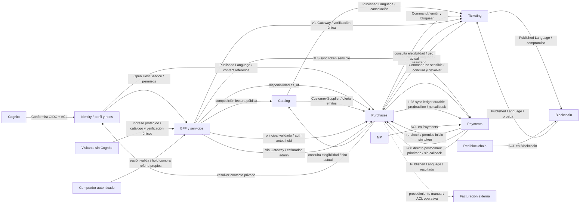

# Entralo V1 — Context Map

- **Lifecycle status:** `draft`; **estado de revisión:** `revision-needed`; shared context `planning`, validación anterior invalidada por D-AUTH-01.
- **Fecha:** 2026-10-01; owner Planner; delta UNKNOWN/timestamp aprobado por usuario, propuesta pendiente revalidación/aprobación de plan.
- Base: [landscape](system-landscape.md), brief R-01–R-12; contratos macro [integration-map](integration-map.md). No modelo físico ni contrato implementable.

## 1. Bounded contexts, lenguaje y ownership

| Contexto | Lenguaje ubicuo propio | Owner funcional / técnico propuesto | No posee |
|---|---|---|---|
| Identity | Perfil, sujeto, asignación, permiso | Operación/producto / responsable Identity | Credenciales Cognito, órdenes, identidad del titular fiscal |
| Catalog | Evento, localidad/tipo, oferta versionada, capacidad configurada, clasificación fiscal, hito | Operación eventos / responsable Catalog | Holds/disponibilidad fuerte, venta, pago |
| Purchases+Inventory | Orden, reserva, gracia, cupo efectivo, saga, elegibilidad, autorización, solicitud fiscal | Ventas/SUPPORT / responsable Purchases | Estado monetario MP canónico, QR/uso, confirmación cadena |
| Payments | Intención de pago, observación MP, transacción, ejecución de refund, conciliación | Operación financiera / responsable Payments | Elegibilidad SUPPORT, stock, emisión |
| Ticketing+Validation | Conjunto de emisión, boleta, secreto QR, uso, bloqueo de acceso | Operación acceso / responsable Ticketing | Ledger MP, cupo, prueba confirmada |
| Blockchain Proof | Compromiso, hoja, lote, raíz candidata, envío, confirmación | Producto/seguridad / responsable Blockchain | QR/preimagen, PII, vigencia de boleta |

`order_id` correlaciona sin compartir entidad Order. `payment_status` es una observación de Payments; `order_status` y reserva son estados distintos de Purchases. `ticket_status` operativo no es `proof_status`; `refund_authorized` no significa desembolso confirmado. Capacidad configurada Catalog no es cantidad disponible de Purchases. DTOs/schema de Published Language no son modelo de dominio compartido.

**D-AUTH-01 / identidad y propiedad:** Identity resuelve el vínculo validado `issuer+sub` a `userId` estable de cuenta; `subject_id` opaco usado en contratos representa esa misma identidad, no session_id ni otra cuenta paralela. Purchases posee owner inmutable del hold/orden/compra y solicitud, así como contador `userId+event_id`. BFF autentica, owners verifican propiedad; cliente no asigna owner. Catalog sigue ofreciendo eventos públicos sin sesión y no crea hold; login tampoco reserva. Compra/refund requieren cuenta propia autenticada, no identidad del titular de tarjeta.

## 2. Relaciones DDD y dirección de autoridad

Sync fases disjuntas: inicio I-24 Payments→Purchases antes MP; notificación I-08 Payments→Purchases **tras commit** sin locks/callback; recuperación I-28 Purchases→Payments ledger sin MP/I-24/I-08 sync callback. Receptor I-08 no llama I-28 durante request (consulta sólo job separado tras resolver incertidumbre), I-24 no I-08/I-28. Grafo servicios bidireccional no DAG global, call graphs por fase acíclicos; CI prohíbe callbacks recursivos. BFF/owners hechos Identity/Catalog/Ticketing sin dominio/JPA/Shared Kernel ni cross-DB locks, motor PRICE-01 único.

| Upstream → downstream | Relación / propietario de contrato | Traducción / adaptación / conflictos |
|---|---|---|
| Cognito → BFF/Identity/backend | Conformist OIDC+ACL; plataforma app clients | Identity upsert issuer+sub→UUID onboarding/login/refresh antes sesión operable; BFF assertion firmadaTTL60s/token-hash/issuer/sub/userId/audience/version, owner valida; cero Identity sync por hold fresh/cache mapping no grants. Suspensión/recreación sin adoptar órdenes; propuesta §7.1 |
| Identity → servicios/BFF | Open Host Service + Published Language, proveedor Identity | Consumers mantienen identificador de sujeto; grants sensibles actuales server-side; indisponibilidad niega mutaciones privilegiadas |
| Identity → Purchases | Published Language contact reference versionado I-23; owner Identity | Sin correo/teléfono en SQS; resolución privada de contacto verificado actual para avisos, resync ante hueco, caída deja aviso pendiente |
| Catalog/Purchases → BFF | Open Host Service lecturas de canal I-21; cada owner su contrato | Composición paralela oferta+disponibilidad fechada; UNKNOWN si falta Purchases, no comprar desde cache/capacidad Catalog |
| BFF → Payments → Purchases | Sync sensible I-07 y re-check/permiso inicio no sensible I-24; Payments/Purchases owners | Token sólo TLS/memoria Payments, nunca cola/DB; monto lo devuelve autorización Purchases, resultado/key no sensible al canal; gate linealizable evento+reserva/fence fija precedencia contra CLOSING, no cache |
| Catalog/Ticketing → Purchases | Open Host Service hechos de elegibilidad I-22; owners de hito/uso | Purchases único decisor refund; read contracts de hechos/version/as_of I-22, sin decisión remota/callback sync; revalida hito y guard Ticketing fuerte, no cache |
| Visitante → BFF → Ticketing | Open Host Service verificación única I-25; owner Ticketing, BFF superficie pública | Sin Cognito comprador; ingreso BFF y Gateway protegidos, service identity pública limitada, WAF/rate limit/uniformidad; proof view async local, ningún acceso público directo alternativo |
| Catalog/Purchases pricing → BFF admin | Open Host Service estimador I-27; Purchases motor, Catalog términos | BFF compone lecturas independientes, Catalog no llama sync Purchases; query sin efecto/PRICE-01/version única, costos incompletos explícitos |
| Catalog → Purchases | Customer-Supplier; Catalog gobierna oferta/hitos, Purchases contrato de aplicación de inventario | Snapshot inmutable versionado; menor versión ignorada, hueco bloquea transición afectada y solicita resync. ACK de capacidad/oferta antes de activar venta |
| Catalog → Ticketing | Published Language; Catalog gobierna cancelación/cambios | Proyección evento para acceso; cancelación se serializa contra uso con guard de evento local; bloqueo administrativo fuerte según §3 |
| Purchases → Payments | Customer-Supplier + Published Language comandos, Purchases coordina | Payments ACL traduce a MP; no decide elegibilidad ni recrea stock. Cambios de comando requieren compatibilidad de ambos |
| Payments → Purchases | Published Language I-08 directo prioritario+SQS recuperación/I-28 ledger, Payments owner evidencia sin signer JWS | MP approval<grace tiempo comercial/Payments commit evidencia+outbox/IAM-TLS. Purchases reconcilia CAS-stock<deadline/obligación con reloj nuevo tras locks; **accepted_at post-grace permitido**. Sin confirmación al deadline release, approval después del deadline o release sin decisión durable previa R-04/no reconsumo; no clock host como autorización tardía. D-SAR01-CA04 «sí, dale la opción A» aprobada/aplicada brief y §5.2; raw−1ms no venta automática, revisión independiente pendiente |
| Purchases → Ticketing | Customer-Supplier comandos + Open Host Service lectura de resultado | Venta válida MP autoriza entrega durable; Ticketing deduplica, resultado confirma entrega no corte comercial; bloqueo precede compensación |
| Ticketing → Purchases | Published Language resultado; Ticketing owner | Confirmación/ausencia terminal, usos/bloqueos como evidencia; no confiar en timeout como ausencia de emisión |
| Ticketing → Blockchain | Customer-Supplier + Published Language compromiso; Ticketing owner del hecho de emisión | Blockchain nunca recibe preimagen/QR/PII; obligación por emisión permanece aunque se anule/refunde luego |
| Blockchain → Ticketing | Published Language estado de prueba; Blockchain owner | Copia eventual con fecha; no transforma estado operativo ni concede acceso |
| MP → Payments | ACL en infraestructura Payments | Autenticidad/deduplicación webhooks y consultas canónicas; raw MP no entra al dominio |
| Cadena → Blockchain | ACL en infraestructura Blockchain | Traduce tx/finalidad/reorg; proveedor/red por decidir, pending no equivale confirmed |
| Externo fiscal ↔ operación/Purchases | ACL operativa manual, sin sync API | Solicitud/evidencia verificadas; no fabricar CUFE ni crear proveedor/servicio fiscal nuevo |

## 3. Resolución de consistencia y lag (propuestas)

**SAR-01/F-E / D-SAR01-CA04 aprobada y aplicada «sí, dale la opción A»:** propuesta§5.2/brief R03/R04/CA03/CA04/source trace autoritativos. MP payment_approved_at<grace es tiempo comercial; Payments evidencia durable/I08 directo postcommit/SQS/I28 recovery margen5s. Purchases reconcilia CAS-stock<deadline+obligación con reloj BD nuevo tras locks: **accepted_at posterior a grace no excluye**. Sin confirmación canónica al deadline release; approval hallado después del deadline o LIBERADA sin decisión durable previa refund R04/no reconsumo. ACK de decisión previa recuperable después, no aceptación nueva; raw MP+299.999+delay2s sin reconciliación previa no venta. No extensión comercial/nuevos pagos; TTL20/grace30/UNKNOWN5m/R07 intactos. M1-AC01…08/locks/crash/failover no ejecutados; revisión independiente pendiente, no plan approval.

- **Fuerte local:** Purchases serializa cupos y contadores cuenta/evento en misma transacción. Ticketing serializa primer uso y estado/bloqueo. Payments protege unicidad pago/orden y refund identity. Identity protege grants. Catalog protege hitos/versiones. Ningún dato crítico tiene dos escritores.
- **D-AUTH-01:** auth válida antes de hold; Purchases verifica disponibilidad y límite default8/orden y8/userId-evento (confirmadas+holds activos/gracia/UNKNOWN) y persiste owner/stock/contador/orden atómicos. Sesiones/dispositivos concurrentes comparten contador. Selección/login no reservan; TTL desde creación hold servidor. Sesión inválida niega nuevas acciones propias; reauth solo mismo owner, sin transferencia ni renovación de created_at/expires_at/grace_end_at/reconciliation_deadline. LIBERADA no revive; conciliación/emisión/refund internos sin sesión abierta. I-24 conserva precheck inmediato de disponibilidad y propiedad para inicio MP; ningún nuevo sync callback/ciclo/contexto.
- **Oferta/capacidad:** Catalog solicita cambio con `event_id+offer_version`. Purchases verifica capacidad efectiva >= vendidas+reservadas/gracia; rechazo deja propuesta no activada. Catalog publica versión sólo después del ACK. Reserva valida oferta activa en Purchases; no usar réplica obsoleta para cobro. No reducir aforo por debajo de obligaciones existentes.
- **Cancelación/fin ventas H-A/H-C:** Catalog intención/hito; Purchases close_requested durable→advisory tx shared admisión/exclusivo try drenaje→barrera/version/conjunto, no FOR SHARE gate/fairness inferida/red bajo lock. CAS orden previa: approval<corte con evidencia canónica/durable reconciliada en Purchases antes de reconciliation_deadline (respuesta MP cruda no basta)/asignación válida acepta compra, entrega posterior; cancelación bloquea uso, no refund masivo. ACK clasifica UNKNOWN hold5min o release/obligación, no entrega/MP completos. R-07 brief actualizado: payment_approved_at proveedor<hito, received_at/accepted_at/issued_at no anterioridad; SUPPORT/ventana/hito servidor intactos.
- **Cambio fecha/lugar:** CLOSING CHANGE_DATE_PLACE pausa nuevas reservas/inicios de pago, resuelve permisos previos dentro del mismo plazo, aplica versión/ACK y reabre sin Cancelado ni refund automático. **Tickets existentes no se bloquean/anulan ni pierden uso por cambio/CLOSING**; estado/uso/guard individual gobierna. H-2 aplica semántica cerrada también aquí: pago confirmado admisible completa compra, no compensación por barrera. Hito UTC/ms y ventana del brief intactos, I-22 hito actual/uso y guard fuerte, snapshots previos inmutables.
- **Deadline/carrera externa D-UNKNOWN-01 aprobada «sí, la B»2026-10-01:** UNKNOWN al grace_end_at hold **máximo5min no renovables solo conciliación**, reconciliation_deadline=grace_end_at+5m/consulta MP durante ventana; no nuevo inicio/pago/venta al cutoff. Approved con evidencia canónica/durable reconciliada en Purchases antes del deadline (respuesta MP cruda no basta)/approval<corte/asignación válida acepta compra; failed/declined libera; UNKNOWN al deadline libera y concilia. Confirmación igual/posterior deadline no venta pendiente aunque liberador demore. Tras LIBERADA cualquier approval aun previo→R-04 original/aviso/incidente, cero reconsumo/R-07. Venta aceptada mantiene emisión post-corte/deadline: 3 intentos1/5/25s timeout10s, tercer fallo definitivo refund, latencia sola no; ACK incierto consulta/cierra mismo resultado sin cuarto intento.15s técnico no tolerancia5min. Integration §4/ADR004, delta pendiente revalidación.
- **Emisión/compensación:** protocolo de cierre por orden en Ticketing impide emitir/activar después de aborto; consultar resultado durable e invalidar antes de confirmar compensación. Uso y bloqueo de refund se serializan; conflicto de boleta usada impide autorización por cambio, no por cancelación. Detalle en integration-map §4–5.
- **F-01/F-02 técnicos, pendientes revalidación:** polling MP corte+0/5/15/30/60/120/240/300s y webhook→consulta/conciliación idempotencia; primer poll no define cierre, deadline exacto+300s libera sin esperar red si no hay aprobación admisible con evidencia canónica/durable reconciliada en Purchases antes del deadline (respuesta MP cruda no basta). Después cada5min, late approved refund sin reconsumo. Sólo emisión máximo3/+1/5/25s/base durable única/timeout10s/no solapamiento: transient probado sin efecto retry; non-retryable definitivo cierre+ausencia probada/refund sin esperar retries; incierto emissionId/guard/tombstone antes retry/refund, ISSUED recupera/cero false refund. Agotamiento definitivo/imposibilidad comprobada cierre/R-04. F01-AC1–3/F02-AC1–6 integration §§3.1/4.2 complementan CM-09; no nuevos boundaries/ciclos ni aprobación humana solicitada.
- **Lag normal propuesto:** proyecciones de oferta/hitos/prueba p95 <=30 s; no SLA confirmado. Lectura de disponibilidad eventual muestra `as_of`; nunca usa ese lag para autorizar reserva, cancelación o refund. Desfase >60 s: alerta y resync; guard crítico niega operación incierta.
- **Datos duplicados:** Purchases conserva precio/fiscalidad aplicados a orden por auditoría, no los sobrescribe con catálogo actual. Ticketing conserva sólo atributos mínimos de emisión; Blockchain sólo compromiso/metadatos técnicos necesarios; Identity no recibe titular fiscal. Copias de estado incluyen versión y reconciliación por owner; no last-write-wins por timestamp de máquinas distintas.

## 4. Consistencia financiera y fiscal

Purchases conserva un ledger de intención/snapshot comercial y autorización; Payments conserva ledger de interacción/resultado externo; MP es autoridad monetaria. Reconciliar identificadores y montos, no fusionar tablas ni confundir devolución autorizada con confirmada. Una orden/una transacción MP; una devolución total y ajustes distinguibles según R-08. Cancelación exige solicitud/SUPPORT, salvo automatismos R-04. Purchases posee coordinación de nota crédito manual si la orden estaba facturada; no llamar una API inexistente.

**R-7 / P-04 ownership propuesto:** Catalog **autor** de términos/versiones nominal/cargo/fiscalidad/r/F/costos configurados, no autoridad de total cobrado. Purchases posee **motor único de precio/fee/margen**, quote canónico, snapshot inmutable por línea/orden y cálculo refund sobre snapshot. Payments valida amount/currency contra autorización Purchases y conserva costo MP real reconciliado. Calculadora admin/BFF compone términos Catalog + query privada Purchases I-27 con escenarios1/8 boletas/lotes1/10/100; Purchases valida términos autoritativos Catalog, nunca callback inverso. Respuesta estimada/no contratación, no biblioteca domain compartida ni segundo algoritmo React/BFF/Catalog.

**Regla única P de redondeo PRICE-01:** COP decimal exacto (sin float), scale2, HALF_UP una vez por componente monetario unitario (nominal, cargo base, impuesto configurado de cada componente); total de línea = cantidad × suma de componentes ya redondeados, orden = suma de líneas, nunca redondear de nuevo total ni aplicar porcentaje al total cuando el término es por boleta. Refund nominal R-07 usa importe nominal del snapshot y cantidad/alcance, no términos actuales; automatismos R-04 conservan alcance propio por formalizar sin inventar tratamiento fiscal. Costo MP estimado = round2(r×total_cobrado+F), IVA MP configurado se calcula sobre base configurada y round2; sin tasa supuesta. Margen deriva de mismos importes y costos/versión, no cambia15% ni cobra recargo. Quote con pricing_engine_version/rounding_policy_version/terms_version y estimator inputs; persistir en compra. Compatibilidad scale2/precision MP se verifica DR-05 antes cerrar PRICE-01, no regla fiscal adjudicada; si exige otra unidad monetaria, elevar sólo precisión afectada y actualizar motor/estimador juntos. Falta costos reales muestra estimación incompleta, no bloqueo por margen ficticio; déficit real dispara Q-C03 según brief. AC PRICE-01: mismo escenario/version produce mismos componentes/total/margen en calculadora y checkout, COP100000→cargo15000 antes impuesto configurado; empate de fracción HALF_UP, refund snapshot tras cambio no deriva ni excede cobrado. P-04/diseño humano pendiente.

## 5. Acceptance criteria arquitectónicos

- CM-01: cada dato del landscape tiene un único escritor; ninguna relación requiere FK/join remoto o import de entidades/domain de otro servicio.
- CM-02: replay de oferta/hito viejo no revierte versión; hueco/resync y ACK faltante no habilitan venta ni cancelación falsamente confirmada.
- CM-03: carreras uso/refund y emisión/aborto se serializan en Ticketing; compensación no deja boleta activa ni posterior emisión por mensaje atrasado.
- CM-04: caída de Identity niega autorización privilegiada; caída cadena no impide vender/usar una boleta operativamente vigente.
- CM-05: roles/upstream/downstream de diagrama y tabla coinciden; no shared kernel oculto ni fuente dual financiera/fiscal.
- CM-06: antes de implementación se define schema/índices/nullability/retención/contratos por servicio; estas matrices no se toman como migrations aprobadas.
- CM-07 (RES-07): diagramas/tablas I-21–28, token sensible sólo sync/verificación pública Ticketing; fases I-24/I-08/I-28 disjuntas. **Prueba futura de contrato y traza obligatoria:** request I-08 no dispara I-28/I-24; I-28 sólo lee ledger Payments, sin MP ni callback I-08/I-24; I-24 no dispara I-08/I-28. Cero llamadas y spans descendientes prohibidos, incluidos duplicados/timeout/ACK perdido. I-28 sólo job independiente tras finalizar el request, conservando key/deadline/fence. Coincide con PLAN-04/PLAN-04-RES07; no claim DAG global ni pruebas ejecutadas ni lectura pública Blockchain.
- CM-08: motor Purchases único, precio/refund snapshot y estimator no divergen bajo PRICE-01; módulos/worker no saltan ownership (§6).
- CM-09: H2-01–06/UNKNOWN-01–04/TIME-01–03 prueban approval previo con evidencia canónica/durable reconciliada en Purchases antes del deadline (respuesta MP cruda no basta)/venta aceptada/emisión posterior, tercer fallo definitivo refund3/hold5min no renovable/release/late discovery R-04 sin reconsumo y timestamp proveedor R-07 sin fallback local. HC/HB conservados; delta aprobado por usuario pendiente revalidación independiente, no pruebas runtime ni plan aprobado.
- CM-10: AUTH-01–06 y CA-AUTH-01 prueban catálogo sin sesión, cero hold/pago/solicitud sin auth o con owner ajeno, límite8 por userId agregado concurrente y reauth mismo owner sin transferir/renovar; login no consume stock/inicia TTL y disponibilidad se revalida. H2 requiere hold propio autenticado; no agregar servicio ni Shared Kernel de identidad.

**CM-11/SAR:** evidencia Payments durable sin JWS/I-08 prioritario y CAS-stock clock_timestamp<deadline, release local/margen5s/D-SAR01-CA04 aprobada funcionalmente por usuario/propagada al brief, no plan approval; freshness60/proactive30s/deps quotas+budget; SES policies IAM/HTTPS/envelope/dedup/DLQs no cert fetch; único token interno aserción principal/no grant admisión; docs3MB/body4MB/fiscal grande externo referenciado sin ALB/stream; pública proof_as_of minuto/sin metadata pre-gate, emisión offsets segundos/35snominal/p95. I1/I2 conservados, propuesta§§5.2/7.1/9/17 canónica/ADRsproposed/draft/re-review/approval pendiente.

## 6. Purchases modular hexagonal y workers (R-8)

Propuesta dentro del **mismo** bounded context, no nuevos microservicios: `inventory` dueño cupos/holds/contadores, `ordering` orden/snapshot, `pricing` motor puro PRICE-01, `purchase-saga` process manager/intenciones, `refunds` elegibilidad/autorización, `documents-fiscal` PDF/registro externo, `notifications` obligaciones de aviso. Cada módulo domain/application/infrastructure; application sólo ports, dominio puro Kotlin, sin ORM/HTTP/SQS. Inventory+ordering cooperan por puertos/use cases y transacción local del agregado, no repositorios de otros módulos desde controllers. Pricing no conoce MP SDK ni fiscal oficial externa. Saga usa puertos hacia owners, no manda escribir sus tablas; notifications no decide estado comercial.

API de reserva/orden con pool/capacidad protegidos; workers de saga/corte, refund, documentos/fiscal y avisos separados como deployments/capacidad/IAM/colas dentro del repo Purchases. Workers llaman mismos use cases, no SQL directo ni god facade; pools y réplicas suman presupuesto DB máximo. Avisos/PDF lentos no consumen budget crítico de reserva/corte, cola de refund aislada mantiene SLA. Adapter/ACL externos y Command no sensible por obligación real; enums/transiciones explícitas, no jerarquías State/Strategy fiscal sin variantes reales. AC MOD-01: test de dependencias sin infraestructura en dominio ni imports de dominio remoto; MOD-02: saturar avisos/documentos no bloquea reserva/corte/refund ni hace negativo stock; MOD-03: crash worker reanuda job con misma key/fencing y no duplica efecto; MOD-04: ningún módulo comparte entidad Order con Payments/Ticketing.
