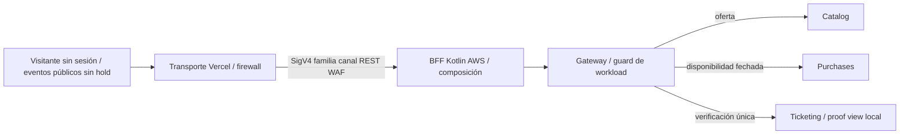
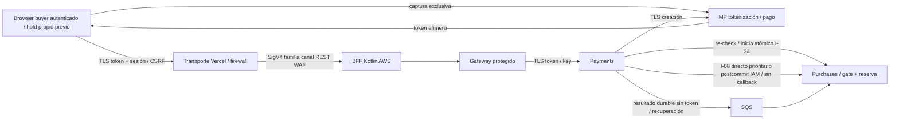
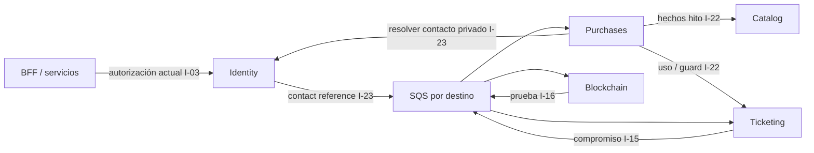
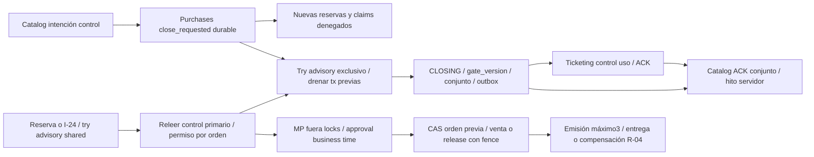

# Entralo V1 — mapa y protocolos de integración propuestos

- **Lifecycle status:** `draft`; **estado de revisión:** `revision-needed`; contexto activo `planning`; fecha 2026-10-01; owner Planner. D-AUTH-01 incorporado como delta sustantivo de flujo, validación anterior invalidada hasta nueva revisión. F-01/F-02 y D-UNKNOWN-01/D-TIME-01 conservados; no plan aprobado.
- Alcance macro enterprise. Hallazgos independientes del Solution Architect B-1–B-3/R-1–R-9 recibidos vía usuario y corregidos en propuesta; nueva revisión independiente de Spec Validator pendiente. No contratos OpenAPI/event schemas ejecutables ni aprobación de plan.
- Fuentes: [brief](../specs/requirements/entralo-v1-requirements-brief.md) R-03–R-12/§13.C; [landscape](system-landscape.md); [context-map](context-map.md); ADR-002/004/005. Valores del brief se conservan; nuevos budgets/SLO/SQS son **propuestas P**.
- Selecciones [propuesta maestra](architecture-proposal.md) P1–P8/§7: transporte Vercel Node mínimo same-origin→IAM REST/WAF→BFF Kotlin AWS/DynamoDB→familia owner IAM distinta, owner valida token Cognito adicional; público sin login no significa sin workload. Contratos macro siguen draft, no OpenAPI ejecutable.

## 1. Reglas de transporte y contratos

SQS **Standard default**: entrega al menos una vez y posible desorden. Colas por destinatario/protocolo, no todos los consumers en una cola para broadcast (compiten, no reciben todos). **FIFO sólo si se demuestra orden estricto por orden**: `MessageGroupId=order_id`, `MessageDeduplicationId=event_id`, ventana de dedup SQS 5 min **no** reemplaza inbox/idempotencia de aplicación. Se propone resolver con guards/versiones y Standard incluso emisión/aborto; FIFO sería alternativa documentada, no requisito universal.

SNS/EventBridge no seleccionados para bus interno V1; outbox por destino para hitos/emisión. **F-B excepción justificada:** SES configuration set delivery/bounce/complaint→SNS topic dedicado→SQS `purchases-ses-events`, no SES directo SQS. No EventBridge ni fanout interno adicional; contrato §2.3.

Envelope macro propuesto `IntegrationEnvelopeV1`: `event_id` UUID no nulo estable, `type` string no vacío, `schema_version` integer=1, `producer` enum de seis servicios, `aggregate_id` UUID opaco, `aggregate_version` int64 >=1, `occurred_at` timestamp UTC/ms, `correlation_id` UUID, `causation_id` UUID opcional, `traceparent` W3C opcional, `payload` objeto por tipo. No ids/tokens de tarjeta, QR/preimagen, PII ni URLs prefirmadas en envelope. Mensajes internos pueden correlacionar `order_id`/`refund_id` con IAM/cifrado/restricción; jamás publicarlos como proof.

Cada productor futuro posee schema versionado en su repo; canonical path propuesto `docs/contracts/events/<Type>.v1.schema.json`. **No existe aún ninguno**: payload de la tabla es un mínimo para diseñar, no permiso de omitir required/nullability/validaciones/security/ejemplos en el contrato final. `event_id` identifica entrega; business key deduplica efecto aun con distinto `event_id`. Inbox único `(consumer,event_id)` + restricciones por business key; reuse de key con payload distinto = conflicto/incidente, no overwrite. Para órdenes, conservar dedup `order_id+tipo_evento+versión` del brief; otros agregados usan su id/version, sin fabricar order_id para catálogo.

Outbox transaccional + registro durable de entregas por destino; marcar publicado sólo tras ACK transporte, crash antes de ACK provoca duplicado seguro. Consumer confirma efecto+inbox+respuesta outbox en transacción local y elimina SQS **después** del commit. Fallo externo no se incluye en transacción DB: persiste intención, identidad estable, consulta/reconcilia resultado y luego transición. Versiones viejas no regresan estado; huecos generan resync o retry diferido. Mensaje inválido/quarantined nunca marca operación como exitosa.

## 2. Catálogo de canales macro

Colas lógicas propuestas llevan prefijo de entorno `entralo-{env}-`; nombres siguientes sin prefijo para legibilidad. Cada fila usa envelope §1, retry §3, seguridad IAM/SSE-KMS, consumer owner del servicio receptor. Las respuestas regresan a cola de resultados propia, no RPC sobre conexión bloqueada.

Envelope/SSE/SQS sólo aplican filas async; HTTP sync usa DTO conceptual y TLS/service identity, no envelope ni cola ficticia. Catálogo/detalle de eventos públicos y verificación no requieren sesión/token Cognito comprador; crear/operar hold, compra/pago y solicitud de refund sí requieren cuenta autenticada propia antes de cualquier efecto (D-AUTH-01, §2.2). Cuenta/staff y comunicación privada exigen sus identidades/autorizaciones según ADR002/003. El diagrama abstrae ingreso protegido, no abre servicios públicos alternativos.

| ID / tipo / trigger | Producer → consumer; cola / esquema mínimo | Idempotencia y consistencia / compensación | Señal éxito / fallo |
|---|---|---|---|
| I-01 sync canal | React → transporte Vercel → Gateway familia canal → BFF → Gateway familia owner → servicio; OpenAPI futuro | Lectura pública sin sesión; hold/compra/refund con sesión+CSRF y principal/propiedad server-side §2.2, auth antes hold. Key scoped userId+operation+key cliente/payload, no session_id. Sin retry ciego de mutación; BFF no decide saga/stock/límites | `api_request_duration_seconds`, `api_request_total{outcome}`, `buyer_action_authorization_total{action,outcome}` |
| I-02 sync OIDC | BFF ↔ Cognito login/refresh/logout; protocolo OIDC, no endpoint Entralo definido aquí | Code+PKCE/state/nonce; canje de code incierto reinicia auth, no sesión parcial. Logout revoca sesión local incluso si remoto cae | `bff_auth_total{outcome}`, `bff_session_refresh_total{outcome}` |
| I-03 sync autorización/mapping | BFF/servicio → Identity; issuer/sub, sujeto, acción, recurso/evento | Mapping idempotente issuer+sub en onboarding/login/refresh antes sesión operable, no lookup Identity en cada hold con principal firmado fresh. Grants privilegiados actuales fail-closed, cache mapping no grants; lifecycle/budgets propuesta §7.1. Sin cookies canal Identity | `authorization_decision_total{outcome}`, `identity_binding_total{outcome}`, `identity_lookup_failure_total` |
| I-04 event oferta | Catalog → Purchases; `purchases-catalog`, `OfferChangeRequestedV1`: event/offer_version, localidades, capacidades, límites, precio y fiscalidad versionados | `event_id+offer_version`; ACK/rechazo `OfferAppliedV1`/`OfferRejectedV1` a `catalog-results`. Rechazo no publica ni reduce cupos por debajo de obligaciones | `offer_apply_total{outcome}`, `offer_pending_age_seconds` |
| I-05 barrier control evento | Catalog→Purchases purchases-catalog y Ticketing ticketing-event-controls; CloseEventRequestedV1 event/closure/version/kind, ACK Purchases gate_version/conjunto | event+closure+destino; gate corta nuevos inicios. Permiso previo approval<grace/evidencia durable reconciliada CAS Purchases<deadline stock/asignación/fence válidos; accepted_at post-grace permitido, sin comparar clocks. Sin reconciliación previa al deadline o release→refund no reconsumo. Emisión posterior sin cutoff físico. D-SAR01-CA04 aprobada/aplicada; raw−1ms no basta. Cancel bloquea uso, cambio no; ACK/hito/UNKNOWN §5.0 | event_close_total/event_close_pending_age_seconds/payment_start_gate_total |
| I-06 event hito | Catalog → Purchases/Ticketing mismas colas; `EventMilestoneRecordedV1`: event_id, milestone_id, version, kind, recorded_at | `event_id+milestone_id+version`; replay no cambia tiempo/hito; resync ante hueco. Cancelación ya tiene barrera I-05; cambio requiere última versión para refund | `milestone_apply_total{outcome}`, `projection_lag_seconds{context}` |
| I-07 sync pago sensible | Browser autenticado tokeniza con MP → BFF → Payments vía Gateway TLS; `CreateCardPayment` conceptual: order_id, payment_intent_id, token MP efímero, authorization_version; principal validado separado del payload. Payments consulta autorización/monto/owner Purchases I-24, no confía en monto/userId browser | Sesión buyer válida y mismo userId propietario antes inicio MP; ausencia/owner ajeno deniega sin cobro ni mutar hold. Key estable por order/payment_intent, scoped owner. Sin token en DB/outbox/SQS/DLQ/vault/trace. Un envío inicial, incierto consulta identidad; no retry nuevo token/segundo pago. Conciliación interna I-08 no exige sesión abierta | `payment_create_total{outcome}`, `payment_uncertain_age_seconds`, `sensitive_payload_leak_total` (0) |
| I-08 sync prioritario+event recuperación pago | Payments → Purchases privado IAM/SigV4/TLS **tras commit**; respaldo `purchases-payment-results`, `PaymentObservedV1`/`CanonicalPaymentFactV1`: order/intent/evidence_id/version, estado/payment_approved_at proveedor, auditoría observed_at/canonical_confirmed_at, amount/currency/deadlines I-24/fence/hash; **sin JWS/kid/firma propia** | intent+observation_version/payload hash. Approval<grace/durable, directo budget3s/connect1s/1 retry seguro dentro3s y restante/misma key; ACK perdido recuperar decisión por key, I-28 job separado. SQS outbox/inbox productor exclusivo Payments IAM/SSE-KMS; duplicado no nueva decisión. Purchases locks primero/reloj BD nuevo/CAS reconciliación<deadline+stock+obligación: **accepted_at post-grace válido**, provider approval es tiempo comercial. Sin confirmación canónica al deadline libera; approval encontrado después del deadline o release sin decisión durable previa R-04/no reconsumo. Sin comparar reloj Payments ni venta por raw respuesta. D-SAR01-CA04 aprobada «sí, dale la opción A», aplicada §5.2/brief CA-04. Fallo final de directo/SQS conserva obligación I-28/conciliación/refund, nunca nuevo pago | `payment_evidence_to_acceptance_seconds`, `payment_predeadline_delivery_missed_total`, `purchase_acceptance_total{outcome}`, `payment_canonical_evidence_recorded_total` |
| I-09 webhook+sync MP | MP → Payments vía Gateway ruta exclusiva sin auth Cognito; Payments → API MP para crear/consultar/devolver | Firma/autenticidad/replay conforme contrato oficial futuro; notificación dedup durable antes de ACK exitoso. Notificación es trigger para consulta, no autoridad de estado. No contrato/tarifa reales inventados DR-05 | `mp_webhook_total{outcome}`, `mp_request_total{operation,outcome}`, `mp_reconciliation_mismatch_total` |
| I-10 command emisión | Purchases → Ticketing; `ticketing-commands`, `IssueTicketsRequestedV1`: order_id, issuance_id, authorization_version, event_id, líneas/quantity, subject_id opaco, purchased_at, payment_approved_at, payment_start_fence, sale_gate_version, accepted_at, grace_end_at, reconciliation_deadline, referencia de confirmación canónica/decisión durable, sale_authorization_version, attempt_number | `order_id` conjunto único y `(order_id,line_id,ordinal)` ticket único; venta admisible §4, purchased_at=payment_approved_at, sin deadline físico de emisión. Tres intentos totales/issuance_id sin reset SQS/restart; autorización/decisión previa válida continúa después del deadline, fence terminal de release/compensación prevalece. Resultado a purchases-ticket-results; jamás issue de venta nueva al cutoff | `ticket_issue_total{outcome}`, `ticket_duplicate_effect_total` (0), `ticket_sale_authorization_rejected_total` |
| I-11 command cierre/refund | Purchases → Ticketing; `ticketing-commands`, `CloseIssuanceRequestedV1`/`BlockTicketsForRefundV1`: order_id, issuance_id/refund_id, control_version, motivo, alcance | Tombstone durable por orden evita emisión posterior; bloqueo+uso serializados. Resultado terminal/used conflict a `purchases-ticket-results`; no timeout tomado como ausencia | `issuance_close_total{outcome}`, `ticket_refund_guard_total{outcome}` |
| I-12 event emisión/guard | Ticketing → Purchases; `purchases-ticket-results`, `TicketsIssuedV1`/`IssuanceClosedV1`/`RefundGuardAppliedV1`: order_id, ids opacos, issuance/refund_id, version, estado guard, timestamp | `order_id+tipo+version`; resultado durable consulta/resync confirma entrega, no validez temporal de venta; refund sólo guard positivo/ausencia cerrada | `purchase_saga_transition_total{transition}`, `saga_stalled_age_seconds` |
| I-13 command refund | Purchases → Payments; `payments-refunds`, `ExecuteRefundRequestedV1`: order_id, refund_id, motivo, scope/adjustment_id, amount COP, authorized_at, authority, original payment reference | `order_id+motivo+alcance/ajuste_id`; clave MP derivada refund_id. Un total/order, ajustes distintos. Refund original, incierto consultar antes retry, sin medios alternativos | `refund_initiated_at` (auditoría), `refund_initiation_sla_breach_total` (0) |
| I-14 event refund | Payments → Purchases; `purchases-payment-results`, `RefundObservedV1`: refund_id, observation_version, state, initiated_at/confirmed_at según resultado, external reference interna | `refund_id+version`; marca monetaria no elegibilidad. Purchases ordena estado operativo final Ticketing y nota crédito externa; no reembolsar de nuevo ante ACK perdido | `refund_confirmed_at`, `refund_failed_final` (auditoría/eventos), `refund_observation_total{outcome}` |
| I-15 event anclaje | Ticketing → Blockchain; `blockchain-emissions`, `EmissionCommittedV1`: emission_id, proof_version, opaque ticket proof reference, commitment, algorithm_version, issued_at | `emission_id+proof_version`; sin QR/preimage/PII/order/payment refs. Outbox independiente destino Purchases y Blockchain; fallo cadena no revierte emisión; obligación durable §6 | `anchor_obligation_total{outcome}`, `anchor_pending_age_seconds` |
| I-16 sync+event cadena | Blockchain→proveedor/resultado Ticketing ticketing-proof-results; ProofStatusObservedV1 proof_reference/batch_id/state/observed_at/metadata confirmación **sólo interna** | batch+anchor_attempt, consulta tx antes reenviar/pending hasta finalidad/reorg pending; no compensación monetaria/exactly-one-tx. SAR10 I25 **no expone** batch/tx/hash/leaf/root/proof/finetime/metadata pre-gate, sólo allowlist §6 | anchor_submit_total/anchor_confirmation_total |
| I-17 files / imágenes excepción bytes H-B | Catalog presigned POST quarantine<=5min/10MiB/content-length-range vía metadata API; browser→S3 sin BFF. Approved-public noPII CloudFront OAC/WAF, privado sólo restricción/Catalog signer. Purchases documento pequeño autenticado Gateway/BFF | asset+version+upload_intent_id/document+version; archivo<=3MB/body<=4MB por dirección/Vercel4.5MB decimal/overhead incluido;10s owner/15s canal/range/GET1 retry antes bytes. Copia fiscal **opcional** AV/quarantine/finalize key/checksum/version, job5intentos1/2/4/8/16min10s/cleanup temporal24h/final incidente. >cap413 antes buffer, original fiscal permanece externo y evidencia referenciada I-19. Sin ALB público/stream4–25MB/grant/presign fiscal/redirect ni rollback compra. Propuesta §9 SAR-02/12 | `object_finalize_total{owner,outcome}`, `object_scan_total{outcome}`, `private_document_access_total{outcome}`, `private_document_size_rejected_total` |
| I-18 aviso/job y feedback SES P | Purchases→SES notification_id/tipo/subject-order/template_version; SES config→SNS→SQS purchases-ses-events→Purchases ACL envelope proveedor §2.3 | order+tipo+version/10s/5intentos1/2/4/8/16min/budget<=70% real-reserva auth. Feedback SAR-06 queue/topic policies source exacta/IAM/HTTPS/Notification TopicArn allowlist/schema/dedup mail.messageId+eventType, sin fetch cert.4d/DLQ14d/receive5/subscriptionDLQ. Bounce/complaint suprime/no resend/no rollback/ACK no exactly-once; sin PDF/URL S3 email | notification_delivery_total/notification_dead_total/ses_quota_utilization_ratio/ses_event_ingestion_total/ses_event_authenticity_rejected_total |
| I-19 operación manual fiscal | Comprador solicita→Purchases; operación emite/envía en externo manual; registra reference/CUFE verificados + localizador opaco expediente externo **protegido**, resultado/responsable/instante verificación; adjunto<=3MB opcional I-17 | invoice_request_id/order+request_version. Permiso operación actual/owner, evidencia externa comprobada antes EMITIDA_Y_ENVIADA; no fetch automático/URL bearer ni API fiscal. Falta verificación ERROR_PENDIENTE/revisión diaria/corrección/escalado, sin retry automatizado proveedor. Archivo>cap no upload Entralo V1 ni obligación perdida. Refund facturado obligación nota crédito externa; no rollback ni CUFE inventado. DOC-SAR02/CA-09 | `external_invoice_pending_age_seconds`, `external_invoice_review_total{outcome}` |
| I-20 scheduled durable jobs | Cada owner → su DB/jobs: expiración Purchases, reconciliación Payments, lote Blockchain, revisión fiscal/avisos Purchases | `(job_type,aggregate_id,due_at/version)` único; lease recuperable, checkpoint, claim concurrente; restart procesa vencidos. Efectos usan claves anteriores, compensaciones según flujo | `durable_job_total{type,outcome}`, `durable_job_overdue_seconds` |
| I-21 sync catalog-read composition | Visitante→BFF→Catalog oferta+Purchases availability; event_id/offer_version/availability_version/as_of e imágenes asset/version/variant/image_visibility. Pública: URL CDN estable sin firma. Privada sólo restricción producto/acceso: Catalog autoriza/firma URL CloudFront<=5min+expires_at, BFF transporta/no-store | Workload read-only, no sesión comprador en catálogo público; rama privada exige principal/grant actual Catalog. Timeout3s/1 retry seguro dentro5s; UNKNOWN availability ante fallo/version mismatch. Bucket siempre privado OAC/WAF; quarantine/unapproved jamás retornados; fallo firma imagen privada deja unavailable/no public fallback, sin rollback lectura. Propuesta §9 F-C | `catalog_composition_total{outcome}`, `availability_read_age_seconds`, `catalog_image_signing_total{outcome}`, `catalog_image_signing_duration_seconds`, `object_capability_issued_total{kind=event_image_download,outcome}`, `catalog_image_delivery_total{visibility,outcome}` |
| I-22 sync elegibilidad | Purchases → Catalog lectura privada de última versión/hito y Ticketing lectura privada estado/uso/guard por orden; trigger consulta/solicitud SUPPORT | Purchases decide elegibilidad; Catalog sólo hechos `event_id, control_kind, control_state, control_version, milestone_id, milestone_kind, recorded_at, milestone_version, as_of`; Ticketing sólo `order_id, ticket/usage_version, used, operational_status, refund_guard_state, as_of`. Cada owner versiona su contrato, service identity y scope lectura, sin callbacks sync a Purchases. Cuenta propia/rol actual, timeout3 s/1 retry dentro5 s; fallo/hueco = no determinada. Autorización revalida hito actual y guard fuerte I-11, no cache ni decisión de Catalog/Ticketing; CLOSING no crea motivo de compensación para compra completada, se espera hito vigente según §5.0. Sin reversión por lectura | `refund_eligibility_total{outcome}`, `refund_eligibility_dependency_failure_total` |
| I-23 event contacto | Identity → Purchases; `purchases-identity`, `ContactReferenceChangedV1`: subject_id opaco, contact_version, canal permitido, verified/available, occurred_at; sin dirección/correo/teléfono en cola | subject_id+contact_version; cambios de perfil/contacto disparan outbox, hueco consulta Identity autorizada/resync. Avisos resuelven contacto verificado actual por API privada (3 s/1 retry); no destino confirmado implica aviso pendiente, 5 intentos1/2/4/8/16 min y incidente, no rollback compra. Contacto queda en Identity | `identity_contact_projection_total{outcome}`, `notification_contact_resolution_total{outcome}` |
| I-24 sync autorización/inicio pago | Payments→Purchases recheck/claim order+intent/principal propio; `PaymentAttempt` incluye amount/currency/snapshot y **grace_end_at/reconciliation_deadline UTC exactos generados BD Purchases**, event_control_version/gate_version/payment_start_fence/start_committed_at | Key intent+order+owner/payload; Purchases transacción gate+reserva+límite/plazo fuerte. Payments conserva deadline exacto, no recalcula ni compara canonical_confirmed_at remoto para venta. Timeout3s consulta claim durable/no MP sin permiso probado. Replay no nuevo permiso/cobro/hold; conciliación independiente sesión. F-E propuesta §5.2 | `payment_authorization_total{outcome}`, `payment_authorization_uncertain_total`, `payment_start_gate_total{outcome}` |
| I-25 sync verificación pública | Visitante→BFFbuyer protegido→Gateway→Ticketing único/identificador opaco/sin Cognito buyer; pública SAR10 allowlist operational_status/proof_status/proof_as_of **minuto UTC** o null sin dato/error y último estado R06 | Workload limitado/read3s/1retry seguro, sin side effect/compensación. No batch/tx/hash/leaf/root/proof/finetime/metadata I16 pre-gate; raw/QR/PII/order-payment nunca. Inválidos uniformes/rate WAF, pending observación fechada/caída503 no vigente inferido. Threat model/acta security-product previa P03/serialization negativos §6 | public_verification_total/proof_view_lag_seconds/verification_unavailable_total |
| I-26 sync uso puerta | BFF admin→Ticketing IAM/TLS+token/aserción principal staff existente, permiso Identity **actual** action/event/device; ticket reference protegida+admission_attempt_id | Sin nuevo grant firmado SAR-06; key attempt+staff/event/device ligada payload. Timeout3s sin retry ciego, consultar resultado key; validación permiso fuera locks y uso único/control actual en tx Ticketing. Denegación/caída no abre torno/cache ni revierte uso confirmado. DOOR-01…04 | `admission_decision_total{outcome}`, `admission_authorization_rejected_total`, `admission_manual_reconciliation_total{outcome}` |
| I-27 sync estimador económico | Admin → BFF admin → Gateway → Purchases pricing; BFF obtiene términos versionados Catalog por lectura independiente, escenarios1/8 boletas/lotes1/10/100; sin tarjeta/PII | Catalog no llama sync a Purchases. Motor único PRICE-01 valida versión/componentes contra términos autoritativos Catalog (lectura privada o snapshot aplicado vigente), cálculo sin efectos, timeout3 s/1 retry lectura dentro budget5 s; terms/engine/rounding version en respuesta. Versión incoherente/datos incompletos explícitos, no precio alterno; sin rollback ni ajuste automático15% | `pricing_estimate_total{outcome}`, `pricing_consistency_mismatch_total` (0) |
| I-28 sync recuperación hecho canónico | Purchases job predeadline→Payments privado IAM/TLS; intent/order/deadline/fence/min_version; respuesta CanonicalPaymentFactV1 durable sin firma propia o estado provisional. Producer Payments, consumer Purchases; job separado, no callback I-08/I-24/MP | Key intent+deadline+fence/version, hash distinto conflicto/incidente. **Máximo2 intentos totales** (inicial+1 retry seguro jitter100–300ms) dentro budget total3s/connect1s y tiempo restante; al agotar registra unavailable/conserva conciliación, sin renovar hold. Prioridad deadline−5s/margen técnico no cutoff anticipado, lease5s/tick1s §3.2; negativo provisional no adelanta release. Payments sólo lee ledger, cero efecto monetario/compensación en esa lectura. Purchases reconcilia evidencia por reloj nuevo/CAS predeadline+stock+obligación; approved_at<grace honra aunque accepted_at post-grace. Sin confirmación canónica al deadline release local sin red; approval hallado después del deadline o release sin decisión durable previa refund R-04 original/no reconsumo. Recuperación de resultado durable previo no nueva venta. D-SAR01-CA04 aprobada/aplicada §5.2, no nuevos pagos | `payment_evidence_snapshot_unavailable_total`, `purchase_acceptance_total{outcome}`, `reservation_release_overdue_seconds`, `payment_released_assignment_refund_total` |

**B-3 corregido:** captura PAN/CVV ocurre sólo en componentes MP; browser obtiene token MP, BFF lo transporta sin persistir, Payments lo recibe sólo por llamada síncrona TLS y lo usa en memoria para crear pago MP. Purchases no recibe token. Eliminar `CreatePaymentRequestedV1` de colas: `payments-commands` sólo admite consultas/reconciliación no sensibles (`ReconcilePaymentRequestedV1`: order_id/payment_intent_id, key intent_id+cycle_version; resultado I-08). Refund I-13 tampoco contiene token. No referencia a vault que permita recuperar token desde mensaje.

Payments persiste intención/key/monto autorizado antes de MP; body logging/data tracing deshabilitado en browser telemetry, Vercel proxy/BFF, WAF muestreo, Gateway, HTTP client, APM, excepciones y auditoría. Allowlist de logs sólo operation/key opaca/outcome/latencia; redacción defensiva de Authorization/cookie/token/headers secretos y bodies MP, sin echo de token en errores. TLS en todos los saltos; Cache-Control no-store, sin querystring sensible. Timeout MP10 s, budget inicial BFF15 s (excepción al normal5 s), sin ciclo de retries en request. Respuesta ofrece payment_intent_id/idempotency key y estado conocido o UNKNOWN consultable, nunca token ni éxito de emisión anticipado. Si el request termina antes/después de MP, reconciliar identidad durable; token perdido no puede recuperarse de cola ni se solicita nuevo cobro automáticamente. Si se prueba ausencia de transacción pero falta token, estado pendiente recuperable/reselección según hold, sin llamarlo pago fallido ni inventar un segundo pago. DR-05 debe verificar búsqueda/idempotencia real del contrato MP antes de ejecución.

### 2.1 Flujos de lectura y pago (alineación C4)

Separados para legibilidad: flechas sólidas HTTP, eventos SQS. Ingreso canal seleccionado P es transporte Vercel firmado→familia REST/WAF→BFF Kotlin; BFF→familia owner REST/IAM distinta. Diagramas abstraen familias, no recursos creados ni loop routing; auth usuario validada adicionalmente en owner ADR002/003.

### 2.3 F-B — ingestión acotada de eventos SES (contrato propuesto)

- **Trigger/payload/ruta/owners:** SES configuration set con Delivery/Bounce/Complaint→SNS Standard `entralo-{env}-ses-events` misma cuenta/región→SQS Standard `entralo-{env}-purchases-ses-events`→ACL worker Purchases. Plataforma owner topic/subscription/IAM/KMS; Purchases owner ingestión, correlación notification_id↔SES `mail.messageId`, suppression y runbook. Envelope SNS Notification con Type/MessageId/TopicArn/Timestamp/SignatureVersion/Signature/SigningCertURL y Message JSON SES: eventType/mail.messageId/configuration-set/tags(notification_id opaco)/bloque delivery,bounce,complaint. No IntegrationEnvelopeV1 impuesto al proveedor. Parse/schema/body<=256KiB, tipos allowlist; no aceptar SubscriptionConfirmation como evento SES ni auto-confirmar URL recibida.
- **Autenticidad SAR-06:** topic policy sólo ses.amazonaws.com Publish SourceAccount+SourceArn configuration-set exactos; queue SendMessage sólo sns.amazonaws.com TopicArn+SourceAccount exactos, revisar identity policies para que **ningún otro rol** publique directamente (incluido redrive no controlado). Consumer IAM lee exclusivamente cola dedicada por HTTPS/TLS/SSE-KMS. RawMessageDelivery=false conserva envelope Type=Notification/TopicArn/account/region allowlist, Message schema SES<=256KiB; no auto SubscriptionConfirmation ni fetch SigningCertURL. Envelope no se toma como prueba por sí solo: políticas/identidad fuente y canal SQS lo autentican. Signature SNS puede conservarse como metadato externo sin protocolo/descarga verificador propio. SNS HTTPS **no elegido**: si futuro receptor HTTPS, firma debe verificarse con validador oficial/cert allowlist/no SSRF y review adicional. Replay hasta retención dedup, no TTL60s.
- **Idempotencia/concurrencia:** inbox SNS MessageId y business key `(mail.messageId,eventType)`; hash payload guardado, conflicto mismo key distinto payload incidente/no overwrite. Recipient outcomes por hash de destino protegido; suppression permanente gana frente Delivery posterior, no last-write-wins por timestamp/desorden. Efecto+inbox+job/outbox local commit antes DeleteMessage, crash/replay un efecto. Eventos no correlacionados quedan job de resolución/alerta, no nueva compra ni reenvío automático. Persistir sólo campos necesarios; correo/recipient raw proveedor es PII externa cifrada, acceso mínimo, nunca logs/labels ni cola interna general. Raw normalizado se descarta tras commit, raw DLQ hasta14d; **dedup/correlación protegida mínimo60d** cubre23d retry SNS+14d subscription DLQ+4d cola/replay consumidor, sin purgar obligación pendiente. Redrive conserva SES business key/payload aunque republish SNS cree MessageId/firma nuevos; no exigir transporte idéntico ficticio. Política legal final Q-N05 posterior, suppression no expira automáticamente con dedup.
- **Retry/retención/DLQ:** handler10s/visibility60s/longpoll20s/batch10/receive5/fuente4d/consumerDLQ14d Standard timestamp original; no multiplicar send email. Autenticidad/schema inválidos cero efecto/quinto receive DLQ incidente, **no firma check propio SQS**. SNS→SQS retries gestionados AWS100.015/~23d, final subscription DLQ14d distinta/redrive privilegiado auditado topic con keys originales, topic no ledger. Monitorizar/repair antes agotar, no depender23d; huérfano5jobs1/2/4/8/16min/final DEAD+incidente/reconciler5min.
- **Compensación:** email ya enviado no se revierte; fallo ingestión conserva obligación/replay, no rollback compra. Permanent bounce/complaint suprime destino actual mediante versión/hash, incidente/obligación aviso alternativa operativa, no retry al mismo destinatario. Delivery sólo marca entrega observada, no compra ni lectura del comprador. No adjuntos/URLs S3.
- **Observabilidad/AC SES-01–04:** ses_event_ingestion_total, `ses_event_authenticity_rejected_total`, notification_delivery_total/sns_subscription_delivery_failed_total/sqs_dlq_visible_messages/oldest_pending. DLQ>=1/1min/triage<=30min/lag>60s5min. SES-01 SES→SNS→SQS end-to-end; SES-02 principal/SourceArn/TopicArn no permitido denegado antes efectos y URL cert maliciosa nunca descargada; SES-03 replay/desorden suppression permanente/un efecto; SES-04 crash/redrive auditado ambas DLQs conserva keys/correlación sin nuevo email/compra. Redrive se registra como operación privilegiada y verifica payload original, no concede publicación genérica. Logs sin PII. Sin pruebas runtime.

### 2.2 D-AUTH-01 — público → autenticación → hold propio → compra/refund

**Fuente y delta:** brief §3, R-02/R-03 y precondición, §6, E-14/E-15 y CA-AUTH-01; solicitud usuario2026-10-01. Sustituye auth exigida solo al pagar por auth antes del hold. No nuevo canal/servicio ni reapertura Cognito+BFF/Java21/seis contexts. Contrato macro, no endpoints/DDL ejecutables.

| Paso / trigger / owner | Contrato mínimo / auth y efecto | Fallo / retry / compensación / señales |
|---|---|---|
| Consultar eventos públicos / visitante / I-21 | Sin sesión buyer; workload admitido, event/offer/availability_version/as_of. Selección sin hold ni reserva de cupo | Read3s/1 retry dentro5s, UNKNOWN sin promesa de stock. Sin compensación/efecto. `catalog_composition_total{outcome}` |
| Autenticar antes de reservar / visitante / I-02 BFF+Cognito | Code+PKCE/state/nonce; mapping Identity issuer+sub→UUID idempotente onboarding/login/refresh **antes** sesión operable; ACTIVE/email verificado o staff MFA completo. BFF assertion firmada<=60s token-hash/audience/issuer/sub/userId/mapping_version; owner valida token+assertion+IAM. No lookup sync Identity por hold fresh; grants staff actuales sí I-03. Propuesta §7.1 | Cognito5s/store2s/lease10s, mapping3s/1 retry consultable dentro5s misma key. Fallo login pendiente/cero hold; canje incierto reinicia auth. Quotas reales categoría/cuenta/región/pool, no hardcodeadas. `bff_auth_total{outcome}`, `identity_binding_total{outcome}`, `principal_assertion_rejected_total` |
| Crear hold / comprador / I-01 Purchases | Principal validado+sesión/CSRF, event_id/offer_version/líneas/cantidades/key cliente; owner userId derivado server-side inmutable. Antes commit, stock/oferta/gate actuales y default8/orden,8/userId-evento contando confirmadas+hold/gracia/UNKNOWN; stock+contador+hold+orden+snapshot atómicos. created_at servidor=creación hold; expires_at=created_at+TTL20m y grace_end_at=expires_at+gracia30m según snapshot | Budget sync3s/canal5s; locks/retry HC, máximo1 retry técnico100–300ms dentro3s con misma key. Key `(userId, create_hold, key_cliente)` ligada a payload canónico; payload distinto conflicto, replay retorna mismo hold y relojes, nunca nuevo. Timeout consulta misma key con owner válido, sin recrear hold; rechazo auth/stock/límite/gate rollback completo/cero efectos. `reservation_hold_total{outcome}`, `reservation_account_limit_rejected_total` |
| Comprar/pagar / comprador / I-07 e I-24 | Sesión válida y userId=owner antes nuevo inicio; principal validado por owner, misma orden/intent. Disponibilidad/hold/gate/plazo fuertes inmediatamente antes MP, no login ni cache como autorización. Idempotencia order/payment_intent sin segundo pago | MP10s/BFF15s y conciliación/retries previos; auth/owner denegados sin iniciar MP ni alterar hold ajeno. Resultado incierto consulta misma intención, no nuevo cobro. Compensación solo R-04 ya aprobada, no por expiry de sesión. `buyer_action_authorization_total{action,outcome}`, `payment_start_gate_total{outcome}` |
| Solicitar refund / comprador / I-01 e I-22 Purchases | Sesión válida+CSRF y userId=owner compra antes registrar solicitud; orden/motivo/alcance/adjustment_id. Identidad refund R-08, no solicitud en nombre de otro ni auth que sustituya SUPPORT/elegibilidad | Hechos3s/1 retry seguro dentro5s; mutación no retry ciego, recuperar por identidad estable R-08. Rechazo auth/owner cero solicitud/guard/desembolso. Tras autorización, guard/I-13–14/compensaciones/retries previos, autoridad interna sin sesión buyer abierta. `buyer_action_authorization_total{action,outcome}`, `refund_eligibility_total{outcome}` |
| Sesión expira/revoca durante hold / BFF+owners | Nuevas acciones buyer denegadas hasta reauth. Solo mismo userId puede continuar estado propio dentro plazos originales; session_id nuevo no crea nueva cuenta. Owner y created_at/expires_at/grace_end_at/reconciliation_deadline no cambian, no transferencia/renovación/hold implícito | Auth expirada no retry automático de mutación: login explícito y lectura owner del estado existente. Cuenta distinta niega; LIBERADA terminal, no revival, seleccionar otra reserva es acción explícita futura con validaciones normales. Conciliación/venta aceptada/emisión/refund de sistema siguen sin sesión. Sin nueva compensación/release por logout/expiry. `reservation_resume_total{outcome}` |

**Confianza y errores:** BFF autentica y owners validan token/principal/propiedad server-side incluso si BFF autorizó; session_id/userId arbitrario en body/header nunca asigna owner. `subject_id` opaco en I-10/I-23 es referencia a ese mismo userId estable, no identidad anónima ni entidad compartida. Validación de auth antes efectos; recurso ajeno sin revelar existencia/PII. Forma/códigos HTTP/error finales se fijan en OpenAPI posterior, no rutas o schemas parciales inventados aquí. Observabilidad: log protegido `buyer_action_authorization_decided` con action/outcome/reason/correlation_id y referencia opaca auditada; métricas sin userId/session_id/IP como labels. Outcome permite distinguir `unauthenticated`, `owner_mismatch`, `limit_exceeded`, `unavailable`, `accepted`, `replayed`; `reservation_resume_total` distingue `same_owner`, `owner_mismatch`, `expired_session`, `released`. No tokens/cookies/PII en logs.

**AUTH-01–06 — casos/CAs a revisar y probar, no pruebas ejecutadas:**
- AUTH-01 (R-01/CA-01): sin sesión consulta catálogo/detalle públicos; selección/login no crean hold/orden ni consumen stock, TTL inexistente hasta hold.
- AUTH-02 (R-03/CA-AUTH-01): reserva/pago/refund sin sesión o autenticación incompleta se deniegan con cero hold/cupo/cobro/solicitud; cuenta autenticada vuelve a validar disponibilidad/límite antes hold. Cupo agotado durante login no se garantiza ni inicia MP.
- AUTH-03 (R-02/CA-02): dos sesiones/dispositivos del mismo userId intentan holds concurrentes sobre evento; suma confirmadas+hold/gracia/UNKNOWN<=8, máximo8/orden y stock>=0; replay misma key sin hold extra/relojes nuevos, key/payload diferente conflicto. Otro evento conserva ámbito de límite aprobado.
- AUTH-04 (E-15/CA-AUTH-01): B envía hold/order/userId de A; no lectura privada/operación/compra/solicitud/guard/refund ni transferencia, incluso por llamada owner con principal validado distinto; owner derivado server-side y no tarjeta.
- AUTH-05 (E-15/CA-AUTH-01): A pierde sesión durante hold y no realiza nuevas acciones; reauth A (session_id nuevo) continúa solo estado/plazos originales, reauth B deniega. Owner/created_at/expires_at/grace_end_at/reconciliation_deadline idénticos; ninguna renovación/transferencia por refresh/login, LIBERADA no revive.
- AUTH-06 (R-03/04/07/08): sesión buyer expira tras iniciar intento permitido o venta aceptada; conciliación/emisión/refund automático o ya autorizado siguen reglas anteriores sin nuevo inicio buyer ni refund por expiry. TTL empieza al hold, I-24 aún comprueba disponibilidad/plazo/propiedad antes nuevo MP; H2/UNKNOWN/TIME sin cambios comerciales.

## 3. Retry, timeout, DLQ y jobs

### 3.1 Defaults funcionales del brief preservados

| Operación | Política a formalizar (no aumentar por retry de transporte) | Después del fallo |
|---|---|---|
| Consulta canónica MP — F-01 | Consulta al TTL; en el corte, slots absolutos `grace_end_at + [0,5,15,30,60,120,240,300] s`; timeout máximo10 s. Webhook válido dispara consulta/conciliación por identidad estable. No aplicar límite3 ni offsets1/5/25 de emisión | Hold máximo300 s exactos; el slot+300 no retrasa release ni acepta venta pendiente. Después cada5min hasta resolver/incident24h, sin reconsumo; late approved→R-04 |
| Emisión — F-02 | **Máximo3 intentos totales**, slots nominales `issuance_cycle_started_at + [1,5,25] s`, timeout10 s por intento; base durable única creada con obligación de emisión. Inicio real sólo tras resolución del anterior, sin solapamiento ni reset | Transient confirmado sin efecto permite siguiente intento; non-retryable definitivo pasa directamente a cierre/ausencia probada/refund R-04. Incierto consulta resultado/tombstone antes de retry/refund; ISSUED recupera, nunca false refund. Agotamiento con ausencia probada→cierre+R-04 |
| Refund MP | **3 envíos** programados 1/5/25 min, timeout10 s; consultar primero si envío anterior incierto | Conciliar cada hora24 h, incidente operación/product owner; evitar segundo desembolso, mantener obligación/SLA hasta resolución |
| Blockchain | Intento inicial **+3 retries** 1/5/25 min tras fallos; pending hasta confirmación | Incidente/alerta; obligación durable retenida, recuperación/reconciliación, no descarte ni confirmación inventada |
| Outbox/avisos | **5 intentos** 1/2/4/8/16 min | Registro/cola operativa + alerta; no revertir compra por aviso fallido |
| Fiscal externo | Revisión diaria de solicitudes abiertas; corrección/escalado manual | `ERROR_PENDIENTE`, evidencia protegida; no rollback compra ni inventar CUFE |

**Base temporal F-02/SAR-03:** base durable obligación inmutable, máximo3 slots absolutos+1/+5/+25 **segundos**; inicio>=max(slot,resolución anterior), sin solapamiento/reset. Contador reservado antes dispatch, timeout10s desde actual_dispatch_at hasta resultado durable o UNCERTAIN; ACK SQS no emisión. Crash consume slot/consulta misma key, SQS duplicado no intento nuevo. Sin incertidumbre tercero+25+10=**35s presupuesto nominal** desde obligación, no31min/backoffs acumulados. Primero termina+11→segundo+11, tercero+25 si resuelto; conciliación puede superar35s sin venta revertida/refund ciego. Resultado+10.001 se recupera por guard como ISSUED, no siguiente dispatch sin prueba ausencia. SLO sano p95 dispatch→resultado<=8s/venta→ISSUED<=30s medidos separado, no ACK timeout como éxito físico. SAR03-AC/propuesta §17 y F02-AC1…6; métricas issuance_attempt_result_seconds/issuance_completion_seconds. Queries/cierre no cuarto intento.

**Polling canónico F-01:** preparar los jobs antes del corte; base exacta `grace_end_at`, primer slot+0 s inmediatamente al corte, después+5/+15/+30/+60/+120/+240/+300 s. Cada slot tiene key `(payment_intent_id, grace_end_at, offset_seconds)` y resultado durable; consultas read-only, máximo2 concurrentes por intención para admitir+0/+5 con timeout10 s. Webhook autenticado/deduplicado dispara consulta canónica y conciliación de idempotencia por `payment_intent_id`/key estable/MP reference; si ya hay consulta en vuelo comparte su resultado y deja reconsulta pendiente si hace falta, sin mutar pago/contador emisión. Slots vencidos por outage se coalescen en una consulta del slot más reciente, registrando omitidos; nunca desplazan el deadline ni producen ráfaga catch-up. Primer poll no es cierre comercial: éste lo determina `grace_end_at`, independientemente de que el poll empiece, tarde o falle.

**Deadline SAR-01/F-E / D-SAR01-CA04 aprobada:** grace+300s fijo, guarda/reloj Purchases nuevo tras locks; I-08 prioritario/I-28 recuperación/margen5s no cutoff anticipado. MP approved_at<grace elegible, evidencia durable reconciliada CAS-stock<deadline honra aunque accepted_at post-grace; resultado previo committed conserva entrega, sin confirmación al deadline release/R-04. Sello host Payments/raw respuesta no autorizan tarde. Polls previos budget min(10s,restante), +300 sólo concilia/posteriores300k/incident24h; release sin esperar red. CA-04 raw−1ms+delay2s sin reconciliación previa da release/refund conforme al brief actualizado. DB caída overdue/no renovación, Payments/canal caído no impide release ni failed ficticio; no nuevos pagos en ventana.

### 3.2 Parámetros nuevos propuestos (no SLA aprobado)

- Todas las colas con DLQ propia, `maxReceiveCount=5`; Standard/FIFO DLQ de tipo compatible, misma región/cuenta y redrive allow restringido a fuente. **Retención origen4 días, DLQ14 días** (DLQ siempre mayor). Standard conserva enqueue timestamp original: mensaje que pasó4 días en origen dispone de hasta10 días adicionales, no14 garantizados desde entrada DLQ. Ledger/inbox/outbox y obligaciones DB no expiran con cola. Alerta DLQ visible>=1 durante1 min, triage <=30 min P; redrive conserva keys y exige comprobar efectos/actor.
- Longpoll20s/batch10/ACK individual. General handler<=10s/visibility60s. SAR-07 purchases-payment-results handler<=5s/visibility30s (6×), error tras rollback confirmado ChangeMessageVisibility5s; heartbeat10s/extensión30s sólo vivo/proceso total<=10s, luego ceder/reconciliar. Standard puede duplicar incluso bajo visibility, inbox/fence siempre. No sostener mensaje ni tx esperando proveedor, no Lambda budget inferido. Alarma cola crítica oldest>5s1min/deadline restante, visibility_change_total; directo I-08/I-28 scheduler no depende de5receives para deadline.
- Recepción SQS separada retry DB: persistir efecto/inbox/job/outbox antes ACK, no ACK si commit falló; receive5/DLQ no multiplica contador negocio. Delay>15min siempre DB. Scheduler tick1s corte/subminuto, tick30s otros; **release/recuperación deadline lease<=5s/fencing/dos réplicas**, demás lease30s. Claim no acepta deadline por hora antigua: locks/reloj actual sentencia nueva. Worker stale pierde fence aun heartbeat; crash job crítico recuperación objetivo<=6s y release ejecución<=15s sano, overdue>0 no tolerancia. Jobs key immutable type+aggregate+due/version, no timer browser/renovar hold. SAR09-AC crash/worker stale/failover y lease_recovery_seconds.
- Outbox de efectos críticos después de quinto fallo queda DEAD+incidente pero **obligación no resuelta**, reconciler P cada5 min la detecta; reparación/redrive controlado. No infinito automático que oculte incidentes ni borrado a14 días.
- Sync interno lectura: timeout total3 s/connect1 s, máximo1 retry jitter100–300 ms sólo lectura segura y dentro del budget. BFF solicitud normal budget5 s; procesos largos devuelven aceptación/estado vía futuro contrato, no aguardan saga. MP10 s distinto; no ejecutar retry completo MP en una petición navegador.
- Circuit breaker P: abrir30 s ante >=50% errores técnicos en20 muestras,5 probes half-open; bulkhead por dependencia. No contar rechazos de negocio como caída proveedor. Ante abierto, conservar intención/jobs, no inventar fracaso monetario.

## 4. Saga de compra y pago — owner Purchases

**Nomenclatura SAR-01/F-E / D-SAR01-CA04 aprobada:** MP payment_approved_at<grace determina elegibilidad comercial; hecho durable Payments/I-08/I-28 reconciliado CAS-stock Purchases<deadline honra compra, **accepted_at post-grace permitido**. canonical_confirmed_at sólo auditoría, no reloj host comparador; raw respuesta no venta. Release sin confirmación al deadline/red independiente; approval tras deadline o LIBERADA sin decisión durable previa refund/no reconsumo. Brief R-03/R-04/CA-03/CA-04 actualizado por «sí, dale la opción A»; no ACID cross-DB ni aprobación del plan.

Estados de reserva del brief: `RESERVADA`, `EXPIRANDO`, `VENDIDA`, `LIBERADA`. Saga P (no enum físico): `PAYMENT_PENDING`, `ISSUANCE_PENDING`, `CONFIRMED`, `ISSUANCE_FAILED_FINAL`, `COMPENSATION_PENDING_GUARD`, `ABORTING`, `REFUND_PENDING`, `COMPENSATED`, `MANUAL_RECONCILIATION`. Imposibilidad non-retryable comprobada o agotamiento3 sin efecto sale de ISSUANCE_PENDING a ISSUANCE_FAILED_FINAL→COMPENSATION_PENDING_GUARD si falta cierre→REFUND_PENDING al guard terminal, nunca vuelve a emitir; obligación automática refund conservada. Incierto con ISSUED recuperado→CONFIRMED sin false refund. UNKNOWN monetario puede persistir con inventario LIBERADA, no failed ni hold indefinido. Guard Ticketing `OPEN/ISSUED/CLOSED` independiente de vigencia/uso.

0. Visitante consulta oferta pública sin hold; autentica por Cognito+BFF antes de reservar. Login/selección no garantizan cupo ni inician TTL. Auth incompleta deja cero hold/orden/pago (§2.2).
1. Purchases valida principal autenticado/owner userId server-side, oferta/configuración/disponibilidad fuerte/límites8 por orden y8/userId-evento (confirmadas+holds/gracia/UNKNOWN) y gate OPEN **antes hold**; transacción única crea owner inmutable+orden+hold+snapshot y cupo/contador agregado, key scoped userId/operation/payload. No token/MP bajo locks. `created_at` creación servidor hold; expires_at=created_at+TTL20m, grace_end_at=expires_at+gracia30m según snapshot. Sesión expirada exige reauth mismo owner sin transferencia/renovación/revivir LIBERADA; procesos internos independientes de sesión.
2. Browser/BFF tokeniza/transfiere I-07; Payments registra intención única/order y hace **re-check I-24 inmediatamente antes de iniciar/confirmar pago MP**, no sólo al crear reserva. Purchases comprueba disponibilidad fuerte, reserva aún asignada, gate OPEN y plazo no vencido, y persiste permiso/fence en la misma transacción. Si se deniega, no llamar MP; compensar side effects no monetarios y liberar hold idempotentemente. Si se acepta, ejecutar creación sólo en llamada TLS sensible; persiste resultado y outbox no sensible. El permiso ordena la carrera con CLOSING, no elimina la ventana de red hasta MP (§5.0). Crash tras aceptar MP consulta/reconcilia antes de cualquier reenvío permitido por contrato; no job que regenere token ni segundo pago. Sólo tarjetas/COP; DR-05 antes real.

   **Precondición D-AUTH-01 de este paso:** autenticar y comprobar owner antes crear intención/claim o iniciar MP. El rechazo por sesión inválida/owner ajeno termina sin efectos, **no libera ni compensa el hold por ese rechazo**; la liberación del paso2 solo aplica al rechazo comercial de gate/disponibilidad/plazo sobre una operación propia ya autorizada. Reauth mismo owner puede continuar si estado/plazos aún lo permiten; sesión expirada no es failed monetario ni causa adicional R-04.
3. Webhook autenticado persiste/deduplica, consulta MP y publica observación. Purchases serializa observación vs job de expiración: `failed` canónico libera inmediatamente; incierto mantiene pending. TTL convierte a `EXPIRANDO` y consulta, no refund a los20 min. Aviso2 min antes TTL; grace sigue restando cupo.
4. **SAR-01/F-E / D-SAR01-CA04 aprobada y aplicada:** Payments consulta MP/verifica payment_approved_at<grace, commit evidencia+outbox, I-08 directo IAM/TLS sin firma KMS/SQS recuperación. Purchases reconcilia predeadline, locks primero/reloj BD nuevo/CAS<deadline+stock+obligación; **accepted_at post-grace no excluye** compra, payment_approved_at es tiempo comercial. Sin comparar clocks Payments ni raw webhook como confirmación. I-28 lee ledger durable sin MP/callback, margen5s no cutoff. Rollback no venta; ACK tardío recupera decisión durable previa, no venta nueva. Sin confirmación canónica al deadline libera; aprobación hallada después del deadline o release sin decisión durable previa refund R-04/no reconsumo. Raw MP+299.999+delay2s sin reconciliación previa no venta conforme CA-04 actualizada; decisión aprobada «sí, dale la opción A», no reconocimiento pendiente ni plan aprobado.
5. **D-UNKNOWN-01 aprobado, regla canónica R-03/CA-03:** MP UNKNOWN al `grace_end_at` retiene inventario **máximo5min no renovables solo conciliación**, `reconciliation_deadline=grace_end_at+300s`; no nuevos inicios/confirmaciones de pago ni extensión comercial. `unknown_hold_until` retirado. Sin pago pendiente libera al cutoff; failed/declined libera inmediatamente. Registrar `payment_unknown_hold_started`, polling canónico F-01 §3.1 +0/+5/+15/+30/+60/+120/+240/+300s y triggers webhook, nunca3 consultas1/5/25s. Primer poll no determina cierre comercial. Approved previo con evidencia canónica/durable reconciliada en Purchases antes del deadline (respuesta MP cruda no basta)/asignación válida adjudica venta/obligación una vez. Al deadline, mismo CAS/fence reconoce venta/confirmación admisible durable previa; en su ausencia libera/invalida permiso y autorización no vendida sin esperar poll+300 ni respuesta pendiente. Confirmación igual/posterior deadline no vende aunque liberador se retrase; release previo gana terminalmente. Cualquier aprobación descubierta tras liberar, aun timestamp MP previo al cutoff/hito→R-04 original/aviso/incidente sin reconsumo/no R-07. Mensaje «Reserva liberada; seguimos verificando el pago; si hubo cobro lo devolveremos», nunca «pago fallido». Conciliación posterior cada5min, incidente al vencer/24h sin detenerla; jamás renovar. UNKNOWN sin venta no emite; guard incoherente→incidente integridad, no extensión. DB caída/release tardío es incumplimiento operativo, no autorización. Auditar causa/actor/deadline/confirmación/release/fence.

   Liberador cada1s en capacidad aislada; CAS libera una vez/fence terminal. `release_due_at=grace_end_at` sin pago pendiente; UNKNOWN al cutoff `release_due_at=reconciliation_deadline`. **15s es objetivo técnico medido de ejecución, no tolerancia de negocio: cualquier retención UNKNOWN posterior al deadline incumple el máximo5min**, genera overdue/alerta, no permite aceptar nueva venta. `reservation_release_overdue_seconds`, `payment_unknown_hold_age_seconds`, `payment_unknown_hold_limit_breach_total` (objetivo0), `payment_unknown_hold_expired_total`, `payment_deadline_reconciliation_pending_total`; alerta overdue>0/guardia al límite. UI hold «Estamos verificando tu pago; no vuelvas a pagar»; venta válida «Compra pagada; estamos preparando tus boletas»; release/refund no promete boleta. Cutoff pago/deadline conciliación/emisión/obligación monetaria separados.

   Conciliar cada5min tras ventana/release, incidente24h sin detener obligación. UTC/ms sin tolerancia; precisión/zona ausente→UNKNOWN/DR-05. UNKNOWN-01: proveedor caído durante toda ventana libera al deadline, no espera MP ni Ticketing; UNKNOWN-02: crash/retry/operador no renueva5min; UNKNOWN-03: reconciliación durable Purchases=deadline−1ms con approval=cutoff−1ms/asignación válida conserva venta/emisión posterior, reconciliación durable Purchases=deadline o después sin venta previa libera/refund, serialización stock≥0; UNKNOWN-04: late discovery tras LIBERADA siempre refund/aviso/incidente, cero emisión/reconsumo/segundo cobro aun approval previo al hito. `payment_late_refund_total`, `payment_released_assignment_refund_total` distingue discovery de aprobación monetaria tardía.

### 4.1 M-3 — reloj y operación (propuesta técnica)

- SAR-08: Purchases primaria deadline/CAS con **clock_timestamp sentencia nueva tras todos locks**; no now/transaction_timestamp ni statement_timestamp previo, no reevaluación volátil asumida. Payments auditoría registro+evidencia commit/directo sin firma JWS, no clocks cross-host1ms. Provider timestamp R-07/comercial DR-05 precisión/zona/comparabilidad, incierto UNKNOWN. Salud real reloj BD fuente/pin RDS/failover debe probarse, guard1s/health60s propuesto/no tolerancia comercial; no inferir BD por NTP JVM. Monotónico sólo budgets; M1/CLOCK tx predeadline lock tardío/rollback/crash/failover.
- No hardstop global: writer con reloj no verificable/fuera guard se aísla; nodos JVM sanos no sustituyen reloj BD dueño con host propio. Si BD Purchases afectada, pausar nuevas reservas/claims/aceptación del inventario afectado y recuperar writer verificado; preservar conciliación/refund/lecturas y overdue si release imposible. Reloj Payments afectado no traslada deadline a Payments. Operador recupera tras evidencia sincronía/failover/overdue, sin estimaciones/backdating/renovación.
- Buyer recibe «No podemos iniciar esta compra temporalmente; inténtalo más tarde» para una mutación aislada; catálogo sigue accesible. Compras pendientes muestran estado/contador del servidor y «Estamos verificando tu pago; no vuelvas a pagar», sin cuenta regresiva local como autoridad; resolución/release/refund por I-18. Admin ve evento/nodos afectados, alarma y acción, no cierre comercial ficticio.
- AC CLOCK-01: alarma en un nodo con restantes sanos no hardstop global; CLOCK-02: criterio de seguridad incierto niega sólo mutación afectada; CLOCK-03: UI y auditoría distinguen indisponibilidad de fallo monetario, recuperación no duplica pago ni extiende bound H-3.

### 4.2 Continuación de emisión y compensación
6. Ticketing emite conjunto único/order en transacción guard+autorización de venta/fence+inbox+outbox Purchases/Blockchain, incluso post-grace. Un conjunto/order y `(order_id,line_id,ordinal)` únicos. Deadline monetario ya adjudicado no crea tombstone. Cancelación previa bloquea uso de entrega posterior; cambio no. Crash/ACK perdido devuelve mismo resultado. Purchases `CONFIRMED` significa entrega técnica; venta VENDIDA existe desde aprobación admisible registrada, PDF/avisos/cadena no redefinen corte.
7. **F-02 — clasificación obligatoria de cada intento**, máximo3 totales/base/offsets/timeout §3.1, ledger único `(issuance_id,attempt_number)`; `emissionId` en la solicitud del finding significa esa misma identidad lógica `issuance_id` para consulta/cierre, no UUID nuevo ni nuevo campo de contrato. Consumer duplicado recupera resultado, no consume nuevo intento:
   - **(a) `RETRYABLE_TRANSIENT`:** fallo técnico recuperable con evidencia durable de que el intento no emitió (p. ej. rechazo temporal anterior al commit o rollback confirmado). Permitir siguiente intento no usado según+1/+5/+25s; tras tercer fallo definitivo sin efecto pasar a cierre terminal y R-04, sin cuarto intento.
   - **(b) `NON_RETRYABLE_DEFINITIVE`:** imposibilidad definitiva con evidencia de no emisión; no esperar slots restantes ni retries inútiles. Registrar `ISSUANCE_FAILED_FINAL`, solicitar cierre idempotente y comprobar `CLOSED`/tombstone durable+ausencia de tickets antes de compensación/refund R-04 original, aviso/incidente.
   - **(c) `UNCERTAIN`:** timeout, ACK ausente, desconexión/error5xx sin prueba de rollback o crash tras dispatch. Conciliar por emissionId/issuance_id+order_id contra resultado/guard/tombstone autoritativos **antes de retry o refund**. `ISSUED` recupera conjunto existente/CONFIRMED y cancela compensación por supuesto fallo; `OPEN`+ausencia sólo habilita retry tras probar que el intento anterior terminó sin efecto y no hay commit en vuelo. Ausencia de fila/404 por sí sola no prueba cierre: exigir CAS/guard que serialice mensajes/commit tardíos. `CLOSED`+ausencia terminal prueba imposibilidad→R-04. Si quedan intentos y se prueba fallo transient sin efecto, retomarlos sin reset; si el tercero termina comprobado sin efecto, cerrar/refund. No resolver incertidumbre por elapsed10s ni por agotar contador.
   **Cierre vs emisión:** resultado+cierre son serializados por guard de orden; si commit de emisión gana, devuelve `ISSUED` y no refund por no emisión; si cierre gana, tombstone `CLOSED` impide todo comando tardío. Una boleta existente no dispara falso refund R-04 por timeout; otros motivos R-04/R-07 se gestionan separadamente con bloqueo seguro. `COMPENSATION_PENDING_GUARD` representa coordinación: Ticketing caído impide probar resultado/cierre, alerta inmediata/reconciler5min/incident24h, obligación conservada sin reemitir ni refund ciego. Al comprobar imposibilidad o agotamiento definitivo se ejecuta refund automático, no soporte discrecional/pending perpetuo como sustituto. CLOSING/latencia post-grace no son fallos.
8. Confirmado guard cerrado/anulado (o ausencia terminal) coordinar refund automático original sin SUPPORT por R-04; liberar inventario local sólo con evidencia de no acceso/boletas inutilizables, no con respuesta incierta. Si se detecta uso antes de aborto, incidente/reconciliación protegida, no liberar cupo ni fabricar ausencia de uso. Al confirmar refund marcar operativo `reembolsada`; compra no confirmada no se anuncia como éxito. No undo del ledger MP/compromiso blockchain.
9. Compensación durable puede quedar pendiente si Ticketing/MP caen: alertar y mantener obligación, no descartar ni prometer compensación ya realizada. Reconciler compara saga, resultado Ticketing, MP y refund, corrige por comandos a owners. Es decisión de seguridad de coordinación propuesta a Solution Architect; no cambia el derecho de devolución automática.

**Invariantes:** último cupo único/límites8/8; no segundo pago ni recrear hold; tres intentos totales no generan tres emisiones; failed definitivo tras3 activa refund R-04, no pending. Guard CLOSED por orden no reabre (distinto CLOSING evento/entrega válida bajo cancelación); MP incierto no duplica cobro/refund. No exactly-once global.

**Acceptance F-01/F-02 (documentales, no pruebas ejecutadas):** F01-AC1 jobs due en+0/5/15/30/60/120/240/300s, base/deadline fijos tras crash y webhook; primer poll omitido/tardío no mueve cutoff. **F01-AC2/D-SAR01-CA04:** approval MP=cutoff−1ms/evidencia durable reconciliada a+299.999s/asignación válida acepta una vez, **accepted_at post-cutoff permitido**; reconciliación a+300s o después no venta nueva aun release demorado. Raw respuesta+299.999 y delay2s sin decisión durable previa libera/refund; poll+300/outage no retrasa release, consulta pendiente no retiene stock ni permite nuevo pago. F01-AC3 webhook duplicado consulta/recupera idempotencia sin nuevo pago/emisión; conciliación+600/+900s y late approval refund único/cero reconsumo. F02-AC1 base durable+1/+5/+25s, primer intento ocupado hasta+11s desplaza segundo a>=+11s sin solapar/reset; timeout10s por intento, máximo3. F02-AC2 fallo non-retryable en intento1 cierra/prueba ausencia y refund una vez sin ejecutar2/3. F02-AC3 transient comprobado sin efecto permite2/3; agotamiento definitivo cierra/refund una vez. F02-AC4 timeout/ACK perdido con ticket existente recupera ISSUED, cero retry/refund por falso fallo. F02-AC5 ausencia incierta/404 no compensa; carrera commit/cierre produce exactamente ISSUED o CLOSED terminal, sin ticket activo+refund por no emisión. F02-AC6 caída/restore/SQS no resetean contador ni crean cuarto intento; incertidumbre resuelta retoma sólo slots no usados o compensa imposibilidad probada.

**Observabilidad F-01/F-02:** `payment_canonical_poll_total{trigger,offset_seconds,outcome}` (trigger scheduled/webhook/post_deadline; offset sólo slots canónicos o none), `payment_poll_inflight`, `payment_poll_slot_skipped_total`, `payment_unknown_hold_limit_breach_total=0`; log protegido `payment_canonical_poll_completed` con key/canonical_confirmed_at/deadline. `ticket_issue_attempt_total{attempt,error_class,outcome}`, `issuance_reconciliation_total{outcome}`, `issuance_close_total{outcome}`, `ticket_issue_failed_final_total`, `issuance_false_refund_total=0`; log `issuance_failure_classified` con issuance_id/attempt/class/evidencia y `issuance_terminal_result_reconciled` con guard/version. IDs opacos sólo auditoría protegida, no labels/PII/QR; éxito ISSUED y fracaso CLOSED+refund confirmado distinguibles.

### 4.3 D-TIME-01 — contrato de tiempo de compra y R-07

**Delta formalizado2026-10-01 en brief R-07/CA-07/§13.C:** la anterior lectura de purchased_at como commit local queda sustituida por payment_approved_at proveedor. Compra completa en negocio tras aprobación admisible R-03, no emisión; hitos/ventana/SUPPORT intactos. No confirmación humana residual ni decisiones previas reabiertas; delta pendiente revalidación independiente.

- Payments fuente canónica: MP `approved_at`→`payment_approved_at`, timestamp UTC precisión ms normalizada sin redondear hacia atrás, nullable hasta approved verificado; además `observed_at`, `observation_version`, referencia protegida/procedencia. Timestamp ausente/zona/precisión incapaz de decidir comparación→no determinada, consultar/incidentar DR-05, no reemplazar por received_at.
- Purchases payment_approved_at/accepted_at CAS real reloj BD tras locks no exact commit; CAS<deadline/no backdating/purchased_at proveedor R-07, local nunca anterioridad hito. Inmutables/corrección excepcional versionada/auditada/no last-write-wins; I-08 hecho durable IAM/TLS sin firma propia/I-10 tiempos separados, Ticketing issued_at entrega.
- R-07 elegibilidad: compra válida y payment_approved_at<event_change_at/cancelled_at (`latest_change_at` alias del último event_change_at), solicitud `[hito,hito+3meses)`, empate fuera, SUPPORT/nominal sin servicio intactos. Hito Catalog servidor UTC/ms tras ACK no se backdatea. received_at/observed_at/accepted_at/issued_at posteriores no excluyen pago previo; nunca sustituyen timestamp MP. Approval con evidencia canónica/durable reconciliada en Purchases antes de reconciliation_deadline (respuesta MP cruda no basta) con asignación válida honra compra previa al hito; descubierto tras LIBERADA compensa R-04 sin R-07/reconsumo.
- Modelo lógico (no DDL): timestamps anteriores, versiones bigint positivas, relación única order/payment_intent; índice owner de orden+tiempo comercial para elegibilidad y deadline/estado para reconciliación, sin índices sobre timestamps de terceros compartidos. Campos internos no públicos de MP, retención ledger/auditoría sin expiración inventada; migration contract físico antes SDD. Greenfield, no backfill con accepted_at fingido.
- TIME-01: compra válida approval=hito−1ms con evidencia canónica/durable reconciliada en Purchases antes del deadline (respuesta MP cruda no basta)/asignación válida, received_at/accepted_at/issued_at=hito+1min→anterior/elegible por tiempo; TIME-02 approval=hito o posterior→no elegible; TIME-03 hito posterior renueva ventana, clock local/webhook no altera compra, timestamp MP no verificable→no determinada/sin fallback local; approval previo al hito descubierto tras LIBERADA→R-04/no R-07/cero reconsumo. `refund_business_time_evaluation_total{outcome}`, `payment_approval_timestamp_invalid_total`, auditoría protegida con ambos tiempos/deadline/release.

## 5. Saga de devolución y cancelación

### 5.0 Barrera CLOSING y órdenes en vuelo — H-2 cerrado funcionalmente

**H-2 cerrado funcionalmente; delta aprobado2026-10-01 pendiente revalidación:** precheck inmediatamente antes MP; approval<grace_end_at, permiso/asignación válida y confirmación canónica antes reconciliation_deadline aceptan compra; persistencia de venta/entrega no es cutoff físico. CLOSING posterior no refund; cancelación política solicitud/SUPPORT salvo R-04. UNKNOWN al cutoff solo hold5min no renovable/consulta, failed/declined libera, UNKNOWN al deadline libera/continúa consulta; approval tras release refund sin reconsumo. Venta aceptada conserva emisión post-corte/deadline: tres intentos totales1/5/25s timeout10s, tercer fallo definitivo refund R-04, no mera demora ni cuarto intento. R-07 timestamp proveedor decidido, no pregunta residual ni aprobación de plan.

#### Secuencia atómica propuesta (detalle técnico, no nueva decisión funcional)

1. Catalog posee intención de control/hitos y persiste `CLOSING`+outbox `CloseEventRequestedV1`. **El clic/commit Catalog y su proyección async no son el punto linealizable de fin de venta.** Purchases posee el gate efectivo de venta; Catalog muestra cierre/actualización en curso hasta ACK y no afirma barrera aplicada antes de él. Sin gate verificable, Payments no inicia MP. Esta separación evita pretender lectura distribuida ACID o depender de cache/lag.
2. **H-C, drenaje durable y fencing, sin claim de fairness:** Purchases persiste primero intención de cierre `close_requested`+closure_id+control_version+outbox en transacción corta **independiente del advisory exclusivo**; fila de control sólo escrita al cerrar/reabrir, nunca lock de fila gate por reserva. En primario READ COMMITTED, reserva/I-24 comprueba close_requested, adquiere **`pg_try_advisory_xact_lock_shared(event_lock_key)`** y relee control/gate en sentencia nueva; si cierre solicitado o sale_state!=OPEN deniega/rollback. Try fallido no queda en cola esperando lector: rollback y máximo1 retry jitter100–300ms dentro3s, después error reintentable sin MP. Con shared retenido durante transacción, locks exclusivos cuenta/evento→localidades ids ordenados→orden/permiso; releer control antes de efectuar cambios tras espera local. Sin upgrades/red ni shared de sesión. Operaciones ya admitidas antes de close_requested pueden terminar, exclusivo las drena y fija barrera efectiva; no atribuir barrera al clic ni a flag previo.
3. Cierre usa `pg_try_advisory_xact_lock(event_lock_key)` exclusivo con mismo namespace; si false termina transacción, retry job durable cada100–300ms, **no mantiene transacción dormida ni advisory shared**. Tras adquirir, verifica closure_id/version, cambia OPEN→CLOSING, incrementa gate_version sólo por control, captura permisos previos/outbox y commit. close_requested corta nuevos lectores aunque ningún exclusivo tenga prioridad; por eso seguridad no depende de FIFO/fairness no documentada. READ COMMITTED lecturas primario, P presupuesto total transacción1s, statement_timeout1s/lock_timeout250ms/idle_in_transaction_session_timeout1s y transaction_timeout1s candidato PostgreSQL18 que debe verificarse en pin RDS/bootstrap; **statement_timeout/idle_timeout solos no acotan una transacción activa con muchas sentencias**. Si enforcement total no verificable, bloquea readiness HC, no se promete drenaje acotado sólo con esos dos timeouts. Request total3s; objetivo drenaje<=3s desde close_requested sano, alerta>3s e incidente>60s, transacción atascada se cancela por timeout/operador auditado, nunca ACK falso. Crash antes flag no hay barrera; después flag y antes exclusivo mantiene admisión cerrada y recupera mismo job; después barrera/outbox recupera ACK. Reabrir sólo ACK oferta/control completo con versión superior, nunca rollback flag por retry/error.

   Re-check I-24 ocurre antes red MP; permiso durable fija precedencia, no ACID externo. Adjudicación previa CAS orden/fence, no shared de admisión ni OPEN de nuevo; cierre no aguarda red/MP. UNKNOWN mantiene stock solo hasta reconciliation_deadline fijo §4, luego release invalida permiso local sin afirmar fallo MP. Permiso previo puede terminar red tras barrera; **cero permisos nuevos** después barrera/cutoff, no claim falso de cero paquetes previos. No segundo pago/nuevo permiso por replay.
4. `EventSaleGateClosedV1` referencia conjunto de permisos previos; Ticketing sólo emite con autorización de venta durable, sin deadline físico. Version gap→resync, cierre evento no tombstone de compras válidas. Cancelación bloquea uso existente y emisiones posteriores; cambio conserva uso. Sin rollback/refund inducido por CLOSING.
5. ACK Purchases certifica barrera aplicada y conjunto durable clasificado (venta/obligación emisión, compensación, UNKNOWN hold con límite o release con obligación monetaria); ACK Ticketing control de uso aplicado y guard durable, no entrega completa. UNKNOWN no retrasa indefinidamente hito ni se declara failed. Catalog hito UTC/ms tras ambos ACK/versiones; cambio reabre con versión nueva/ACK, cancelación CLOSED. Compra previa se evalúa **payment_approved_at<hito, D-TIME-01 §4.3**, incluso accepted_at/issued_at posteriores; no backdating del hito/commit local ni comparación exclusiva de accepted_at.

**Modelo lógico P, no DDL:** gate event_id único, **event_lock_key bigint único positivo asignado por secuencia local**, sin hash UUID truncado/colisiones; advisory key64bit namespace exclusivo event-admission en Purchases. Writers misma conexión/transacción, no locks sesión en pools. sale_state/control_kind/control_version/gate_version/closure_id/close_requested boolean no nulo; close_requested_at UTC/ms nullable solo false; versión solo control. Permiso único intent/order: reservation_id, gate_version, fence, start_committed_at, grace_end_at, **reconciliation_deadline UTC/ms inmutable=grace_end_at+5m**, payment_approved_at nullable hasta verificado, confirmación canónica durable con instante/versión/evidencia (nullable hasta observación), accepted_at/purchased_at para venta válida, sale_authorization_version, release cause/instante. Membresía `(closure_id,payment_intent_id)` única/índices estado-deadline. Ticketing order_id único/fence/issued_at/tombstone, **sin issuance_deadline_at**. Stock localidad/límite cuenta8, no contador global mutable. Datos de confirmación son evidencia de ventana, jamás timestamp de compra R-07; evento/version entregado tarde conserva decisión durable previa sin crear venta tras release. Constraints físicos/retención/migración futura SDD; ledger no expira con hold. Presupuestar claves/conexiones lock manager, no capacidad ilimitada.

**Fallos/retry/avisos:** I-05/ACK por closure_id+destino/version; §3 gobierna entregas5 intentos y jobs durables, consulta sync3 s con recuperación por identidad ante incertidumbre; `event_close_pending_age_seconds>60` P genera incidente, no política alternativa. Crash entre gate commit/outbox/ACK se recupera por lectura durable; replay no cambia conjunto ni deadline. Si no se inició pago: «El evento ya no está disponible; no se inició el pago». Permiso previo UNKNOWN: «Estamos verificando tu pago; no vuelvas a pagar». Pago/compra completado: compra y estado ticket visibles, instrucciones normales de devolución según hito; vencido no completado: mensaje §4 y refund original si approved. Cierre no compensa compras completadas ni fallo de aviso/PDF las revierte.

**Acceptance H2-01–06 (casos a ejecutar, no tests ejecutados):** H2-01 barrera/cutoff primero→permiso denegado/cero MP nuevo; permiso previo→una transacción, no rollback por CLOSING. H2-02 precheck fuerte no cache. H2-03 approval=cutoff−1ms con evidencia canónica/durable reconciliada en Purchases antes del deadline (respuesta MP cruda no basta)/asignación válida→venta/obligación emisión; worker dormido hasta después cutoff/deadline conserva venta y completa dentro sus tres intentos; tercer fallo definitivo→R-04, no mera latencia. H2-04 UNKNOWN al cutoff consulta/hold≤5min no renovable; failed/declined libera; reconciliación durable Purchases=deadline−1ms puede aceptar, reconciliación durable Purchases=deadline o posterior sin decisión durable previa libera/refund; approval=cutoff o posterior refund; late discovery después LIBERADA aun approval previo→refund/aviso/incidente/cero reconsumo. H2-05 ACK/reorder/crash recupera mismo resultado/guard/contador, sin cuarto intento; mensaje previo entregado tarde no pierde decisión durable ni revive orden liberada. H2-06 cancelación bloquea uso posterior/cambio no; approval<hito con auditoría local posterior elegible R-07 solo compra válida, empate fuera, tras release R-04; ventana/SUPPORT intactos. Señales payment_start_gate_total, purchase_acceptance_total, ticket_issue_failed_final_total, issuance_compensation_pending_guard_age_seconds, payment_deadline_reconciliation_pending_total, event_control_transition_total, event_close_pending_age_seconds. Autorrevisión documental, no ready ni aprobación global.

**Precondición y extensión D-AUTH-01 de H2:** H2-01–06 usan hold creado por userId autenticado y propio, TTL desde ese hold, sesión válida para nuevo inicio buyer MP/solicitud refund. H2-02 además prueba auth/owner antes precheck y denegación sin MP para visitante/owner ajeno; disponibilidad sigue fuerte aun reauth mismo owner. H2-05 además cubre session_id cambiado por reauth sin transferir/renovar hold y procesos internos continuando tras expiry buyer, sin segundo pago ni refund causado por expiry. AUTH-01–06 son cobertura complementaria, no renumeran H2 ni reabren CLOSING/UNKNOWN/retries/negocio cerrado. Casos actuales requieren nueva revisión independiente; no reutilizar validación histórica.

**Acceptance H-C:** HC-01 shared advisory compatible, exclusivo try false con lector activo y tras release true; fin tx/rollback/crash libera, misma conexión/pool. HC-02 flood200/s/burst400/s, flag durable corta nuevos lectores y drenaje<=3s sano sin FIFO; ningún permiso nuevo postbarrera, previos pueden terminar red. HC-03 100 compradores último cupo→uno/stock>=0; HC-04 novena denegada incluida grace; HC-05 no write/row-lock gate por reserva/red bajo lock. HC-06 rollback completo/misma key/máximo1 retry100–300ms dentro3s, sin ACK falso. HC-07 crash/failover/dos closers recuperan closure/version/flag/fence; HC-08 churn30min/autovacuum/reserve-release-claims: comparar FOR SHARE histórico vs advisory, MultiXact age/SLRU/WAL/n_dead_tup/bloat/IOPS/locks, no MultiXact atribuible a gate nuevo (stock puede generarlo). HC-09 pool/lock manager presión→error/alerta sin fuga; **inyectar múltiples sentencias individuales<1s cuya transacción supera1s y verificar enforcement total**, no declarar que statement/idle timeout bastan. En pin/bootstrap sin enforcement total probado queda blocked HC; cancelación operador no crea éxito/ACK. No runtime probado.

Fuentes verificadas2026-09-30: PostgreSQL18 [§13.3.5](https://www.postgresql.org/docs/18/explicit-locking.html#ADVISORY-LOCKS) y [§9.28.10](https://www.postgresql.org/docs/18/functions-admin.html#FUNCTIONS-ADVISORY-LOCKS): advisory shared/exclusive y lifecycle transaccional; advisory requiere cooperación de todos los writers. No garantía contractual de fairness/starvation; reentrada del mismo holder puede ganar aunque haya espera. §13.3.2 documenta escrituras por row locking; no confundir lock shared advisory con FOR SHARE fila ni prometer ausencia total de MultiXact en inventario.

1. Comprador con sesión válida solicita sobre compra propia; Purchases valida principal userId=owner antes registrar solicitud/guard, no userId cliente ni recurso ajeno. Sin sesión/owner ajeno cero solicitud/efecto (§2.2). Consulta hito Catalog actual y resultado/uso Ticketing; ventana `[hito,hito+3 meses calendario)`, compra `<hito`, empate fuera. Último cambio gobierna; usada denegada por cambio, permitida por cancelación. SUPPORT autoriza elegible; product owner excepciones sin medios alternativos. Cancelación no dispara refunds generales automáticos; R-04 automático no exige sesión buyer abierta.
2. Para autorización, guard Ticketing de alcance por `refund_id` se serializa con uso: bloquear acceso y confirmar eligibility según motivo. Si uso ganó carrera para cambio, no confirmar autorización; actualizar revisión SUPPORT. Catalog barrera de cancelación ya impide uso/venta tras cancelación confirmada. Si ACK perdido, autorización permanece pendiente hasta consulta durable, no confiar en cache.
3. Tras guard positivo, Purchases confirma aprobación UTC/ms+refund identidad+outbox inmediatamente en misma transacción; SLA7 días calendario para **iniciar API MP desde aprobación**, distinto de payout/acreditación. Guard provisional huérfano tras crash se reconcilia con autorización, no desbloquea sin consultar. Nominal sin servicio para devoluciones R-07; ajustes diferenciados, importe/fiscalidad de automatismos R-04 se formalizan sin inventar reglas fiscales.
4. Payments ejecuta original con clave estable `refund_id`; unique funcional `order_id+motivo+alcance/ajuste_id`, una devolución total/order, además límite financiero agregado para no devolver más del monto cobrado. Consulta antes retry incierto,3 envíos1/5/25 min timeout10 s; conciliar hora/24 h, incidente si no resuelto. No reautorizar ni usar key order_id para ajustes distintos.
5. Confirmación monetaria → Purchases estado refund y comando Ticketing estado operativo `reembolsada`; registro de nota crédito manual externa si facturado y aviso. Nunca se borra uso histórico ni prueba de emisión. Fallo monetario conocido no desbloquea automáticamente tickets/compra; operación decide restauración controlada sólo tras estado MP canónico y regla documentada, sin producir segundo desembolso. Hasta formalizar esa restauración no se inventa compensación inversa.

**Acceptance:** autorización y primer uso concurrentes producen resultado coherente; dos consumers/refund repetido generan un único efecto local y consulta externa estable; la falla del PDF/aviso/nota externa no revierte pago/refund confirmado, deja obligación independiente visible. Inicio<=7 días con alerta P al día6 y al acercarse7; métrica de ruptura0.

### 5.1 Puerta online, grants y contingencia manual (R-2)

- SAR-06 Ticketing autoridad verify/use: BFF transmite token/aserción principal existente+IAM, Ticketing verifica permiso Identity actual staff/action/event/device y control actual; no emite grant firmado propio. Autorización fuera locks; tx uso único/guard/control serializados, key admission_attempt_id ligada actor/event/device/payload. Replay retorna resultado durable sin ingreso nuevo. Identity/Ticketing caído o permiso/token vencido deniega, sin JWT rol cacheado/offline ni nuevo protocolo de claves.
- Cache UI último estado/as_of informativo, JWKS/config no permiso/estado actual. Indisponible503/VERIFICACION_NO_DISPONIBLE/hora-banner aun cache vigente; torno no abre por cache/token/aserción/proof/timeout. Uso incierto consultar admission_attempt_id sin reintento físico automático; grant firmado propio retirado SAR06.
- Emergencia R-06 **manual autorizada**, no falso verde: responsable de acceso habilita incidente/modo registrado; asigna lista autorizada por evento/checkpoint a **un único controlador/escritor por ticket/partición**, aísla ese carril del automático y de otros carriles que puedan admitir la misma partición. Lista protegida, versión/as_of/alcance, entregada antes de contingencia, no cache pública. Responsable identifica boleta, consulta lista y marca uso en registro único antes de permitir ingreso, registra actor/boleta/hora/motivo/incident_id/attempt_id. Presentación repetida se deniega. Sin lista autorizada, sin exclusión de carriles o sin unicidad del registro, detener admisión manual; no garantía imposible de doble uso entre dispositivos offline independientes.
- Operador ve «decisión manual por contingencia», nunca `vigente` inferido. Al volver servicio, mantener carril aislado, importar registros con idempotencia `(incident_id,admission_attempt_id)` y restricciones ticket/event, reconciliar Ticketing usos/bloqueos/Catalog cancelación, incidentar conflictos sin borrar historial ni repetir ingreso; sólo reabrir tras ACK de sincronización. No permitir entrada de boleta anulada/reembolsada conocida. La lista no da autoridad al staff para refund ni revive un evento cerrado. Cancelación conocida interrumpe manual; estado incierto requiere responsable, sin automático.
- Acceptance DOOR-01: caída con cache vigente/token-aserción válidos devuelve indisponible/no abre; DOOR-02: permiso/principal expirado-revocado/otro evento-device niega; DOOR-03: presentaciones online/manual conceden uno/carriles no aislables detienen; DOOR-04: restart/import duplicado único uso/UI contingencia. Sin grant propio SAR06. verification_unavailable_total/admission_decision_total/admission_manual_reconciliation_total/admission_duplicate_prevented_total/auditoría, no pregunta nueva offline.

## 6. Blockchain asíncrona durable — P-02/P-03

1. Ticketing crea compromiso de emisión y outbox en misma transacción de emisión; destino Blockchain independiente. Propuesta criptográfica sujeta a threat model: secreto aleatorio >=256 bits por boleta, dominio explícito/versionado y hash256, sin datos enumerables; secreto/preimagen/QR permanecen sólo protegidos en Ticketing. No enviar order/payment refs ni PII a Blockchain/cadena/proofs públicos.
2. Blockchain inbox+obligación única/emission, primer N100/T15min desde primera pendiente; claim/membresía/root/intent antes envío. **Merkle batching recomendado P-02 dentro del plan**, formato exacto/red/firma/finalidad gate contrato productivo posterior, no algoritmo/red aprobado ni permiso público. No misma obligación en dos lotes activos por carrera.
3. Worker envía raíz candidata, persiste tx/reference y consulta confirmación/finalidad requerida del proveedor/red a definir. Crash después broadcast **no** reenvía a ciegas: consulta por intent/tx/nonce según contrato de red. Timeout P15 s consulta/submit; contador y3 retries1/5/25 min del brief separados de confirmación; poll P1 min. Red/finalidad/proveedor/costos y estrategia de firma pendientes, bloquean integration contract productivo, no arquitectura.
4. Fallo final abre incidente/alerta y conserva prueba `pendiente`; obligación nunca se elimina por agotamiento, DLQ o retención SQS. Reconciler P cada5 min detecta emisión sin obligación, lote sin tx, tx sin confirmación, confirmación perdida; recupera mediante replay/outbox/resync autorizado. Tras reparar proveedor/clave/fondos, redrive manual auditado reinicia ciclo sobre mismo intent lógico (reconsultar antes envío). Evitar duplicado deseable no garantiza una única transacción on-chain.
5. Confirmación con finalidad suficiente → estado prueba confirmado/evento Ticketing. Reorg/inconsistencia detectada vuelve pending+incidente hasta reconciliar. Blockchain caída nunca cambia `vigente/utilizada/anulada/reembolsada`; verificación no puede afirmar prueba nueva ni vigencia desde cache.
6. **Gate P-03/SAR-10:** I-25 antes gate allowlist sólo operational_status/proof_status/proof_as_of redondeado abajo a minuto UTC o null sin observación y error/último estado R-06. Metadata I-16 interna (batch_id/tx/timestamps finos/hash/root/leaf/proof) **nunca** pública hasta threat model/aprobación seguridad-producto; sensibles raw/QR/PII/refs pago/orden nunca públicos aun tras gate. Una superficie Ticketing, no query pública Blockchain/cadena. Owner seguridad+producto/Ticketing acta previa activar P-03; negative tests serialization/snapshot/uniformidad inválidos. Sin no-vinculabilidad prometida, caída503 no vigente inferido.

**Durabilidad garantizada por diseño, no liveness incondicional:** toda emisión comprometida tiene obligación persistida recuperable y auditada hasta confirmación; ejecución eventual requiere proveedor disponible, fondos/keys y operación de incidentes. No prometer confirmación bajo caída indefinida. Acceptance: caída en cada punto commit/broadcast/ACK, expiración SQS y restart conserva pending/obligación, recuperación no pierde ninguna emisión; nada publica sensible ni confirma sin prueba verificada.

## 7. SLO y observabilidad propuestos

No objetivos de carga contractual aprobados. Estos son **P** para discusión, no promesa ni resultado de benchmark; fijar RPS/picos/dataset/región antes dimensionar.

| Señal / objetivo P | Medición / alerta propuesta |
|---|---|
| Disponibilidad catálogo/reserva/consulta mensual99,9%; acceso online99,95% | Probes+5xx/timeouts válidos, rechazo negocio no caída. SAR05 reserva end-to-end incluye Identity/KMS/STS/DynamoDB/canales/Gateway/DB; fallo técnico dependency/freshness por outage sí cuenta indisponibilidad, no esconder como denegación negocio. MP/cadena separados/impacto checkout registrado |
| Lecturas backend p95<=200 ms; reserva p95<=300 ms; uso online p95<=200 ms | Ventana5 min bajo carga acordada; end-to-end Vercel/AWS separado, no inferir mismo budget |
| Publicación outbox p95<=5 s; efecto async transaccional p95<=30 s | `outbox_oldest_pending_age_seconds`, `integration_effect_lag_seconds`; critical oldest>60 s durante5 min alerta |
| Emisión sana: dispatch→resultado durable p95<=8s; aceptación→ISSUED p95<=30s | issuance_attempt_result_seconds/issuance_completion_seconds; timeout10s por intento/offsets absolutos1/5/25s/presupuesto nominal35s, no garantía peor caso ni deadline físico venta |
| Blockchain pending umbral T15 min + retries31 min + duración intentos + finalidad pendiente | Backoffs sucesivos1+5+25=31 min; T15+31=46 min antes de añadir duración de4 intentos y finalidad. No confundir offsets absolutos con intervalos. `anchor_pending_age_seconds`; warning>20 min, critical>60 min P son alertas operativas, no plazo terminal/SLA confirmación |
| Refund | Auditoría exacta `refund_initiated_at`, `refund_confirmed_at`, `refund_failed_final`; día6 warning,24 h incierto incidente,7 días breach0 |
| Fiscal externo | `external_invoice_pending_age_seconds`; revisión diaria `external_invoice_review_total`, >24 h sin revisión alerta P; no promesa de emisión fiscal24 h |
| Integridad | `reservation_oversell_total=0`, `ticket_duplicate_effect_total=0`, `ticket_double_use_total=0`, `refund_duplicate_disbursement_total=0`, `refund_initiation_sla_breach_total=0` → cualquier >0 critical inmediata |
| Transporte/obligaciones | `outbox_dead_total`, `sqs_dlq_visible_messages`, `saga_stalled_age_seconds`, jobs overdue; DLQ>=1/1 min alerta; saga sin transición>60 s propuesta salvo espera declarada proveedor/deadline |

### Perfil propuesto de concurrencia/carga H-C (no volumen comercial aprobado)

- Entorno reproducible DB/tasks/pools/dataset;1 evento caliente,10 localidades,100.000 cupos,10.000 cuentas. Warmup5min, sostenida15min200 reservas/s/200 clientes, I-24 separado200/s, burst reservas400/s60s. Reservas300s=60.000, ventana mixta burst60s+sostenida240s=72.000; I-24/otros routes/doble salto cuentan aparte. WAF120.000/5min es400rps promedio **familia completa**, sólo semilla COUNT, no capacidad de burst reservas. Matriz ruta/principal/cuenta+headroom30% y cuotas efectivas Gateway conforme propuesta §7.2; cargas mezcladas y catchup antes BLOCK. MP stub10s fuera locks, no throughput real; dataset repuesto/failed canónico libera y mide límites8/8 sin omitirlos.
- Sostenida: p95 reserva<=300ms,p99<=1s, adquisición try advisory p95<=20ms, errores técnicos<1%, invariantes0 (denegación normal por cierre separada). close_requested→barrera<=3s sano bajo flood, cero **permisos nuevos** tras barrera; red de permisos anteriores/ACK/hito/entrega aparte. Burst integridad0 y recuperación p95<=300ms dentro60s tras bajar200/s, no SLO durante burst. HC-07–09 incluye starvation/churn30min/pools/autovacuum/failover, no prueba fairness.
- Comparar10 localidades vs una; event_gate_lock_wait_seconds{mode,operation}, event_gate_lock_hold_seconds{mode,operation}, event_admission_rejected_total{reason}, event_close_drain_seconds, inventory_lock_wait_seconds, db_deadlock_total, db_multixact_age, db_gate_wal_bytes, db_gate_dead_tuple_count, db_lock_manager_pressure, payment_deadline_reconciliation_pending_total, issuance_completion_seconds. Sin ids/IP labels. Capacidad/pins/runtime pendientes; excedencia no se corrige declarando fairness/autoscaling nominal.

Logs/eventos exactos de éxito/fallo con `operation`, `outcome`, `attempt`, `event_id`, `correlation_id`, `causation_id`, owner y timestamp UTC/ms; refs order/MP sólo en auditoría interna protegida CA-04, no etiquetas de métricas de alta cardinalidad ni logs públicos. Traceparent cruza HTTP y envelope; nuevo span async vinculado al productor. Dashboards separados saga/pagos/refunds/inventario/acceso/anchor/fiscal. Alerta final siempre posee obligación/incident_id y owner; aviso fallido no revierte compra.

## 8. Pruebas de arquitectura y límites de readiness

**Disposición conceptual vigente RES-01/02/05/06/07 (2026-10-01):** [propuesta §§14.1/16](architecture-proposal.md) es la clasificación autoritativa del plan; no contrato ejecutable ni cambio de reglas R/CA. SA §10 firmado preservado, sin aval nuevo. Scan registrado PASS/narrow FP ignore y SEL-R3 PASS selectivo separados de global R2 `not ready` histórico, pendiente de nueva revisión del conjunto. No hay ready ni aprobación humana.

- **I-AC22 / RES-07, contrato/traza futuro:** en request I-08 cero I-28/I-24; en I-28 cero MP/callback I-08/I-24; en I-24 cero I-08/I-28. Stubs de contratos fallan ante llamada prohibida y traza registra cero spans descendientes prohibidos, con duplicados/timeout/ACK perdido. I-28 job independiente tras cierre del request, key/deadline/fence estables. CM-07/PLAN-04-RES07 iguales; bidirección entre servicios no es recursión autorizada ni DAG global.
- **RES-06 / significado de toda «alerta inmediata» UNCERTAIN en §4.2/SAR-13:** métrica `issuance_uncertain_total` y ticket/registro durable deduplicado por `(order_id,issuance_id,uncertainty_version)` desde el primer incierto, **sin paging inmediato**. Timer original inmutable; replay/restart no duplican ticket ni acción por nivel. Paging guardia+aviso a5min, escalado operación15min y mayor24h/reconciler5min ya definidos; resolución antes5min cancela escalamiento pendiente, no borra auditoría. `issuance_uncertain_age_seconds`/`issuance_uncertain_escalation_total{level}` prueban niveles. Critical inmediata de integridad §7 intacta. No refund ciego/cuarto intento/release por tiempo. Contrato físico de ticket/runbook posterior.
- **RES-02 / requisito follow-on:** riesgo visible approval previo con pipeline/visibilidad MP tardíos→release/R-04 sin boleta. SDD debe definir dashboard misses/latencia/refund con `payment_predeadline_delivery_missed_total`, `payment_evidence_to_acceptance_seconds`, `payment_released_assignment_refund_total`, p95≤1s/p99≤5s y misses>0; DR-05 mide approved_at→approved visible y webhook perdido/último poll útil+240. Copy de aviso refund versionado y confirmado por UX distingue inicio/confirmación de devolución de acreditación, sin promesa boleta. No editar brief ni inventar copy aprobado.
- **RES-01 / riesgo load-wave visible:** formalización posterior de barrido periódico I-28 desde grace con jitter/prioridad/cota, catch-up/colisiones y perfil I-08/I-28 a intensidad I-24 (200/s, burst400/s60s); decidir receive5/backoff y heartbeat10s/total10s no-op antes bootstrap ejecutable. No nuevo timer/receive/backoff seleccionado ni benchmark afirmado aquí.
- **RES-05 / presupuesto conservador:** una firma KMS/request es supuesto de dimensionamiento, no obligación de runtime ni cuota verificada; sin optimización/reuso hasta inventario real y decisión SDD que preserve exp/freshness/jti/token-hash/mapping_version/revocación. Matriz de cuotas y F-A obligatorios antes bootstrap.

Revisión: I-AC01 duplicados/desorden/outbox parcial; I-AC02 approval<corte con evidencia canónica/durable reconciliada en Purchases antes del deadline (respuesta MP cruda no basta)/asignación válida acepta/emite después, empate/posterior refund; I-AC03 MP incierto/key/token; I-AC04 tercer fallo definitivo emisión→R-04, latencia post-corte no refund/ACK consulta-cierre sin cuarto intento; I-AC05 TIME-01–03 business time/hito/frontera release; I-AC06 refund único; I-AC07 UNKNOWN-01–04 hold5min fijo/no renovación/consulta/release/late discovery refund; I-AC08 público503; I-AC09 fiscal/PDF/avisos no rollback; I-AC10 restore sin duplicar; I-AC11 composición UNKNOWN/DAG; I-AC12 contacto/resync; I-AC13 facts vs owner; I-AC14 DOOR; I-AC15 CLOCK/HB-01–08; I-AC16 H2-01–06 actuales; I-AC17 HC-01–09/carga. H-A/TIME/D-UNKNOWN-01 decididos por usuario; delta pendiente revalidación, todo draft sin plan aprobado.

Evidencia técnica histórica2026-09-30: Context7 PostgreSQL18/docs explicit-locking/functions-admin y AWS presign/signatureAge/CloudFront OAC, no fairness/benchmarks/cobertura WAF API sobre S3. Delta documental2026-10-01 alineado a brief planning/revision-needed: D-UNKNOWN-01 aprobado/timestamp MP formalizado, ready anterior invalidado; nueva revisión independiente pendiente. Ninguna prueba runtime ejecutada.

No se definen endpoints method/path aquí para evitar contratos parciales falsamente implementables. Specs SDD futuras requieren cada endpoint con método/path/auth/schemas/status/validación/error/idempotencia/side effects; schemas de datos completos, indexes/uniqueness/relaciones/nullability/retención/migration notes; integration schemas y controles operativos exactos. **No Decomposition Contract en esta propuesta**, porque no alimenta Task Decomposer; deberá existir en specs ejecutables aprobadas. Gates externos go-live y security gate no bloquean esta discusión.

**I-AC18 / revisión D-AUTH-01:** AUTH-01–06/CA-AUTH-01, precondiciones H2 y ADR1-AC5–6/ADR3-AC8–9 coinciden en auth antes hold, owner/límite userId, disponibilidad y reauth sin transferencia/renovación; TTL desde hold, nunca login. Lifecycle planning/revision-needed y docs draft/ADRs proposed; validación anterior invalidada, no Gate1 ni aprobación del Planner.

**Delta SAR-01…14:** propuesta §§5.2/7.1/9/17 canónica; **I-AC19/D-SAR01-CA04 aprobada y aplicada:** MP approval<grace/evidencia durable reconciliada I-08/I-28/CAS<deadline/stock honra con accepted_at post-grace; raw−1ms+delay2s sin reconciliación previa release/refund, confirmación al deadline o tras release no venta/no reconsumo; locks tardíos/crash/ACK/duplicados/recovery prueban frontera y cero nuevo pago, sin JWS hecho/comparación clocks. I-28 inicial+1retry en3s/restante, final unavailable no renueva. I-AC20 freshness60s/proactive30s/cuotas dependencias+budgets separados/CDN/caps3MB/body4MB/fiscal manual externo sin ALB público. I-AC21 SES autenticidad queue policy/IAM/envelope/dedup/DLQs sin fetch cert. SAR03/04/07/09/10/12/13-AC obligatorios, sin pruebas/dictamen/plan. **SAR-13:** primer UNCERTAIN timer durable, paging+aviso comprador a5min, escalado operación15min, incidente mayor24h/reconciler5min; key aviso order+issuance_uncertain+version/5intentos1/2/4/8/16min10s, no refund ciego/4º intento/stock liberado por tiempo; ISSUED recupera, CLOSED+ausencia compensa. issuance_uncertain_age_seconds/escalation_total/false_refund_total=0. SAR-14 scan ejecutado con PASS (Gitleaks 8.30.1, `gitleaks dir . --redact` desde la raíz, filesystem sin Git, alcance 1.86 MB, exit 0 / 0 leaks con allowlist estrecha de falso positivo (`.gitleaksignore`)); SAR-14/R2-01/V-08 cerrados por Spec Validator en revalidación selectiva 2026-10-01 (SAR-14/R2-01 PASS formal; registro vigente: shared `docs/specs/.working/entralo-architecture-sdd-context.md`).

Referencias oficiales leídas: https://docs.aws.amazon.com/AWSSimpleQueueService/latest/SQSDeveloperGuide/standard-queues.html (duplicates/desorden/al menos una vez); https://docs.aws.amazon.com/AWSSimpleQueueService/latest/SQSDeveloperGuide/FIFO-key-terms.html (group/dedup5 min). Los budgets y políticas propuestas no son garantías del proveedor.
