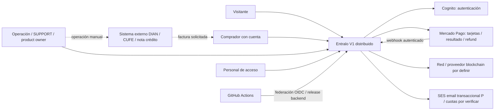
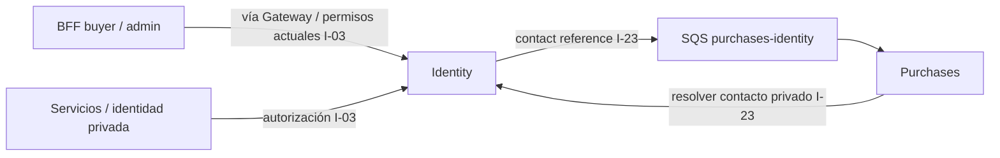
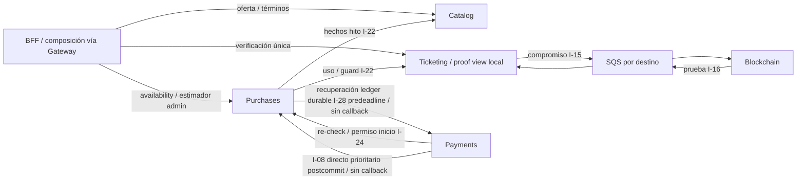

# Entralo V1 — propuesta de arquitectura distribuida

- **Lifecycle status:** `draft`; **estado de revisión:** `revision-needed` (shared context `planning`; validación anterior invalidada).
- **Fecha:** 2026-10-01; delta aprobado por usuario, pendiente revalidación independiente.
- **Owner de propuesta:** Planner; hallazgos independientes del Solution Architect recibidos vía usuario (B-1–B-3/R-1–R-9), incorporados para nueva revisión; decisiones humanas pendientes.
- **Alcance:** arquitectura enterprise para discutir. No Master Spec ejecutable, aprobación de plan, infraestructura desplegada ni autorización de implementación.
- **Convención:** **C** requisito/preferencia confirmado; **P** propuesta; **G** gate. ADRs proposed. **H-02 vigente2026-10-02:** summary §H-02 sustituye TODOS los claims/secuencias anteriores de índice/scan/revisión; describen snapshots históricos. Actual planning/revision-needed, Validator invalidated; global not ready histórico, ready pre-refresh17/H-02 histórico invalidado. `refresh18` ejecutado para su corte; pack17 stale/refresh pendiente es historia. Bundles post-refresh18 anteriores a R2, que escribió shared/pack y exige nuevo scan final pendiente. Este pase same-line → spec-remediator verifica → curator realiza un único refresh final → verificar/freeze → Gitleaks final tras todos los writes → Validator GLOBAL sólo lectura/informe externo → sólo nuevo ready exacto actual habilita solicitud GLOBAL humana en chat. Cero writes entre scan/revisión; shared/status escrito requiere re-scan. Sin Gate1/handoff.
- **Resumen maestro vigente:** [architecture-proposal.md](architecture-proposal.md), P1–P8 defaults seleccionados dentro de un plan único pendiente de revisión/aprobación, no cuestionario.

## 1. Fuentes y precedencia

1. Usuario2026-10-01 «sí, la B»: D-UNKNOWN-01 hold UNKNOWN máximo5min no renovable solo conciliación/consulta MP, cutoff comercial intacto; timestamp proveedor payment_approved_at R-07 formalizado. H-A venta aceptada conserva entrega posterior; tercer fallo definitivo3 intentos R-04, no mera latencia. Preferencias previas seis servicios/stack/plataforma intactas. H-B/H-C recomendaciones, no plan aprobado.
2. [Brief canónico](../specs/requirements/entralo-v1-requirements-brief.md) R/CA/§§13–15: lifecycle `planning`, revisión `revision-needed`; aprobación general conservada, ready anterior invalidado por delta, nueva revisión pendiente.
3. [Planning Context Pack](../specs/.working/entralo-architecture-planning-context.md), índice `incomplete`, no fuente normativa.
4. [Demo aprobado](../designs/entralo-referencia-imagenes/README.md), §Decisión de diseño: presentación/recorrido, no reglas comerciales ni dominio aprobado.

**Delta vigente SA M-1/M-2/I-1/I-2/I-3:** propuesta §§5.2/7.1/7.2/9/11.1/16 autoritativas para evidencia/identidad/capacidad/storage/aislamiento/prerrequisitos. Auth antes hold conservado; discusión/demo/packs sin editar, brief sólo nota lifecycle L246. Refresh7 (2026-10-01, cleared) y refresh13/14/15/17 son históricos; `refresh18` ejecutado por curator2026-10-02 es el actual del corte, pack `incomplete` stale por writes posteriores. Fuentes: shared §Current status/§Artifact evidence y pack encabezado; bundles post-refresh18 son snapshots anteriores a R2, cuyo write shared/pack exige nuevo scan final pendiente tras este pase y único refresh final de curator. Sin nueva decisión de producto ni aceptación del plan; SA §10 snapshot atendido, sin re-review adicional salvo cambio sustancial.

**Verificación del workspace, procedencia:** «raíz sin Git» es snapshot histórico, no filesystem actual: shared2026-10-02 registra `.git/` existente, sin ejecutar Git. Sin Graphify activo ni task board encontrados en búsquedas acotadas; `docs/specs/workspace_changes.md` no existe. No procede graphify --update ni inventar resultados/deuda/scan. Sin código/config/Git ni decisiones técnicas nuevas en H-02; landscape266 líneas conservado.

## 2. C4 nivel 1 — contexto del sistema objetivo

| Elemento externo / actor | Responsabilidad y owner | Razón / límite |
|---|---|---|
| Visitante sin sesión | Consultar eventos públicos/oferta y verificación pública; producto Entralo | Selección sin hold ni consumo; debe autenticar antes de reservar, sin stock garantizado por login |
| Comprador autenticado | Reservar, comprar, consultar y solicitar refund propios; producto Entralo | Propiedad y límite por userId autenticado; reauth mismo owner, sin transferencia/renovación ni acceso ajeno |
| Operación / SUPPORT / product owner / acceso | Configurar, autorizar refund, resolver excepciones o registrar uso según rol | No intercambiar permisos; cancelación no ejecuta refund automático |
| Cognito | Credenciales, OIDC, recuperación/MFA; plataforma Entralo administra configuración | No es fuente del perfil comercial, permisos por evento ni elegibilidad |
| MP | Resultado monetario canónico y refund original; proveedor externo | Una transacción de pago por orden; DR-05 abierto |
| Blockchain | Evidencia de emisión confirmada; proveedor externo aún no elegido | No determina vigencia/uso; no NFT/wallet; exposición P-03 bloqueada |
| Facturación externa | Emisión/envío oficial y nota crédito manual; operación Entralo | Entralo vendedor/emisor funcional; sin API fiscal V1; DR-07 abierto |
| Avisos | SES email transaccional propuesto, contacto verificado Identity; plataforma+Purchases | Quotas cuenta/región y correos Cognito conjuntamente, delivery/bounce/complaint; fallo no revierte compra/no séptimo servicio; propuesta §7.1 |
| GitHub / Vercel / AWS | Releases backend / frontends / infraestructura; plataforma Entralo | Proveedores técnicos, no owners de negocio |

## 3. C4 nivel 2 — contenedores objetivo

```mermaid
flowchart TB
  Buyer[Buyer React / Vercel] -->|same-origin| EB[Transporte buyer Node / firewall]
  Public[Visitante / sin login] -->|catálogo y verificación únicos| EB
  Admin[Admin React / Vercel] -->|same-origin| EA[Transporte admin Node / firewall]
  EB & EA -->|OIDC STS / SigV4| GW[REST regional WAF / IAM por familia]
  GW -->|familia canal / VPC Link| BB[BFF buyer / AWS Kotlin P]
  GW -->|familia canal / VPC Link| AB[BFF admin / AWS Kotlin P]
  BB --> COGB[Cognito buyer pool / P]
  AB --> COGS[Cognito staff pool / MFA required / P]
  BB --> SB[(DynamoDB sesión buyer / P)]
  AB --> SA[(DynamoDB sesión admin / P)]
   BB -->|familia owners / IAM| GW
  AB -->|familia owners / IAM| GW
  MP[Mercado Pago] -->|webhook sin Cognito / firma MP| GW
  GW --> ID[Users / Identity]
  GW --> CAT[Catalog / Events]
   GW --> PUR[Purchases + Inventory / saga y gate de venta]
  GW --> PAY[Payments / adaptador MP]
  GW --> TIC[Ticketing / Validation]
  BC[Blockchain Proof / interno sin API pública]
  ID --> DID[(PostgreSQL identity)]
  CAT --> DCA[(PostgreSQL catalog)]
  PUR --> DPU[(PostgreSQL purchases)]
  PAY --> DPA[(PostgreSQL payments)]
  TIC --> DTI[(PostgreSQL ticketing)]
  BC --> DBC[(PostgreSQL blockchain)]
  CAT --> S3[S3 privado / imágenes]
   PUR --> DOC[S3 privado / PDF y evidencia fiscal]
    Admin -.->|presigned image upload TTL5min / sin WAF API| S3
    PUR -->|documentos pequeños auth Gateway BFF 3MB archivo 4MB body| BB & AB
   Buyer --> CF[CloudFront approved public no PII sin viewer firma / WAF IP]
   CF -->|OAC prefix approved-public / no quarantine| S3
  PUR <--> Q[SQS / colas por destino / DLQ]
  PAY <--> Q
  TIC <--> Q
  CAT <--> Q
  BC <--> Q
  ID -->|contact reference changed| Q
  Buyer -->|captura tarjeta en MP| MP
   Buyer -->|token MP efímero / TLS| EB
  PAY <--> MP
  BC --> CH[Red blockchain por definir]
    PUR --> AV[SES email transaccional propuesto]
    AV -->|delivery bounce complaint| SNS[SNS Standard dedicado ses-events]
    SNS --> SQSE[SQS purchases-ses-events / DLQ y subscription DLQ]
     SQSE -->|IAM policies envelope dedup feedback| PUR
  GH[GitHub Actions / OIDC] --> RUN[Runtime AWS / Fargate propuesto]
  RUN -.-> ID & CAT & PUR & PAY & TIC & BC
  ID & CAT & PUR & PAY & TIC & BC -.-> OBS[Telemetría / logs / métricas / trazas]
```

SQS sin token MP; SES SNS→SQS dedicado/queue-topic policies source exacta/IAM/HTTPS/envelope/dedup4d/DLQ14d, no fetch certificado propio. Imágenes10MiB POST content-length-range/quarantine5min/AV/version bypass BFF/CDN approved-public noPII/OAC/WAF, privado Catalog sólo restricción. Docs<=3MB/body<=4MB/Vercel4.5MB cada dirección/owner Gateway BFF. Fiscal grande **no upload Entralo V1**: expediente externo manual protegido/referencia verificada, copia pequeña opcional; sin ALB público/stream/grant/presign fiscal. Seis contexts/IAM familias sin loop/infra no desplegada.

Detalle de llamadas separado del C4 para **L-3/M-4** (no recursos adicionales):

**H-1/M-2/L-1:** única ruta lógica pública catálogo/verificación visitante→ingreso BFF protegido→BFF→Gateway→owners; sin login comprador no significa origins públicos. BFF compone oferta Catalog+proyección availability Purchases y estimador; Catalog no consulta sync Purchases. Gateway acepta sólo workload BFF limitado para lecturas públicas, cuenta/admin además usuario autorizado; WAF no se omite con token válido. ADR002/003 cubren ambos ingresos y origins/aliases. Refund: Purchases decide, Catalog/Ticketing proveen hechos I-22 sin callback circular. Webhook MP es excepción externa firmada explícita, no bypass de lectura.

| Contenedor | Responsabilidad exclusiva | Owner funcional / técnico propuesto |
|---|---|---|
| Users/Identity (`identity`) | Perfil/contacto verificado Entralo, vínculo `issuer+sub`, roles/asignaciones por evento, autorización y evento contact reference | Operación/producto / responsable Identity |
| Catalog/Events (`catalog`) | Autoría términos P-04, oferta/imágenes/hitos/control CLOSING; capacidad configurada, no disponibilidad; BFF compone calculadora con motor Purchases | Operación eventos / responsable Catalog |
| Purchases+Inventory (`purchases`) | Inventario vendible, holds, gate linealizable de venta/permiso de inicio/fence, aceptación de órdenes, snapshots de precio/fiscalidad, saga, elegibilidad/autorización de refund, solicitudes fiscales, PDF NO fiscal y avisos | Ventas y SUPPORT / responsable Purchases |
| Payments (`payments`) | Integración MP, vínculo único pago/orden, autenticidad de webhook, consulta/conciliación, ejecución monetaria y refund | Operación financiera / responsable Payments |
| Ticketing/Validation (`ticketing`) | Emisión, boletas/QR privado, uso único/guard, verificación pública única con vista async de prueba, verificación de permiso Identity actual y contingencia manual | Operación acceso / responsable Ticketing |
| Blockchain Proof (`blockchain`) | Compromisos de emisión, lotes, envío/confirmación, reconciliación durable y prueba pendiente/confirmada | Producto/seguridad / responsable Blockchain |
| Buyer / Admin React | UI por canal, estados, accesibilidad y clientes generados; base visual demo, admin adaptado sin afirmar demo admin aprobado | Producto / frontend buyer y frontend admin |
| BFF buyer / admin | Sesiones y tokens server-side, CSRF, adaptación/lecturas de canal, no saga | Plataforma/seguridad / responsables de canal |
| Transporte Vercel buyer / admin | Adaptador HTTP same-origin/OIDC workload/SigV4, sin store/sesión/reglas comerciales | Plataforma / responsables de canal |
| Gateway / SQS / stores / CI / telemetría | Routing, autenticación inicial, transporte, operación y despliegue; no reglas de negocio | Plataforma Entralo |

Los owners son **roles de responsabilidad propuestos**, no equipos/personas contratados. Antes de operación debe asignarse persona, suplente y guardia por servicio.

## 4. Datos y aislamiento

DATA-01 seleccionado P: seis **bases lógicas** `entralo_identity`, `entralo_catalog`, `entralo_purchases`, `entralo_payments`, `entralo_ticketing`, `entralo_blockchain`, schema app/runtime/Flyway exclusivos en **una RDS PostgreSQL Multi-AZ DB instance prod inicial**. Nunca tablas/credenciales/joins/FKs compartidos; no aislamiento físico/PITR lógico independiente. Instancias separadas/Aurora alternativas no elegidas; criterio pools/coste/restore propuesta §§4/11.

| Fuente de verdad | Owner | Copias permitidas / consistencia |
|---|---|---|
| Credenciales y sujeto OIDC | Cognito | Identity vincula `issuer+sub`, no copia contraseña |
| Perfil y permisos comerciales | Identity | Decisiones de autorización server-side; grants críticos comprobados actuales, no confiar en React ni JWT de rol viejo |
| Oferta, términos/fiscalidad, hitos y capacidad propuesta | Catalog | Purchases replica versión/capacidad efectiva; motor total/refund canónico; BFF compone términos y estimador sin Catalog→Purchases sync |
| Cupos, reserva/orden con owner userId inmutable, límites userId/evento, gate efectivo de venta, permiso/fence, aceptación y saga | Purchases | Auth+propiedad y límite agregado antes hold; stock/contador/orden atómicos entre sesiones/dispositivos. Proyección availability no autoriza reserva/pago; re-check I-24 conserva disponibilidad fuerte; control Catalog con ACK, sin doble escritor |
| Resultado MP y movimientos externos | MP; Payments evidencia/ledger/outbox durable, sin firma JWS propia | MP payment_approved_at<grace determina elegibilidad; I08 postcommit IAM/TLS+SQS/I28 recovery, Purchases reconcilia CAS<deadline+stock+obligación/fence/reloj tras locks. **accepted_at post-grace válido**; sin confirmación al deadline release, approval tras deadline o release sin decisión durable previa R04/no reconsumo. Sin comparador clocks ni raw respuesta como venta. D-SAR01-CA04 aprobada «sí, dale la opción A» aplicada brief/§5.2; revisión independiente pendiente |
| Refund solicitado/autorizado | Purchases | Payments dueño de ejecución/confirmación monetaria; correlación `refund_id` |
| Boleta, emisión, uso/estado operativo | Ticketing | Blockchain recibe compromiso, nunca QR/preimagen ni decide uso |
| Lote/anclaje/prueba | Blockchain | Ticketing copia resultado de prueba con timestamp; vigencia independiente |
| Solicitud fiscal y PDF NO fiscal | Purchases | Documento fiscal oficial en externo; S3 evidencia restringida verificada, CUFE no inventado |
| Auditoría, inbox/outbox y jobs | Cada servicio | No DB central con escritura cruzada; telemetría agregada no sustituye evidencia transaccional |

ACID por base, outbox+estado/inbox+efecto juntos; red fuera del lock. IDs opacos/evidencia cifrada. Backup/PITR a nivel instancia física, recuperación lógica por owner ensayada sin prometer PITR independiente. Conciliar MP/cadena/guardas/usos/mensajes antes replay, nunca repetir desembolso. Política y DR propuesta §11.

Retención legal/comercial Q-N05 pendiente: no fijar años por inferencia ni activar borrado automático de compras/evidencias. Propuestas operativas: **SQS origen4 días/DLQ14 días**, mayores que origen; cargas temporales S3 24 h; multipart incompleto7 días; logs técnicos30 días. Política final distingue PII, ledger, fiscal, secretos de boleta, pruebas, backups y legal hold. Ledger/inbox/outbox/obligaciones no expiran con SQS; minimización de perfil sin destruir evidencia exigible.

## 5. Gateway, identidad y seguridad

**D-AUTH-01:** catálogo público sin sesión; reservar/operar hold/iniciar pago/solicitar refund exige identidad autenticada y recursos propios. Identity vincula issuer+sub a userId estable; BFF sesión no sustituye verificación owner en Purchases/Payments. Límite default8/orden y8/userId-evento incluye confirmadas y holds/gracia/UNKNOWN; comprobar antes hold, nunca por session_id/cookie anónima/dispositivo/tarjeta. Login no reserva; TTL inicia al crear hold servidor. Sesión expirada: nuevas acciones denegadas hasta reauth mismo userId dentro plazos originales, sin transferir/renovar/revivir LIBERADA; conciliación/emisión/refund internos siguen. Controles/keys/fallos/AC AUTH-01–06 en integration §2.2 y ADR001/003, sin nuevos componentes.

- **GW-01 seleccionado P:** REST regional/WAF stage/execute-api apagado/VPC Link V2→ALB privado. Familia canal IAM sólo transporte Vercel, familia owner IAM sólo BFF/servicios; owner token usuario adicional/Identity, no dos authorizers por método. Público sin token comprador pero workload IAM; MP webhook excepción autenticada. HTTP+CloudFront alternativa no elegida, controles ADR002/propuesta §7.
- **ID-01 seleccionado P:** pools buyer/staff separados, buyer email verificado/password/TOTP opcional, staff TOTP required/provisionado/sin federación V1; onboarding sin privilegios hasta MFA/autenticación posterior. PKCE/state/nonce/issuer/sub/client/scope/access token strict, buyer no admin. Aprobación humana pendiente.
- **BFF-01/02 seleccionado P:** BFF Kotlin AWS/DynamoDB sesiones por canal, transporte Node/TS Vercel mínimo same-origin OIDC→STS/SigV4 sin dominio de negocio. Cookie __Host Secure/HttpOnly/Path=/sin Domain/Lax, CSRF/origin/no-store/refresh CAS ADR003. Hosts reales Q-N01 pendientes, pruebas bootstrap; placement no abierto ni rewrite simple guard.
- Secretos MP/OIDC/proveedor en Secrets Manager/KMS/IAM mínimo; firma blockchain custodia compatible gate posterior, no clave en colas/spec/log. Transporte Vercel seleccionado requiere federación OIDC/STS restringida, no access keys largas ni suponer trust ya configurada. BFF AWS usa task role.
- Bases y runtime privados, TLS, roles IAM por servicio/cola/prefix, endpoints administrativos no públicamente operables sin autorización; deny por defecto. Aislar dev/staging/prod; sin PII real en previews.
- PAN/CVV/captura **nunca Entralo**, BFF, logs o colas. Browser tokeniza con MP; BFF transporta token sólo TLS hacia Payments sync I-07; token no va a Purchases, DB, outbox, SQS/DLQ/vault/logs/traces. Request logging/data tracing y bodies MP excluidos/redactados en todos los saltos. Payments devuelve estado no sensible+key estable y concilia incertidumbre, colas sólo comandos no sensibles/resultados/refund. SDK/contrato/idempotencia MP y solo tarjetas se verifican DR-05.
- F-C/F-D/SAR-02/12 imágenes10MiB POST cap origen/quarantine5min/AV/CDN OAC público noPII/privado Catalog sólo restricción; docs3MBarchivo4MBbody4.5MBabsoluto cada dirección BFF/owner auth. Fiscal>cap externo manual/evidencia referenciada protegida, sin stream/ALB público/grant/presign fiscal. HB/I3/propuesta§9.

## 6. Stack y contrato de generación propuesto

| Decisión / evidencia oficial leída 2026-09-30 | Propuesta |
|---|---|
| Spring oficial estable 4.1.1, Java 17–26; Gradle 8.14+ en 8.x o 9.x [S1] | Target documental **Java25 LTS + Kotlin/Boot4.1.1 en ECS Fargate, propuesto/pendiente de validación** (D-J25-01, 2026-10-04). Java25 dentro del rango framework, no evidencia full-stack; sin Java27 |
| Kotlin mínimo 2.2.x [S2] | Kotlin >=2.2 estable alineado con BOM; pin exacto junto al wrapper antes de spec ejecutable |
| PostgreSQL 18 soportado [S3] | PostgreSQL 18.x propuesta; verificar disponibilidad regional RDS, driver/JPA/Flyway concretos antes de fijar runtime |
| Generator `spring` es Java y tiene `useSpringBoot4` [S4] | Interfaces/DTO Java generados, implementación Kotlin; no asumir soporte idéntico en `kotlin-spring` |
| Gradle plugin documenta tareas [S5] | `openApiValidate`, `openApiGenerate`, sólo salida `build/generated/openapi` |

**Comando futuro exacto desde cada repositorio backend:** `./gradlew clean openApiValidate openApiGenerate compileKotlin compileJava`. No ejecutado: no Gradle ni OpenAPI backend presentes. Dependencias de compilación hacia generación; validación previa. Generación de servidor `generatorName=spring`, `library=spring-boot`, `interfaceOnly=true`, `skipDefaultInterface=true`, `useSpringBoot4=true`, `useSpringBoot3=false`, `useJakartaEe=true`, `useJackson3=true`, `useBeanValidation=true`, `documentationProvider=source`, `useSwaggerUI=false`, `hideGenerationTimestamp=true`. Generar APIs/modelos; no tests ni servidor ejecutable autogenerado. Pin exacto de generator que contenga estas opciones y prueba de interoperabilidad/serialización en la spec de bootstrap; la documentación viva no demuestra compatibilidad de cualquier versión antigua del plugin.

Fuente **futura, aún inexistente**: `projects/entralo-<servicio>/docs/api/openapi.yaml` (servicios enumerados en workspace-mapping). Planner único editor; source versionado, validado y sin datos sensibles. Todo código generado y copias empaquetadas derivadas bajo `build/generated/`, no editar/copiar DTOs a `src/`. Si se exige recurso runtime, derivarlo durante build sin fuente manual adicional. DTOs/interfaces HTTP en infraestructura; mapear hacia commands/results de aplicación y dominio Kotlin puros, entidades JPA separadas. Flyway por servicio en `src/main/resources/db/migration`; contratos de migración pendientes, ningún SQL creado.

**Registro histórico R-9: target del corte2026-09-30, superseded sólo en target documental por D-J25-01; contenido conservado como procedencia, no elección vigente.**

**R-9, fuentes reconsultadas 2026-09-30:** Java21 LTS compatible Boot4.1.1 (17–26). Java27 **GA no-LTS** [S7/S12]; Gradle9.8.0 acepta27 [S6], insuficiente para soporte Spring4.1.1. Java25 **ya es LTS**, candidato a upgrade futuro del proyecto (no release futura ni elección actual). Context7 devuelve main que menciona27: no es contrato estable4.1.1; prevalece página oficial4.1.1. Claim Gradle<=26 del pack: refresh context-curator ejecutado 2026-10-01 (`stale_status: cleared`), sin reescribirlo. Pins exactos Kotlin/Gradle/generator se fijan después en propuesta SDD aprobable y prueba de compatibilidad, no versiones flotantes en implementación. Elegir distribución/updates/licencia JDK por separado; roadmap Oracle no equivale soporte de todos los vendors.

**D-J25-01 — sincronización documental 2026-10-04:** literal humano «apruebo la actualizacion de la sfuentes canonicas a java 25 lts» (mensaje/pack #31), conforme al [borrador](../specs/.working/entralo-v1-executable-specs-java25-compatibility-proposal.md) aprobado en diseño por [SA ronda2](../specs/.working/entralo-v1-executable-specs-java25-sa-review.md). No firma SA de este landscape ni aprobación de adopción. [Master §6.1](../specs/increments/entralo-v1-executable-specs/master-spec.md#61-d-j25-01--target-documental-y-matriz-de-adopción-pendiente) exige matriz por los seis servicios, dos BFF Kotlin AWS y workers/jobs JVM, versiones exactas, CI/JVM efectiva, paquete/imagen/digest/CPU ECS, suite contractual/capacidad/seguridad/rolling/rollback/restore. JDK de build, toolchain, API y bytecode separados del runtime25; no autoelevar release/jvmTarget ni afirmar dual21/25. Java21 = referencia previa/candidato continuidad-rollback pendiente de verificar; Java26 local = Generator G-OAS, no producto. Generación contractual y empaquetado derivado de §§6/7 preservados; tooling/salidas locales G-OAS no se transfieren al producto. React/Node/Vercel sin cambio. G-BOOTSTRAP, G-OAS, G-VALIDATOR y G-HUMAN-CONTRACT siguen abiertos; sin implementación ni despliegue.

## 7. Operación, escala y entrega

**SAR-01/F-E / D-SAR01-CA04 aprobada «sí, dale la opción A» y aplicada:** MP payment_approved_at<grace determina elegibilidad comercial; evidencia durable Payments/I08 IAM-TLS postcommit/SQS/I28 recovery margen5s no cutoff anticipado. Purchases reconcilia CAS-stock+obligación<deadline con reloj nuevo tras locks; **accepted_at post-cutoff comercial válido**, no timestamp de compra. Sin confirmación al deadline release; approval encontrado después del deadline o LIBERADA sin decisión durable previa R04/no reconsumo. Raw+299.999+delay2s sin reconciliación previa release/refund conforme CA04 actualizada en brief. Sin clocks hosts/exact commit/epsilon/nuevos pagos ni renovación. §5.2/ADR004/M1-AC01…08/locks/crash/failover autoritativos, revisión independiente pendiente/no pruebas.

RUN-01 Fargate seleccionado P, API/worker separados/prod mínimo2tasks/2AZ; RDS Multi-AZ/ALB privado/VPC Link. REGION-01 us-east-1 propuesta hasta cuenta/compliance/RTT Colombia; IAC-01 Terraform seleccionado, alternativas ADR006. Pools agregados presupuestados/worker por edad cola; locks Purchases cortos sin red, cache no autoriza venta. Sala espera sólo evidencia carga Q-N02. Detalle/coste/DR propuesta §§4/11/12.

Purchases módulos/workers separados capacidad/colas/IAM ADR001/context-map§6, único owner/sin séptimo servicio. Catalog-read composición/as_of, refund hechos actuales I-22; Ticketing proof view async pública allowlist operational_status/proof_status/proof_as_of minuto UTC/error R-06, sin metadata interna pre-gate. Puerta IAM/token-aserción existente+permiso Identity actual sin grant firmado nuevo, cache informativa/manual lista autorizada unicidad §5.1; SAR-06/10.

**D-UNKNOWN-01 aprobado:** UNKNOWN al grace_end_at hold solo conciliación≤5min no renovable, reconciliation_deadline=grace_end_at+5m/consulta canónica ventana. Approval<corte con evidencia canónica/durable reconciliada en Purchases antes del deadline (respuesta MP cruda no basta)/permiso/asignación válida acepta compra/emisión posterior; failed/declined libera; UNKNOWN deadline libera/continúa consulta. Confirmación igual/posterior deadline no venta pendiente; approval tras LIBERADA aun previo→R-04 original/aviso/incidente/cero reconsumo. Venta aceptada no se revierte por esperar más allá cutoff/deadline; tercer fallo definitivo3 intentos1/5/25s timeout10s sí R-04, ACK incierto consulta/cierre sin cuarto intento.15s técnico no extensión. **D-TIME-01** R-07 brief formalizado: payment_approved_at proveedor=purchased_at compra válida<hito, received_at/accepted_at/issued_at no anterioridad; tras release R-04. **H-C/H-B** previos intactos: close_requested/advisory/fences sin fairness; ACK control no entrega/MP completos; APIs único ingreso/bytes scoped S3/CloudFront/WAF agregado/firma MP. Detalle integration §§4–5.0/propuesta/ADR004; delta pendiente revalidación, no plan aprobado.

CI/CD GitHub contratos/generación/tests/seguridad/SBOM/imagen/OIDC→STS rol repo-entorno exacto, no keys largas; promote digest inmutable/approval prod/Flyway expand-contract/rollback compatible. **Terraform seleccionado P** repo platform/S3 cifrado-versionado+lockfile, sin scripts/config creados. React/transporte Vercel+BFF Kotlin builds propios/repos canal, preview sin PII/secrets prod. Propuesta §12, no aprobación plan inferida.

**F-01/F-02 formalizados técnicamente por Planner:** MP polling `grace_end_at+[0,5,15,30,60,120,240,300]s`, webhooks disparan consulta/conciliación idempotencia; primer poll no equivale a cierre comercial. Deadline exacto+300s libera sin aprobación admisible con evidencia canónica/durable reconciliada en Purchases antes del deadline (respuesta MP cruda no basta), no espera poll final; posterior cada5min, late approved R-04/cero reconsumo. Emisión exclusivamente máximo3/+1/5/25s/base durable/timeout10s sin solapamiento ni reset. Transient probado sin efecto retry; non-retryable definitivo cierra/prueba ausencia/refund sin agotar retries; incierto concilia emissionId/guard/tombstone antes retry/refund, ticket existente recupera éxito/no false refund; imposibilidad probada o agotamiento definitivo cierre/R-04. F01-AC1–3/F02-AC1–6 integration §§3.1/4.2 son criterios adicionales AR-04/15/16; draft/revision-needed, no ready ni nueva decisión humana.

SLO, alertas, retry y DLQ propuestos en integration-map, distinguiendo defaults del brief. Trace W3C `traceparent`, correlation/causation opacos, Micrometer/OpenTelemetry; logs estructurados sin PII/QR/tokens/card data ni URLs firmadas. MPs y cadena degradados no tiran catálogo ni inventan confirmación. `/health` conceptual no se define aquí como endpoint; contratos/health privados se formalizan después.

## 8. Criterios de revisión de esta propuesta (no tareas)

| ID | Requisito arquitectónico / aceptación verificable |
|---|---|
| AR-01 | Exactamente seis bounded contexts de negocio con owner y datastore propio; ningún contrato habilita compartir tablas. C4 y context-map coinciden. |
| AR-02 | Último cupo concurrente/novena boleta/default8 por orden y8 por userId-evento, incluso múltiples sesiones/dispositivos, nunca exceden límite/stock; auth+disponibilidad+límite antes hold atómico, no compra por cache. |
| AR-03 | Saga persiste intención, respuestas, compensación y reanudación; caída entre commit/send/ACK no pierde obligación ni duplica efecto; no ACID distribuido. |
| AR-04 | TTL20/gracia30/corte estricto, approved tardío y emisión incierta tienen rutas explícitas sin segunda transacción MP ni boletas activas tras compensación. |
| AR-05 | Entrega duplicada emite un conjunto único por orden; uso concurrente concede uno; refund mantiene identidad por ajuste, un total; no promesa exactly-once global. |
| AR-06 | Prueba blockchain no bloquea compra, conserva obligación aunque expire cola o caiga worker; pending hasta confirmación; P-03 sin permiso público. |
| AR-07 | Cognito AuthN distinto de permisos de negocio; comprador no consulta ajenos y acceso no autoriza refund; CSRF/CORS/cookies separados por canal. |
| AR-08 | DR-05/DR-07 y clasificación/autorización por evento bloquean go-live/publicación-cobro aplicable, no discusión arquitectónica; PDF no fiscal y factura manual externa no se confunden. |
| AR-09 | Versiones sustentadas en fuentes oficiales; generación sólo build/generated; OpenAPI source explícito futuro; nada se presenta implementable sin contratos completos. |
| AR-10 | Storage privado, secretos fuera de artefactos, CI OIDC restringido; restore/replay demuestra reconciliación sin repetir desembolso. |
| AR-11 | GW-01/ID-01/BFF-01/02 y P1–P8 seleccionan un default en propuesta, sin aprobación humana; origen/aliases/IAM/WAF seguros, público sin login/token buyer no admin. |
| AR-12 | Token MP sólo TLS sync, ninguna cola/DB/log/DLQ lo conserva; C4/integration/context/ADR coinciden; estado UNKNOWN no dispara segundo cobro. |
| AR-13 | CLOSING/cutoff detienen permisos nuevos; H2/HC gate/advisory/fences sin fairness. UNKNOWN solo hold5min fijo aprobado/consulta/release deadline, cero reconsumo; puerta no cache/grant. |
| AR-14 | BFF compone términos Catalog+motor Purchases, mismo redondeo/snapshot; Catalog no sync-query Purchases; call graph por fase I-24/I-28 sin callback, grafo servicios bidireccional declarado; hechos refund I-22 owner único. |
| AR-15 | Bound5min aprobado no renovado por lease/crash/operador, UNKNOWN libera deadline/continúa consulta; confirmación igual/posterior no venta pendiente, overdue incumplimiento visible; reloj/UI intactos. |
| AR-16 | Approval=corte−1ms con evidencia canónica/durable reconciliada en Purchases antes del deadline (respuesta MP cruda no basta)/asignación válida venta/emisión posterior; tercer fallo definitivo3 R-04, latencia sola no; timestamp proveedor<hito eligible pese auditoría posterior, tras LIBERADA R-04 sin reconsumo. Cambio/uso/cancelación/SUPPORT intactos, delta usuario aprobado pendiente revalidación; H-B/HC draft/no plan aprobado. |
| AR-17 | AUTH-01–06/CA-AUTH-01: eventos públicos sin sesión; auth antes hold/compra/refund propios; sesión expirada reauth solo mismo owner, otro userId rechazado sin efectos; created_at/expires_at/grace_end_at/reconciliation_deadline intactos tras login, sin transferir/renovar; disponibilidad revalidada y procesos internos independientes de sesión |

## 9. Estado, consulta y gates

Informe SA independiente **existente** solution-architect-review.md SAR01…14, snapshot previo a correcciones con seguimiento Planner separado; anterior B/R/M3 no localizable sólo procedencia histórica. Request solicita re-review cambios técnicos/delta SAR01 y global Validator, no atribuye aval nuevo. Adapter/ACL infraestructura/Command no sensible/process manager/transiciones explícitas sin nuevo GoF/Shared Kernel/gateway saga, sin delegación ejecutada.

Único shared planning/revision-needed, arquitectura draft/ADRs proposed/brief planning/revision-needed; requisitos D-SAR01-CA04 intactos, brief sólo nota lifecycle L246. Refresh6/7/13/14/15/17 históricos; `refresh18` actual del corte, pack `incomplete` stale por writes posteriores. Global histórico not ready/selectivo PASS no ready global; ready posterior pre-refresh17/H-02 histórico invalidado. SAR14 PASS1.86MB/Gitleaks8.30.1/exit0/0leaks/narrow FP histórico; `final-post-refresh14-2026-10-01` anterior a GV3/refresh15 (173 archivos, manifest674987ef…), `final-2026-10-01` (173/63.127.165B enumerados/1.973.225B scanned, manifest2a90…), post-GV (manifest24afec…) y `final-post-refresh15` PRE-GV4 son snapshots históricos. «Scan posterior a refresh15/GV4 pendiente» describe su corte; constan `final-post-refresh18-2026-10-02` y el posterior `final-frozen-after-HSV1-2026-10-02` (62 archivos/exit0/0findings/pre=post cada uno). R2 escribió shared/pack después: nuevo scan final pendiente tras este pase y curator. SAR-14/R2-01/V-08 cerrados selectivamente2026-10-01, no se reabren por inferencia. Sin Gate1/aprobación de plan; SA §10 snapshot atendido sin re-review adicional salvo cambio sustancial.

**Próximo paso vigente H-02:** `refresh18` ejecutado para su corte, refresh17 stale/refresh pendiente histórico → correcciones agrupadas same-line de este pase → spec-remediator verifica líneas → curator realiza un único refresh final → verificar/freeze → Gitleaks final → Validator GLOBAL sólo lectura/brief completo/bundle actual/salida externa. Ready global2026-10-02 pre-refresh17/H-02 histórico invalidado; global R2 not ready histórico conservado. SA §10 (2026-10-01) snapshot atendido sin aval posterior ni re-review adicional salvo cambio sustancial. PASS históricos intactos:1.86MB/Gitleaks8.30.1/exit0/0leaks/narrow FP; post-refresh14/173/674987ef…, final/2a90…, post-GV/24afec…, post-refresh15 PRE-GV4. Bundles post-refresh18 y final-frozen-after-HSV1 son snapshots anteriores a R2; R2 shared/pack y este pase requieren nuevo scan final pendiente. Refresh7/13/14/15/17 historia; pack refresh18/incomplete stale por writes posteriores. Ningún write entre scan/revisión; shared/status nuevo exige re-scan. Sólo nuevo ready actual habilita solicitud GLOBAL humana; aprobación ausente, sin Gate1, opción A no se repregunta. Draft/proposed/planning-revision-needed, sin OpenAPI/descomposición/ejecución/handoff ni tests/scan nuevos.

### Disposición SA y aceptación adicional

**AR-18/SAR-01…14:** propuesta§§5.2/7.1/9/17/ADRs/integration canónicos: D-SAR01-CA04 aprobada/aplicada provider approval<grace/evidencia reconciliada CAS-stock<deadline/accepted_at post-cutoff permitido/release-late refund sin reconsumo/directo sin JWS/margen5s; freshness60/proactive30s/quotas deps+budgets; SES policies/envelope sin cert fetch; caps3MB/fiscal externo sin ALB; issuance10s/offsets1-5-25s/nominal35s/p95; visibility30/lease5s/clock_timestamp postlocks/pública no metadata pre-gate/CI/uncertain paging5min15min. Tests no ejecutados/findings pendientes revisión, sin ready/plan approval; scan Gitleaks ejecutado con PASS (Gitleaks 8.30.1, `gitleaks dir . --redact` desde la raíz, filesystem sin Git, alcance 1.86 MB, exit 0 / 0 leaks con allowlist estrecha de falso positivo (`.gitleaksignore`); SAR-14/R2-01/V-08 cerrados sujeto a revalidación del validator); fases I24/I08/I28 sin callbacks/runtime pendientes.

## 10. Referencias oficiales

- S1: https://docs.spring.io/spring-boot/system-requirements.html — 4.1.1, Java17–26, Gradle.
- S2: https://docs.spring.io/spring-boot/reference/features/kotlin.html — mínimo Kotlin2.2; consulta Context7 oficial.
- S3: https://www.postgresql.org/support/versioning/ — PostgreSQL18 soportado.
- S4: https://openapi-generator.tech/docs/generators/spring/ — generador Java, Boot4, opciones.
- S5: https://github.com/OpenAPITools/openapi-generator/blob/master/modules/openapi-generator-gradle-plugin/README.adoc — tareas/inputs/output; fuente viva no pin de versión aprobado.
- S6: https://docs.gradle.org/current/userguide/compatibility.html — versión leída9.8.0, Java27 desde9.8.
- S7: https://jdk.java.net/27/ — GA; no prueba de soporte Boot27.
- S8: https://docs.aws.amazon.com/apigateway/latest/developerguide/http-api-vs-rest.html — matriz de funcionalidades.
- S9: https://docs.aws.amazon.com/apigateway/latest/developerguide/http-api-jwt-authorizer.html — validaciones y scopes.
- S10: https://docs.aws.amazon.com/AmazonS3/latest/userguide/using-presigned-url.html — acceso temporal, bearer reutilizable y expiración de credenciales.
- S11: https://docs.github.com/en/actions/how-tos/secure-your-work/security-harden-deployments/oidc-in-aws — OIDC/STS, condiciones aud/sub y formato subject vigente.
- S12: https://www.oracle.com/java/technologies/java-se-support-roadmap.html — 21/25 LTS,27 no-LTS; roadmap vendor consultado2026-09-30.
- S13: https://docs.aws.amazon.com/cognito/latest/developerguide/user-pool-settings-mfa.html — política pool, federados y onboarding.
- S14: https://vercel.com/docs/functions/runtimes y https://vercel.com/docs/rewrites — Node oficial, proxy externo factible, cookies/cache por validar; no prueba JVM directo.
- S15: https://docs.aws.amazon.com/AWSSimpleQueueService/latest/SQSDeveloperGuide/sqs-dead-letter-queues.html — DLQ mayor retención que fuente, timestamp Standard original.
