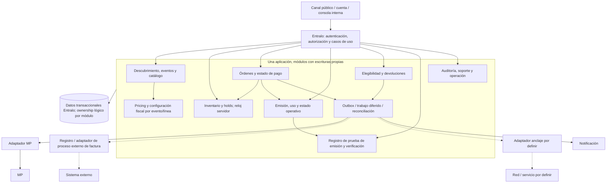

# Entralo V1 — discusión de arquitectura conceptual

- **Lifecycle status:** `draft` — material para conversación, **no** Master Spec, contrato técnico, plan aprobado ni autorización de implementación.
- **Base:** `docs/specs/.working/entralo-fiscal-colombia-cargo-servicio-planning-context.md` (rev. 6, refresh 10, índice incompleto) y `docs/specs/requirements/entralo-v1-requirements-brief.md` (snapshot de 183 líneas, mtime 2026-09-29T20:38:01). Referencias por **sección/ID**, no por línea. El brief sigue `requirements-blocked` (§15). §F.37 permite esta conversación, no un handoff.
- **Hechos de producto ya decididos (refresh 10 — NO volver a preguntarlos):** **(1) emisor/vendedor funcional en V1 = ENTRALO**, derivado de la decisión 11 (en V1 la plataforma gestiona todos los eventos; **si eso cambia, cambia el emisor**) → **§F.38/DR-19 del pack fiscal**; **(2) la factura oficial/fiscal la emite y envía un sistema externo en V1** (integración futura) y **NO es generada por el portal Entralo** → §F.36; **(3) el proceso manual externo en V1 está decidido** (decisiones 26/45) → §F.39: el Planner puede **proponer procedimientos auditables**, no reabrir manual vs API; **(4) NIT/razón social/representante legal y contrato de venta** son **datos/artefactos externos de go-live dentro de DR-07**, **no** una decisión de arquitectura. **Única ambigüedad de producto en factura: OQ-15 (SÍ/NO sobre PDF/comprobante NO fiscal de compra en Entralo V1; si no hay respuesta → sugerir default NO para V1, sin cerrarla).**
- **Convención:** **C** = decisión funcional ya cerrada; **P** = propuesta arquitectónica debatible; **S** = supuesto operativo provisional, pendiente de confirmación; **G** = gate aún abierto. Ninguna P/S aprueba P-02, P-03, P-04 o Gate 1.

## 1. Contexto: quién se responsabiliza de qué

```mermaid
flowchart LR
  Visitante[Visitante] --> Canal[Canal Entralo V1]
  Comprador[Comprador con cuenta] --> Canal
  Operacion[Operación / SUPPORT / acceso] --> Canal
  Canal --> Sistema[Entralo: oferta, inventario, venta, emisión, verificación y operación]
  Sistema --> MP[Mercado Pago: cobro, consulta y reembolso]
  MP -->|notificación de resultado| Sistema
  Sistema -.->|solicitud / datos mínimos, procedimiento manual (auditables por diseñar)| Fiscal[Sistema externo de factura oficial]
  Fiscal -.->|factura y nota crédito, proceso pendiente| Comprador
  Sistema -.->|anclaje de emisión, diseño pendiente| Cadena[Servicio / red blockchain por definir]
  Sistema --> Avisos[Canal de notificación por definir]
  Avisos --> Comprador
```

**C:** Entralo opera eventos V1 sin autogestión de organizadores (decisión 11) y es el **vendedor/emisor funcional** de esa V1; Colombia/COP, tarjetas MP, localidades sin asiento; factura oficial DIAN/CUFE emitida y enviada por sistema externo **solo a solicitud** — **el portal Entralo no la genera**. Blockchain acredita emisión, **no** vigencia ni uso; no wallet/NFT. [Brief §§2–3, R-04/R-06/R-09, §8; pack fiscal §F.38]

**S:** El intercambio con el sistema externo de factura se resuelve en V1 con el **modo manual ya decidido** (decisiones 26/45, §F.39): lo que queda por diseñar son los **procedimientos auditables** (registro de solicitud, correlación `order_id`, estado, evidencias protegidas, escalado), **sin API exigible en V1**. **C:** el **vendedor/emisor funcional es Entralo** (§F.38) y **no proveedor alguno**; lo que **sigue en G DR-07/Q-C05** es la **identidad jurídica (NIT/razón social/representante), el contrato de venta y la identificación del titular**, no «quién emite». La conexión con la red blockchain y el canal de avisos tampoco implican proveedores aprobados. [Brief §8, Q-C05/Q-C07/Q-N04; pack fiscal §F.38, §F.39]

## 2. Dos alternativas para discutir (sin elección humana implícita)

| Criterio | A. Monolito modular V1 (**P: recomendación**) | B. Microservicios desde V1 (**P: alternativa**) |
|---|---|---|
| Fronteras | Módulos con ownership y contratos internos para catálogo/eventos, inventario/holds, órdenes/pagos, boletas/acceso/verificación, pricing/fiscal, devoluciones, auditoría/soporte y adaptadores externos. | Servicios separados según esos contextos, cada uno dueño de sus datos; APIs/eventos versionados entre ellos. |
| Último cupo + cobro | Inventario/hold y estado de orden coordinados en una base transaccional con invariantes atómicas; MP permanece externo. | Coordinación por mensajes/saga y compensaciones; no se puede hacer transacción ACID entre servicios ni con MP. |
| Resiliencia y evolución | Outbox/eventos internos desacoplan facturación, notificaciones y anclaje; escala instancias y trabajos consumidores según carga sin dividir dominios prematuramente. | Aislamiento y escalado independiente, a costa de contratos distribuidos, operación, trazabilidad y conciliación más complejos desde el primer día. |
| Riesgo principal | Acoplamiento si se comparten tablas/modelos sin disciplina de módulos; requiere límites de escritura y pruebas de invariantes. | Doble venta/reembolso y desorden de eventos más difíciles de prevenir; más infra y observabilidad antes de conocer el tráfico. |

**P: recomendar A para V1**, porque la exclusión de cupos, la secuencia temporal de pago y la emisión única son un núcleo de consistencia fuerte; integrar MP, factura externa y blockchain no obliga a distribuir ese núcleo. Mantener límites lógicos extraíbles y separar trabajos diferidos sin afirmar lenguaje, framework, motor de BD, broker o red concretos. Reconsiderar B únicamente con evidencia de carga, ownership independiente o aislamiento operativo que compense la complejidad. Esto **no es decisión de producto ni stack fijado**. [Brief R-03–R-06, E-01–E-05, Q-C04/Q-C06/Q-C07]

## 3. Componentes y límites de datos (A como hipótesis ilustrativa)



**P:** catálogo descubre únicamente eventos publicables; eventos posee oferta, cupos configurados y cambios/cancelación; pricing/fiscal posee versiones de configuración por evento y línea, nunca decide por sí solo la identidad jurídica del emisor (NIT/razón social/representante — dato externo, DR-07; el **rol de emisor/vendedor funcional ya está fijado en Entralo**, §F.38). Inventario posee disponibilidad y holds; órdenes/pagos posee identidad de orden, **una transacción MP por orden**, resultado y conciliación; boletas posee emisión/uso; prueba posee solo evidencia de emisión; devoluciones posee solicitudes, autorizaciones y movimientos de reembolso. Auditoría conserva actor, motivo, sellos y correlaciones restringidas; consola interna distingue Operación, acceso, SUPPORT y product owner (excepciones), con permisos mínimos. Ningún módulo externo escribe directamente el inventario ni se toma la cadena como fuente de vigencia. [Brief §§3, 7, R-01–R-12]

**P: consistencia:** el datastore Entralo tiene dueño único; cada módulo escribe sus propios datos lógicos. La reserva del último cupo y el paso a vendido/emisión deben decidirse mediante transición atómica protegida contra concurrencia, con prueba de que dos compradores no obtienen el mismo cupo ni se emite/usa dos veces. La transición local puede confirmar orden, consumo y emisión junto con un evento outbox en una transacción; **no** incluir llamadas MP, factura o cadena dentro de esa transacción. MP es fuente de verdad del resultado monetario; Entralo conserva su estado reconciliado y no infiere éxito solo porque llegó un webhook. Datos de factura permanecen en el proceso externo como documento oficial; Entralo guarda únicamente solicitud, identificador/estado necesarios y evidencias protegidas. Prueba blockchain es eventual e independiente del estado operativo. [Brief R-03–R-06/R-09/R-11, E-01–E-05, Q-C04/Q-C06]

## 4. Recorridos y fallos que la arquitectura debe soportar

1. **Oferta y precio. C:** descubrir evento publicado con localidades/cupos; precio nominal por boleta mínimo COP 100.000, sin máximo; un cargo de servicio por ticket, configurable por evento, base por defecto 15% del nominal + impuesto aplicable configurado. Nominal excluido de IVA solo si califica art. 476.11; clasificación fiscal por evento/línea/rol, parafiscal 10% y autorización MinCultura solo si aplican. Sin clasificación, tasa/base/régimen o autorización exigible, bloquear publicación/cobro. **P:** snapshot de precio y configuración aplicable en la orden para auditoría; el modelo físico propuesto P-04 **no aprobado**. Nada de gross-up ni línea MP al comprador. [Brief R-02/R-10/R-12, CA-10/CA-12, §11]
2. **Hold y pago. C:** reloj servidor; TTL configurable 20 min → `EXPIRANDO` con gracia configurable 30 min. `approved` **antes del fin de gracia** consume y emite una sola vez; `failed` libera de inmediato; sin webhook libera al fin de gracia. Aprobación **al vencer o después de la gracia**, o tras liberación/sin stock, requiere reversa/reembolso automático al medio original, aviso e incidente; **no** revertir solo por vencer TTL. Tras liberar, salir de checkout y exigir nueva selección. **P:** expiración ejecutada por trabajador persistente más validación en cada transición, no timer del navegador; decisión de estado protegida por control de concurrencia. **G Q-C04/Q-C06:** el orden de llegada de webhook no define por sí solo el instante efectivo de aprobación; resolver conciliación, carreras de frontera, aforo y límites antes de especificar algoritmo final. [Brief R-03/R-04, E-01–E-03, CA-03/CA-04, §F.35]
3. **Webhooks, emisión y refunds. C:** deduplicación funcional de emisión y reembolso por `order_id`; webhook repetido/desordenado no duplica acciones; aprobado sin emisión reintenta y, tras agotar intentos, reembolsa al original y concilia; una devolución elegible autorizada por SUPPORT se inicia en ≤7 días calendario desde aprobación, no garantiza fecha de acreditación. Reembolsos automáticos por fallo de emisión/éxito tardío no esperan SUPPORT; excepciones escalan al product owner. **P:** inbox para eventos entrantes (identidad de notificación + orden), outbox persistente para efectos, idempotencia externa al invocar MP y conciliación antes de repetir una devolución de resultado incierto; fallos finales quedan en cola de incidentes con intervención controlada, sin segundo cobro. **G Q-C04/Q-C06/DR-05:** definir identidad de devoluciones parciales, ventanas/reintentos/backoff/timeout, consultas MP y condiciones contractuales reales. [Brief R-04/R-08, E-02/E-03/E-07, Q-C04/Q-C06]
4. **Cambio, cancelación y acceso. C:** al cancelar, sellar tiempo del sistema, detener venta, marcar Cancelado, dejar nota y avisar; compras previas elegibles para reembolso, sin inferir ejecución automática. Cambio de fecha/lugar: último cambio sellado reinicia plazo de solicitud de 3 meses para compras anteriores a él; boleta usada no elegible salvo cancelación. Uso en puerta exactamente una vez. **G Q-C01/Q-C02:** precisión/bordes temporales, autoridad, procedimiento y evidencia por cerrar. **P:** transiciones auditadas y consulta de elegibilidad basada en historial inmutable de hitos, no en edición silenciosa del evento. [Brief R-05/R-07/R-08/R-11, E-04/E-06]
5. **Factura, avisos y anclaje. C:** factura fiscal oficial se emite/envía por sistema externo V1 solo cuando se solicita, a nombre del titular de tarjeta; nota crédito en refunds/ajustes facturados según validación confirmada por el usuario. PDF sencillo local solo posible comprobante **NO fiscal** (**OQ-15**, no requisito). Para prueba de emisión, mostrar `pendiente` hasta confirmación de anclaje; vigencia/uso/reembolso provienen de estado operativo, nunca de cadena. Ante caída de verificación: `VERIFICACION_NO_DISPONIBLE`, último estado conocido con timestamp y banner, API 503 con error distinto, jamás vigente supuesto. **P:** trabajos diferidos reintentables con registro de intentos y alertas; si falla factura, mantener solicitud pendiente/escalar al responsable del proceso externo, no falsificar documento; si falla anclaje, mantener prueba pendiente. **G DR-07/Q-C05/Q-C07:** proceso exacto de factura, N/T, red, economía y política de fallos sin cerrar. [Brief R-06/R-09, E-05/E-08/E-09/E-11, §8]

**P: señales operativas mínimas para debatir:** correlación por orden y operación interna sin exponer identificadores sensibles públicamente; conteos de holds vencidos, aprobación tardía, cobros aprobados sin boleta, reembolsos pendientes/fallidos, diferencias con MP, solicitudes de factura pendientes, anclajes pendientes y fallos de verificación; alerta e historial auditable para conciliación y soporte. Umbrales, timeouts, política de reintentos, retención y SLO **no están fijados** (Q-C04/Q-C06/Q-C07/Q-N05). Una notificación fallida no debe revertir por sí sola una venta confirmada; se reintenta o se escala, sin perder evidencia. [Brief R-11, §8, Q-C04/Q-C06/Q-N05]

## 5. Seguridad, privacidad y economía: separaciones obligatorias

- **C:** compra y devoluciones desde cuenta propia; catálogo y consulta pública sin PII. Roles internos diferenciados, autorización y auditoría de reembolsos/uso/cambios. Tarjetas: no almacenar ni procesar PAN/CVV propios; **P:** captura tokenizada/alojada por proveedor, credenciales secretas, validación de autenticidad de callbacks, protección contra replay y mínimos privilegios. La modalidad concreta depende del contrato/integración MP (**G DR-05**). [Brief §§3, 8–9, R-04/R-08]
- **C:** nunca publicar ticket original/prehash, QR, PII ni referencias de orden o pago; el usuario no exige demostrar no vinculabilidad. **P:** prueba pública limitada inicialmente a identificador opaco y estados permitidos, sujeto a revisión de enumeración/correlación. Hoja/hash individual y prueba de inclusión/Merkle son **alternativa P-03 no aprobada**, no diseño por defecto; otra alternativa es publicar solo un resultado de verificación controlado sin hoja individual. Decidir tras threat model y aprobación seguridad/producto; no suponer privacidad por ser un hash. **G Q-C07.** [Brief R-06, §9, E-08/E-11]
- **C:** payout elegido MP **7 días**; referencia publicada para costo configurable `r × total cobrado + F` (+ IVA MP según condiciones reales): **2,99% + COP 800 + IVA**, fuente pública Checkout Colombia, lectura registrada 2026-09-29T15:30-05:00, **no tarifa contractual**; costo cubierto desde cargo de servicio, no recargo al comprador. **G DR-05:** usuario obtiene cuenta/contrato, comparar tarifa/IVA/condiciones reales y corregir supuestos antes de go-live. **G Q-C03/OQ-10:** verificar conciliación, efecto en caja y suficiencia del 15%; no confundir payout 7 días con plazo de inicio de refund ≤7 días desde aprobación. [Brief R-10, §8, §11, Q-C03]
- **C:** gate general legal/contable Q-C08 satisfecho por **validación confirmada por el usuario**, no por memo/contrato aportado. **G DR-07:** identidad jurídica (NIT/razón social/representante), contrato de venta, proceso externo e identificación del titular antes de go-live — **el emisor/vendedor funcional ya es Entralo (§F.38), no re-preguntarlo**; no elegir proveedor DIAN ni atribuir al **portal** Entralo la **factura oficial** (la emite/envía el sistema externo). **P-04** sigue sin aprobar aunque la exigencia de configuración por evento/línea sea firme. Retención, minimización, acceso/borrado y respaldos se definirán según obligaciones reales (**G Q-N05**), sin publicar datos ni prometer plazo no acordado. [Brief R-09/R-12, §9, Q-C05/Q-C08/Q-N05]

## 6. Decisiones que sí merecen conversación ahora

1. ¿Aceptamos **A, monolito modular con núcleo transaccional único**, como dirección para diseñar V1, o hay una restricción real de equipos/escala/aislamiento que justifique B desde el inicio? (Esto **no** aprueba el plan.)
2. Para el flujo de factura oficial externa: **el modo MANUAL en V1 ya está decidido** (decisiones 26/45, §F.39) — no se vuelve a preguntar manual vs API. La conversación útil es **qué procedimientos auditables** conviene diseñar V1: registro de la solicitud, correlación con `order_id`, estado de la solicitud, evidencias protegidas, escalado ante fallo y bitácora del proceso externo. **Identidad jurídica, contrato de venta e identificación permanecen en DR-07 como insumos externos de go-live** (el **emisor ya es Entralo**, §F.38); no elegir proveedor ahora por inferencia.
3. Para la verificación pública de emisión, ¿preferimos explorar **resultado controlado sin hoja pública** como punto de partida y someter hoja/proof a threat model, o existe necesidad de prueba criptográfica individual pública que deba guiar la evaluación de **P-03**? Ninguna opción aprueba su publicación.
4. ¿Qué objetivo de carga/latencia o picos por evento y qué capacidad operativa de conciliación/soporte debemos usar como **hipótesis de dimensionamiento**, sin convertirla todavía en SLA ni reabrir TTL/gracia? [Brief Q-N02, Q-C04/Q-C06]
5. **OQ-15 (única ambigüedad de producto en factura) — pregunta de SÍ/NO, sin reformular:** **¿quieres un PDF / comprobante NO fiscal de compra dentro de Entralo V1?** Si la respuesta es **sí** → se especifica como output rotulado **NO fiscal** (nunca factura, nunca sustituto de la oficial externa); si es **no** → no se construye en V1. **Si el usuario no responde → sugerir como default «NO» para V1**, dejando **OQ-15 abierta** (una sugerencia no cierra la pregunta).

**Detalles recomendables por Planner más adelante, no decisiones que haya que re-preguntar hoy:** elección de lenguaje/framework/BD/broker, límites físicos de módulos, timeouts y reintentos, índices/esquemas, nombres de eventos/API, algoritmo de conciliación y métricas/umbrales; solo tras resolver los Q-C correspondientes y pasar a spec formal. Tampoco solicitar de nuevo payout, nominal mínimo, ventana 20+30, corte al fin de gracia, factura externa, gate legal ya satisfecho, **quién emite (Entralo, §F.38)** ni **si V1 factura manual o automática (manual externo decidido, §F.39)**. [Brief §11, §13, §15]

## 7. Estado y siguiente conversación

No hay contratos OpenAPI, migraciones ni código en este material; el pack sigue `incomplete`. Sin Graphify configurado (`graphify-out/` ausente), no hay subgrafo que validar; sin task board existente que desbloquear. **DR-05 y DR-07 son gates antes de go-live y de un handoff SDD completo, no impedimentos para este debate conceptual**; **DR-07 ya no incluye «quién emite» (decidido: Entralo, §F.38) y queda limitado a identidad jurídica, contrato de venta, proceso externo e identificación.** Quedan Q-C01–Q-C07 con cierres parciales, P-02/P-03/P-04 sin aprobación y OQ-15 abierta (**sugerencia de default NO si no hay respuesta; la sugerencia no la cierra**). La siguiente acción es debatir las 5 preguntas anteriores y documentar respuestas si las hay; **no** declarar `ready-for-planner`, no enviar a Task Decomposer/Executor/Architect Executor, no iniciar Gate 1 ni inferir aprobación humana o de Spec Validator. [Brief §13–§15, pack rev. 6 §§Conflicts and open questions/Planner handoff]
